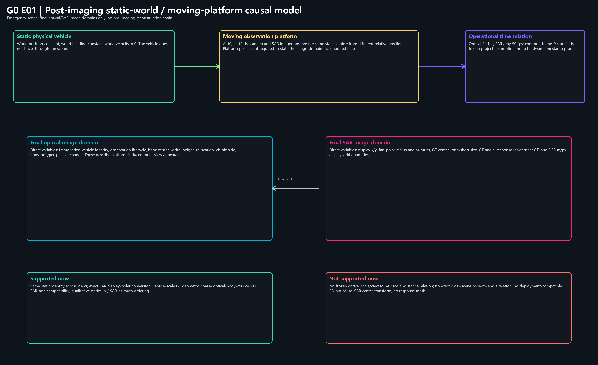
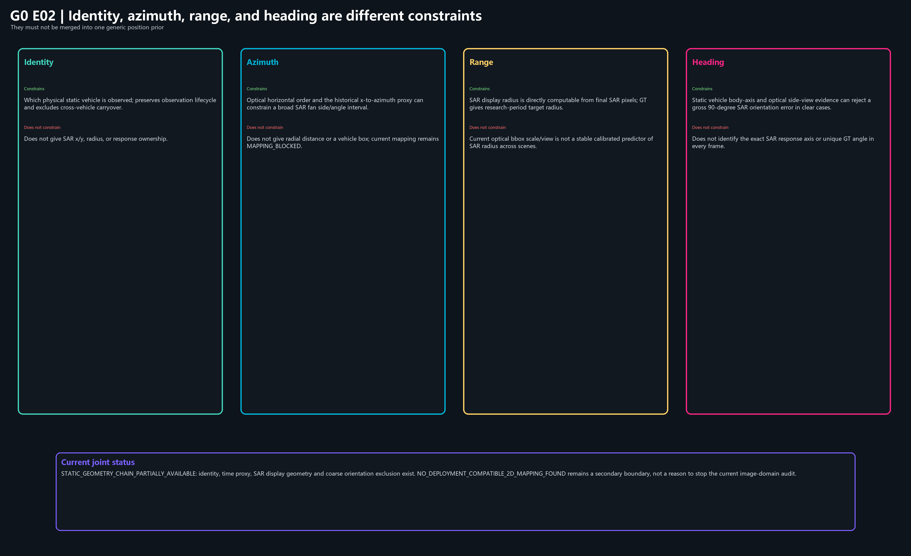

# OTY2-RSA2-G0 成像后静止车辆多视角几何关系合同

日期：`2026-07-18`
主状态：`STATIC_GEOMETRY_CHAIN_PARTIALLY_AVAILABLE`
次级边界：`NO_DEPLOYMENT_COMPATIBLE_2D_MAPPING_FOUND`

## 1. 文件性质与紧急范围修正

本文件冻结的是**成像后静止车辆多视角几何关系审计口径**，不是完整传感器坐标链、SAR 成像链、定位算法或实现计划。

本轮只允许使用：

- 最终光学连续帧；
- 最终 SAR 灰度连续帧；
- 研究期 SAR GT；
- 光学车辆身份与观测生命周期；
- `GM_RM011`、`GM_RM017`、`GM_RM019` 中车辆全部静止这一采集事实；
- SAR 显示坐标、有效扇极原点和 `0.03 m/px`；
- 当前操作性时间映射；
- O2 正向区域、GT 框和负控制框的来源法证。

本轮不再寻找、要求或恢复 ADC/IQ、原始复数回波、距离—多普勒、距离—方位中间结果、成像前逐帧轨迹、高精度 INS/IMU 或可重新成像的中间产物。它们的缺失不是当前 G0 的阻塞条件。范围修正前已经产生的只读检索痕迹继续保存在仓库外，但不得主导本合同或主报告的结论。

## 2. 静止世界因果模型

三个场景中的物理车辆均静止：

```text
P_vehicle_world = constant
heading_vehicle_world = constant
velocity_vehicle_world = 0
```

变化来自搭载相机和雷达/SAR 采集系统的平台经过。随时间改变的是车辆在最终光学图像和最终 SAR 图像中的投影、尺度、视角、方位、径向距离、显示方向、可见性和遮挡关系，而不是车辆在世界中的运动。

因此后续统一使用：

- 观测生命周期；
- 视场准入/准出；
- 平台自运动诱导的表观变化；
- 静止世界目标在传感器坐标中的时变投影；
- 观测主体切换。

不得把这些变化重新写成车辆轨迹传播、车辆响应沿图像运动或车辆进入/退出世界场景。



## 3. 本轮实际使用的成像后坐标与状态

### 3.1 光学图像域

- 图像尺寸：`800 × 600 px`；
- `u` 向右增加，`v` 向下增加；
- 可直接读取车辆身份、观测生命周期、可见状态、参考框中心、宽高、边界截断和可见车身姿态；
- 光学框是可见投影或检测参考，不是车辆世界尺寸，也不直接给出 SAR 径向距离。

### 3.2 SAR 显示图像域

- 灰度画布：`2308 × 1334 px`；
- 显示 `x` 向右增加，显示 `y` 向下增加；
- 冻结扇极原点：`(1154.0, 1330.6)`；
- 冻结有效扇形半径：`1332.7 px`；
- 方位范围：`[-90°, 90°]`。

显示坐标与扇极坐标可复算：

```text
r_px = hypot(x - 1154.0, y - 1330.6)
theta_deg = atan2(x - 1154.0, 1330.6 - y)

x = 1154.0 + r_px * sin(theta)
y = 1330.6 - r_px * cos(theta)
```

这是一条已经冻结的**最终显示域坐标关系**，不是光学到 SAR 的映射公式，也不恢复成像前物理链。

### 3.3 研究期 GT 几何

研究期 GT 提供当帧旋转框中心、长宽和角度，可进一步计算：

- 中心半径 `r_px`；
- 中心方位 `theta_deg`；
- 长轴、短轴；
- 无向长轴角度；
- 使用 `0.03 m/px` 得到的显示网格长度。

GT 是研究期开卷答案，用于机制发现、关系审阅、问题拆解和反事实审计；部署期不得读取目标 GT，GT 框也不得被当作车辆响应 Mask。

### 3.4 操作性时间域

源容器确认光学为 `24 fps`、SAR 灰度为 `50 fps`。当前操作性映射使用共同 frame-0 起点假设：

```text
t_optical(i) = i / 24
t_sar(j) = j / 50
j_center ≈ round(i * 50 / 24)
i_nearest ≈ round(j * 24 / 50)
```

该关系可用于本轮按帧连接，但共同起始没有被公共时钟、硬件触发或逐帧采集时间戳独立证明。它不是硬件级同步真值。

## 4. 四类几何信息必须分开



| 信息类型 | 当前能约束什么 | 当前不能约束什么 |
| --- | --- | --- |
| 身份 | 哪一辆静止物理车辆处于当前观测生命周期；防止跨车延续 | 不直接给出 SAR `x/y`、半径或响应所有权 |
| 方位 | 光学横向顺序和历史代理可提供宽 SAR 扇区方向关系 | 不等于径向距离，不产生车辆框 |
| 距离 | SAR 最终显示像素可直接给出显示半径；研究期 GT 给出目标半径 | 尚无冻结的光学尺度/视角到 SAR 半径关系 |
| 航向 | 清晰侧视车身长轴可排除明显的 90° 错误方向 | 不能单独决定每帧精确 SAR GT 角度或响应主轴 |

不得把四类信息压缩成一个笼统“位置先验”、分数或投票。

## 5. 当前已成立的成像后关系

### 5.1 光学横向位置与 SAR 方位

同一静止车辆随平台经过在光学画面中的横向顺序，与 SAR GT 方位由负向到正向或由一侧到另一侧的变化具有明确的定性相容性。`GM_RM011:PV001`、`GM_RM017:PV002/PV003/PV004` 等线程均显示这种顺序关系。

允许结论：

> 光学横向位置可提供宽方位和顺序约束。

禁止结论：

> 当前已存在跨场景、跨姿态、部署兼容的精确光学 `x` 到 SAR 方位映射。

历史线性式仍为：

```text
theta = 0.0875154 * x_optical_reference_center_px - 40.413555
```

它依赖历史 GT/光学锚点审计，只输出 SAR 显示方位角，不包含径向距离、车辆姿态、平台位姿、相机内参或相机—雷达外参；状态继续为 `MAPPING_BLOCKED`。

### 5.2 光学尺度、视角与 SAR 径向距离

同一静止车辆的光学框宽高、边界截断、侧后/正侧/侧前视角和平台经过阶段，确实随相对观察位置变化；部分完整线程内也可看到光学尺度和 SAR 半径的同向或反向趋势。但是：

- 光学框经常受图像边界截断；
- 可见框不是完整车辆投影；
- 透视、车辆可见侧面和检测框语义混合；
- 不同场景和车辆没有冻结共同的尺度—半径函数；
- 历史 WGV3.5A 仅得到 `CLOSED_SCENE_SPECIFIC_WEAK_CALIBRATION_ONLY`，且 GM_RM011/GM_RM019 的相对深度不稳定。

因此当前只能登记**候选的线程内距离趋势证据**，不能把光学 bbox 尺度、视角或平台经过阶段换算成可靠 SAR 径向位置。

### 5.3 光学姿态与 SAR 方向

`GM_RM011:PV001` 在 optical 3–12 中呈连续侧向多视角，SAR 8–24 的研究期 GT 长轴保持近水平微斜。SAR 16 的首选 GT 为：

```text
center = (1155.377, 1248.565) px
size   = (135.333, 64.847) px
angle  = -10 deg
```

该光学侧视证据与 SAR GT 近水平长轴相容，并能排除同中心旋转 90° 的近竖直错误方向。它不能把光学姿态无条件转换成精确 SAR 角度，也不能识别完整响应边界。

### 5.4 SAR GT 长宽与显示网格尺度

在 GM_RM011 PV001 的 SAR 8–24 / optical 4–12 连接窗口中：

- 光学中心 `x = 281.4–423.8 px`；
- 光学框宽 `556.0–610.8 px`；
- 光学框高 `288.2–395.1 px`；
- SAR 方位 `-3.6–12.8°`；
- SAR 半径 `79.9–88.8 px`；
- SAR GT 长轴 `127.9–137.9 px`，即 `3.84–4.14 m` 显示网格量；
- SAR GT 短轴 `62.8–70.5 px`，即 `1.89–2.12 m` 显示网格量；
- 无向长轴角 `-12–1°`。

这支持车辆尺度和方向相容性审阅，但早期窗口中 SAR 半径仍位于窄且非单调的范围，不能从光学框变化冻结距离公式。


## 6. `0.03 m/px` 的允许用途与边界

根据当前最高优先级深度复盘和结论状态索引：

- 可作为当前 SAR 重建显示网格的有效物理尺度；
- 可用于研究期车辆长宽、局部物理间距、搜索范围和跨帧移动的网格量表达；
- 不等同于 3 cm 的真实独立距离分辨率或方位分辨率；
- 不等同于 PSF、主瓣宽度或车辆物理部件可分辨能力；
- 不把 GT 框或显示像素自动升级为车辆响应体。

## 7. 当前实际存在与不存在的映射链


当前实际存在：

```text
光学车辆身份与观测生命周期
  -> 操作性 24/50 时间连接
  -> 光学横向顺序/历史宽方位代理
  -> 人工 SAR 响应审阅区

SAR 显示 x/y
  <-> SAR 显示半径/方位

研究期 GT
  -> 中心、半径、方位、长短轴、角度和显示网格尺寸
```

当前没有冻结：

```text
光学 bbox 尺度/视角 -> SAR 径向距离
光学车身姿态 -> 精确 SAR 角度
光学身份/位置/尺度/视角 -> 跨场景 SAR x/y 中心
```

相机内参、相机—雷达外参、平台逐帧轨迹或地面平面如果未来获得，可服务严格部署期几何标定；当前仓库没有定位到已经冻结、可直接使用的这些资产。它们的缺失不阻止本轮成像后关系审计，只阻止把当前关系宣称为严格部署二维变换。

## 8. O2 为什么只使用宽方位与人工纹理选择

O2 正向阶段继承了车辆身份、观测生命周期、操作性时间关系和宽方位上下文，但没有建立上述光学多视角变量与 SAR GT 几何变量的连接表，也没有使用：

- 光学多帧尺度与边界截断；
- 侧后—正侧—侧前观察角变化；
- SAR GT 半径趋势；
- SAR GT 长短轴和方向；
- 车辆尺度相容性；
- 方向 90° 排除关系。

因此 `W1A_R01=(1040,1030)–(1190,1140)` 仍是人工硬编码响应审阅区，而不是二维几何预测。O2 的零闭环诊断的是静止世界图像域几何链缺失，不能先归因于 SAR 响应本身不可解释。

## 9. 资产状态

| 资产或关系 | 当前状态 | 本轮作用 |
| --- | --- | --- |
| 最终光学连续帧 | `AVAILABLE_NOW` | 身份、可见性、中心、尺度、视角、截断 |
| 最终 SAR 灰度连续帧 | `AVAILABLE_NOW` | 全局上下文和局部响应直接观察 |
| 研究期 SAR GT | `AVAILABLE_NOW_RESEARCH_ONLY` | 中心、半径、方位、长宽、角度、质量审计 |
| 光学身份与观测生命周期 | `AVAILABLE_NOW_RESEARCH_AUDIT` | 同车连接和多车排他 |
| 24/50 操作性时间关系 | `AVAILABLE_BUT_COMMON_START_UNFROZEN` | 帧连接，不是硬件同步真值 |
| SAR 显示扇极坐标 | `AVAILABLE_NOW_FROZEN` | `x/y` 与半径/方位互换 |
| `0.03 m/px` | `AVAILABLE_WITH_BOUNDARY` | 显示网格物理量，不是分辨率 |
| 光学姿态到 SAR 方向排除 | `AVAILABLE_BUT_QUALITATIVE` | 排除 90° 等明显错误方向 |
| 光学尺度/视角到 SAR 半径 | `AVAILABLE_BUT_UNCALIBRATED` | 仅登记线程内趋势，不冻结公式 |
| 相机内参 | `NOT_FROZEN_OR_LOCATED` | 未来严格部署标定需求；非当前阻塞 |
| 相机—雷达外参 | `NOT_FROZEN_OR_LOCATED` | 未来严格部署标定需求；非当前阻塞 |
| 平台逐帧位姿/轨迹 | `NOT_FROZEN_OR_LOCATED` | 未来严格部署标定需求；非当前阻塞 |
| 跨场景二维光学→SAR 映射 | `NOT_AVAILABLE` | 不得声称已建立 |

## 10. 研究期与部署期边界

研究期允许用 GT 查明静止车辆在最终 SAR 图像中实际出现的中心、半径、方位、长宽和角度，并检查光学多视角变量是否有解释力。部署期禁止读取目标 GT，也不得把本轮关系审阅改写成自动候选、评分、排名、selector、阈值或最终框。

当前有资格进入的仅是后续**成像后静止车辆二维关系验证**：继续检验已登记关系能否跨车辆、跨场景、跨可见姿态成立。该资格不等于授权定位算法实现。

## 11. 动态车辆未来扩展登记

动态车辆、INS/IMU 自运动补偿和多普勒联合处理仅登记为未来扩展。G0 不设计动态目标跟踪器，不处理多普勒，不实现 INS 融合，不写运动目标检测或自动标注算法。

## 12. 冻结结论

```text
STATIC_GEOMETRY_CHAIN_PARTIALLY_AVAILABLE
NO_DEPLOYMENT_COMPATIBLE_2D_MAPPING_FOUND
```

当前主要问题不是已经证明 SAR 响应无法解释，而是此前没有建立静止车辆在移动平台观测下，从最终光学多视角变量到最终 SAR 二维几何的稳定关系。身份、时间、显示坐标、物理网格、宽方位和粗方向排除已经存在；径向距离、精确角度和跨场景二维中心关系仍未冻结。

本合同不授权定位、候选生成、评分、排名、阈值、响应传播、GT 修正、自动标注或任何下一阶段算法实现。
