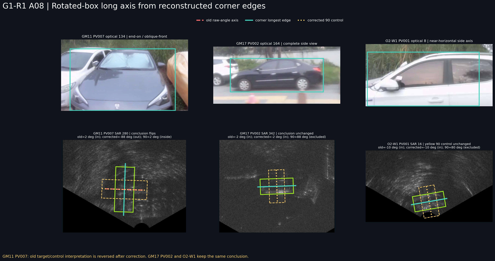

# OTY2-RSA2-G1-R1 旋转框长轴方向语义纠偏

日期：2026-07-18

性质：对既有 G1 方向解释的独立后验纠偏。历史 G1 报告、冻结正向区间、揭示 CSV、负控制 CSV 和 GT 均不改写。

## 1. 错误是什么

G1 先以 `max(width,height)`、`min(width,height)` 得到长短轴长度，却直接将旋转框原始 `angle` 规范到 180° 无向角区间并作为长轴方向。

原始 `angle` 描述的是旋转框 width 边方向。当 height 边更长时，直接使用原始 angle 会把真实长轴旋转错 90°，并同时颠倒目标框与同中心 90° 控制的方向解释。

这属于计算实现和变量语义错误，不是阈值不合适。

## 2. 修正计算合同

本次不再通过 `height > width` 分支直接修补角度，而是统一执行：

1. 从中心、宽、高和原始 angle 重建四个角点；
2. 计算四条相邻边向量和长度；
3. 选择最长边向量；
4. 以 `atan2(dy,dx)` 求该边方向；
5. 将方向规范到 `[-90°,90°)` 的 180° 无向周期。

目标框和 90° 控制使用同一角点—最长边过程。审计表同时保存重建角点、所选边编号、长短边长度和旧/新方向，避免再次依赖 width/height/angle 的含糊组合。

## 3. 审计范围

[完整方向语义审计表](../manifests/oty2/oty2_rsa2_g1_r1_long_axis_semantics_audit.csv) 共 31 行：

- 9 个存在同帧 GT 的 G1 揭示案例及其全部同中心 90° 控制；
- 21 个 G1-R1 视觉审阅中选定的唯一 GT 帧；
- O2-W1 SAR 16 目标框与黄色 90° 控制。

按场景统计的审计行变化：

| 场景 | 审计行 | 长轴相对旧解释旋转 90° |
| --- | ---: | ---: |
| GM_RM011 | 16 | 11 |
| GM_RM017 | 12 | 0 |
| GM_RM019 | 3 | 0 |

这里的行数包含 G1 揭示与 R1 选定案例的不同审计责任，不是唯一 GT 数量。

## 4. G1 揭示计数如何改变

| 指标 | 历史 G1 | 四角最长边修正后 |
| --- | ---: | ---: |
| 目标方向落入冻结 heading 区间 | 9/9 | 8/9 |
| 同中心 90° 控制被 heading 区间排除 | 5/9 | 4/9 |

改变来自 `G1F0020 / GM_RM011:PV007 / SAR 280`：

```text
GT box: width=79.429 px, height=190.707 px, raw angle=2°
历史目标方向: 2°，落入 [-20°,20°]
历史 90° 控制: 92°，被排除

四角最长边目标方向: -88°，不落入 [-20°,20°]
四角最长边 90° 控制: 2°，反而落入 [-20°,20°]
```

因此该案例原来的“目标方向相容且 90° 控制被排除”结论失效。它仍保持 `UNRESOLVED`，且不再提供近水平方向支持。



## 5. 哪些结论不改变

### 5.1 GM17 对照

GM17 审计框的最长边均是 width 边。`PV002 SAR 342` 的旧方向与四角最长边方向均为约 `-2°`，90° 控制约 `88°`，仍被 `[-14°,8°]` 排除。

因此 GM17 两个有界成功案例的方向分量不受本错误影响。它们仍只支持同场景、完整侧视条件下的粗方向相容，不支持跨场景精确角度。

### 5.2 GM19 对照

本次 3 个 GM19 选定 GT 审计行均未发生长轴翻转。GM19 的主要限制仍是阶段定义、截断、窗口不完整和同帧 GT 稀疏，而不是本次方向实现错误。

### 5.3 宽方向域

`[-90°,90°]` 覆盖整个无向角周期。修正前后，目标和 90° 控制都可能同时落入，因此这些案例继续不具方向辨识力。不能把“目标方向被覆盖”写成方向机制成功。

### 5.4 O2-W1 黄色框

O2-W1 SAR 16 的目标框 width 大于 height。四角最长边方向仍为 `-10°`；黄色同中心 90° 框仍为 `80°`。在 `[-20°,20°]` 粗方向区间下，目标相容、黄色框排除，原结论保持成立。

## 6. PV007/PV008 的方向与身份排他

SAR 315 修正后的长轴为：

- PV007：约 `-81°`；
- PV008：约 `-85°`。

二者只差约 4°，所以方向仍不能区分 PV007 与 PV008。身份交换之所以被反驳，来自 optical 151 的左右顺序与 SAR 315 的 theta 顺序一致，而不是来自车辆长轴方向。

应分别记录：

```text
direction_separation = insufficient
pairwise_order_exclusion = supported
```

## 7. 当前研究口径

- 旋转框长轴方向必须由角点最长边计算；
- 历史 G1 方向字段只作为错误发生记录，不继续直接引用；
- G1 的 90° 排除计数修正为 `4/9`；
- `G1F0020` 的方向支持撤回；
- GM17 两个支持案例和 O2-W1 黄色框排除结论保持不变；
- PV007/PV008 仍无法靠方向区分，但可由多车相对顺序排除交换；
- 本纠偏不授权自动响应检测、候选评分、selector、winner 或最终定位。
