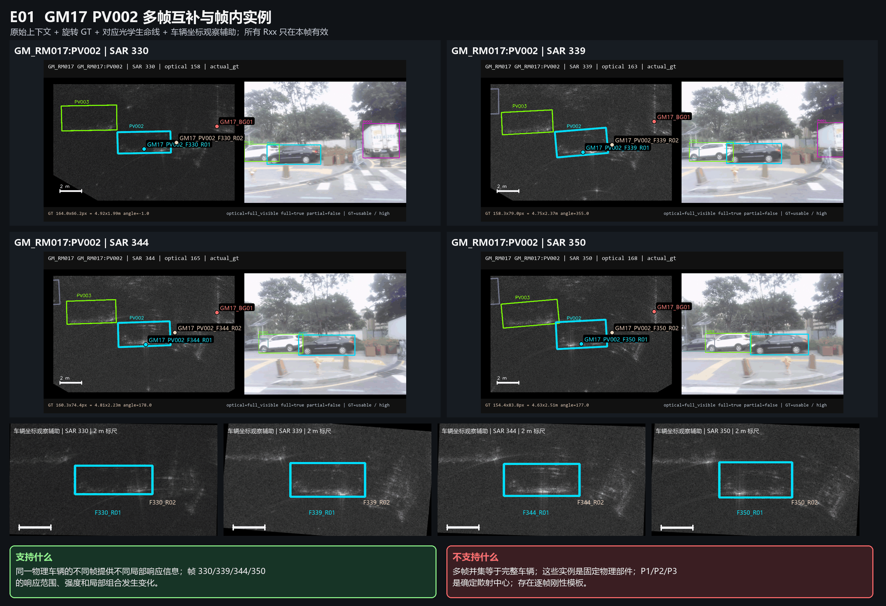
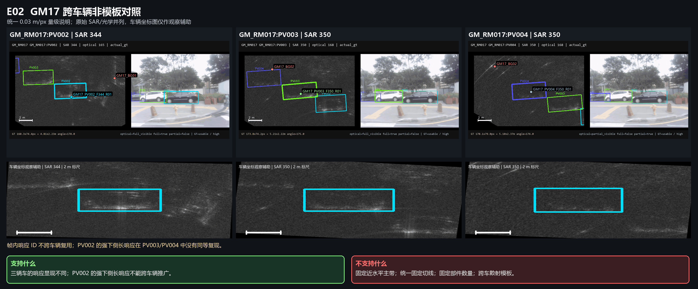
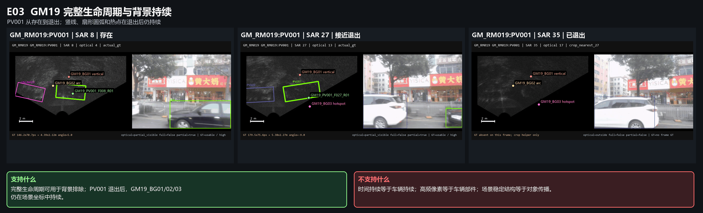
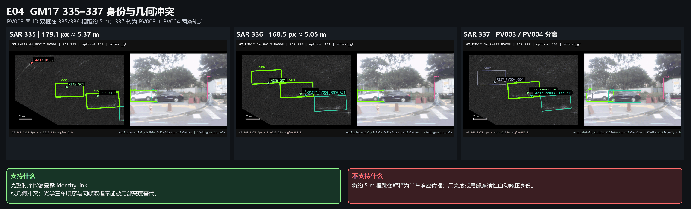
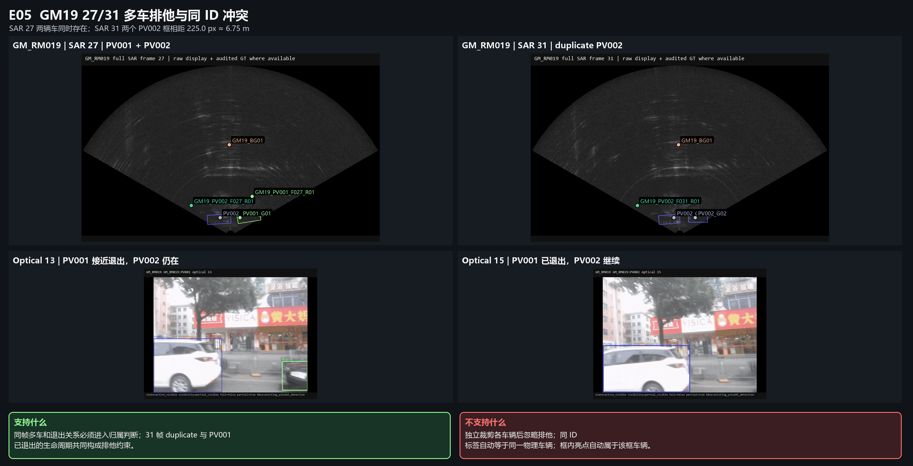
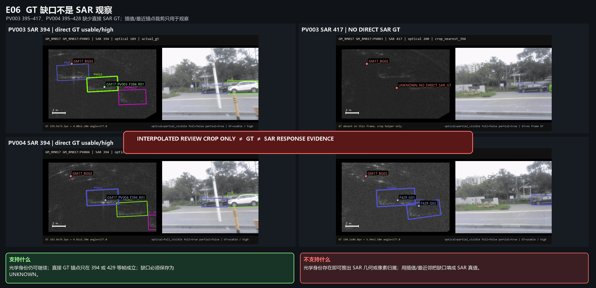
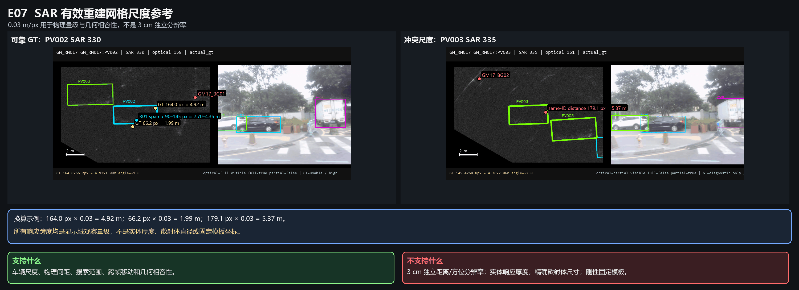

# OTY2-RSA2-O1 核心视觉证据指南

日期：2026-07-18

性质：与 OTY2_RSA2_O1_VEHICLE_RESPONSE_STATE_AND_RELATION_SEMANTICS.md 配套的强制视觉阅读入口。

本指南中的 7 张图是对原始 SAR、光学连续帧、旋转 GT 和 O0 审阅图的标准化排版，不是新的检测、分割、候选、Mask、模板或自动标注。图中的实例编号均为人工帧内中性编号；旋转、裁剪和车辆坐标图只用于观察，原始上下文保留并排。

后续研究不得只读语义文字而跳过这些图。每张图都必须同时读取“支持什么”和“不支持什么”。

## 1. E01 — GM17 PV002 多帧互补与帧内实例

| 项目 | 内容 |
| --- | --- |
| 场景 / 车辆 | GM_RM017 / GM_RM017:PV002 |
| SAR 帧 | 330、339、344、350 |
| 光学帧 | 158、163、165、168 |
| 直接观察 | 同一已知车辆在四帧中都只有局部、不完整响应；下侧长响应、端点能量和较弱局部响应的强度、宽度与组合会改变。图中实例使用 F330_R01、F330_R02、F339_R01 等帧内 ID。 |
| 合理推断 | 可在同一物理车辆上下文中建立 possibly_complementary 或 possibly_alternative_manifestation。 |
| 未知 | 不同帧实例是否来自同一物理散射部件；完整车辆响应边界；背景与车辆混合部分的所有权。 |
| 支持的语义 | 单帧响应实例与跨帧关系必须分开；不同帧可提供不同局部信息。 |
| 不支持的解释 | 多帧并集等于完整车辆；实例是固定物理部件；P1/P2/P3 是确定散射中心；存在逐帧刚性模板。 |
| 对应历史错误 | 把中性 P1/P2/P3 实体化；把车辆坐标相似性写成固定部件或完整对象；多帧并集/交集替代关系解释。 |
| 主要防止重演 | 固定部件、逐帧模板、多帧聚合对象。 |
| 核心图路径 | docs/reviews/assets/20260718_rsa2_o1_canonical/E01_GM17_PV002_MULTIFRAME_COMPLEMENTARITY.png |
| 原始证据路径 | reports/oty2/samples/oty2_rsa2_o0_review_pack_20260718/gm17_pv002_vehicle_coordinate_and_parts.png；reports/oty2/samples/oty2_rsa2_o0_review_pack_20260718/gm17_pv002_sar_302_386_contact_p02.png |

阅读边界：视觉上相近不等于像素所有权相同。裁剪与旋转可能强化相似感，因此原始上下文是结论成立的必要组成。

## 2. E02 — GM17 跨车辆非模板证据

| 项目 | 内容 |
| --- | --- |
| 场景 / 车辆 | GM_RM017 / PV002、PV003、PV004 |
| SAR 帧 | 代表帧 344、350，并回到各车完整审阅范围 |
| 光学帧 | 165、168 及各车生命线上下文 |
| 直接观察 | PV002 可出现强下侧长响应；PV003 更弱、更碎；PV004 未复现同等主带，且斜线/弧线背景更突出。 |
| 合理推断 | 三车响应显现不同；PV002 的长带只能作为该车、该帧范围的局部观察，不能跨车辆推广。 |
| 未知 | 每车局部响应的实体部件名称；跨车辆是否存在更一般但尚未观察到的共同物理机制。 |
| 支持的语义 | different_vehicle_exclusivity；跨车辆比较必须保留车辆身份、强弱差异和背景结构。 |
| 不支持的解释 | 固定近水平主带；统一固定切线；固定部件数量；跨车散射模板。 |
| 对应历史错误 | RSA1-A0 由 PV002 固定切线向 PV003/PV004 推广；把人工 seed 轴预构造段的接受结果写成对象传播。 |
| 主要防止重演 | 固定切线、跨车模板、把局部成功推广成一般车辆响应结构。 |
| 核心图路径 | docs/reviews/assets/20260718_rsa2_o1_canonical/E02_GM17_CROSS_VEHICLE_NON_TEMPLATE.png |
| 原始证据路径 | reports/oty2/samples/oty2_rsa2_o0_review_pack_20260718/gm17_pv002_vehicle_coordinate_and_parts.png；reports/oty2/samples/oty2_rsa2_o0_review_pack_20260718/gm17_pv003_sar_314_417_contact_p02.png；reports/oty2/samples/oty2_rsa2_o0_review_pack_20260718/gm17_pv004_sar_337_446_contact_p01.png |

阅读边界：PV002 的强下侧响应不是“正确车辆都应有”的模板，PV003/PV004 的弱或无主带也不能自动解释为异常。

## 3. E03 — GM19 完整生命周期与背景持续

| 项目 | 内容 |
| --- | --- |
| 场景 / 车辆 | GM_RM019 / PV001；背景实体 GM19_BG01、BG02、BG03 |
| SAR 帧 | 8、27、35，并参考 0–90 全场景 |
| 光学帧 | 4、13、17；PV001 在光学 14 后退出 |
| 直接观察 | PV001 存在、接近退出、已经退出三个状态下，中央竖线、扇形圆弧和近底部热点仍可见；SAR 35 中这些结构仍持续。 |
| 合理推断 | 这些结构具有独立场景背景身份；完整生命周期可形成 background_persistence_conflict。 |
| 未知 | 某些混合热点在车辆存在时的车辆/背景贡献比例。 |
| 支持的语义 | SceneBackgroundStructure 必须成为正式实体；车辆退出可作为背景排除证据。 |
| 不支持的解释 | 时间持续等于车辆持续；高频像素等于车辆部件；场景稳定结构等于对象传播。 |
| 对应历史错误 | component continuity 被误读为部件连续；temporal propagation 被扩大为车辆响应结构传播；最大值/频率图放大背景。 |
| 主要防止重演 | 时序统计实体化、背景被车辆化、把持续性当所有权。 |
| 核心图路径 | docs/reviews/assets/20260718_rsa2_o1_canonical/E03_GM19_LIFECYCLE_BACKGROUND_PERSISTENCE.png |
| 原始证据路径 | reports/oty2/samples/oty2_rsa2_o0_review_pack_20260718/gm19_pv001_sar_0_35_contact_p01.png；reports/oty2/samples/oty2_rsa2_o0_review_pack_20260718/gm19_pv001_sar_0_35_contact_p02.png；reports/oty2/samples/oty2_rsa2_o0_review_pack_20260718/gm19_multivehicle_sar_20_60_contact_p01.png |

阅读边界：背景持续可以否定“持续即车辆”，但不能自动完成每个混合像素的精确分解。

## 4. E04 — GM17 335–337 身份与几何冲突

| 项目 | 内容 |
| --- | --- |
| 场景 / 车辆 | GM_RM017 / PV003、PV004 |
| SAR 帧 | 335、336、337 |
| 光学帧 | 161、162；三车顺序上下文 |
| 直接观察 | PV003 在 335/336 有同 ID duplicate 框，中心约分离 179.1/168.5 px，即约 5.37/5.05 m；337 中 PV003/PV004 框与光学两车上下文分开。 |
| 合理推断 | 完整时序与多车顺序暴露 identity_geometry_conflict；同帧两车不能共用同一局部实例。 |
| 未知 | 哪个历史 link 应被自动修正；PV003 diagnostic-only 框内局部响应的唯一所有权。 |
| 支持的语义 | DUPLICATE_SAME_ID_BOX、IDENTITY_LINK_CONFLICT、MultiVehicleExclusivityRelation。 |
| 不支持的解释 | 把约 5 m 跳变解释为单车响应传播；按亮度或局部连续性自动修正身份。 |
| 对应历史错误 | tracker/GT ID 被当作完整身份真值；身份冲突被局部几何或连续性填平。 |
| 主要防止重演 | 身份偷换、同 ID 即同车、几何冲突被传播解释掩盖。 |
| 核心图路径 | docs/reviews/assets/20260718_rsa2_o1_canonical/E04_GM17_IDENTITY_GEOMETRY_CONFLICT_335_337.png |
| 原始证据路径 | reports/oty2/samples/oty2_rsa2_o0_review_pack_20260718/gm17_pv003_sar_314_417_contact_p01.png |

阅读边界：本图只登记冲突，不授权修改 GT 或生成唯一身份修复结果。

## 5. E05 — GM19 27/31 多车排他

| 项目 | 内容 |
| --- | --- |
| 场景 / 车辆 | GM_RM019 / PV001、PV002 |
| SAR 帧 | 27、31 |
| 光学帧 | 13、15；PV001/PV002 生命周期与退出状态 |
| 直接观察 | SAR 27 是同帧双车上下文；SAR 31 有两个 PV002 框，中心约分离 225 px，即约 6.75 m；局部亮点与背景结构相邻或混合。 |
| 合理推断 | 同帧多车、进入/退出和身份关系必须进入响应归属判断；归属不能在各车独立裁剪中闭合。 |
| 未知 | SAR 31 duplicate 框的自动唯一修复；部分局部响应的唯一车辆所有权；完整响应边界。 |
| 支持的语义 | MultiVehicleExclusivityRelation；IDENTITY_LINK_CONFLICT；LOCAL_RESPONSE_PRESENT_OWNER_UNKNOWN。 |
| 不支持的解释 | 独立裁剪各车后忽略排他；同 ID 自动等于同一物理车辆；框内亮点自动属于该框车辆。 |
| 对应历史错误 | 单目标裁剪掩盖同帧竞争；GT/link 标签被当成像素所有权；车辆退出关系未进入时序解释。 |
| 主要防止重演 | 多车上下文丢失、框内所有权偷换、同 ID 双框自动合并。 |
| 核心图路径 | docs/reviews/assets/20260718_rsa2_o1_canonical/E05_GM19_MULTIVEHICLE_EXCLUSIVITY_27_31.png |
| 原始证据路径 | reports/oty2/samples/oty2_rsa2_o0_review_pack_20260718/gm19_multivehicle_sar_20_60_contact_p01.png；reports/oty2/samples/oty2_rsa2_o0_review_pack_20260718/gm19_pv002_vehicle_coordinate_and_background_risk.png |

阅读边界：E05 说明排他关系必须被表达，不意味着当前证据可以对所有响应做唯一归属。

## 6. E06 — GT 缺口不是 SAR 观察

| 项目 | 内容 |
| --- | --- |
| 场景 / 车辆 | GM_RM017 / PV003、PV004 |
| SAR 帧 | PV003 394、417；PV004 394、429；缺口分别为 395–417、395–428 |
| 光学帧 | 189、200、206；光学生命线继续 |
| 直接观察 | 394 有直接 SAR GT 锚点；随后区间没有直接 SAR GT；417/中段观察裁剪带明确插值/最近锚点水印；PV004 429 恢复锚点但伴随 duplicate。 |
| 合理推断 | 光学可继续支持同车生命线上下文，但 SAR 几何和像素归属必须保持 insufficient_direct_gt。 |
| 未知 | 缺口内精确 SAR 中心、框、方向、局部响应位置、所有权和完整边界。 |
| 支持的语义 | NO_DIRECT_SAR_GT；OPTICAL_PRESENT_SAR_ATTRIBUTION_UNKNOWN；interpolated_review_crop_only 与 GT 严格分开。 |
| 不支持的解释 | 光学身份继续即可插值得到 SAR 真值；最近锚点裁剪等于 GT；裁剪中心等于 SAR 响应证据。 |
| 对应历史错误 | 用光学身份填平 SAR GT 缺口；将观察裁剪误读为真值或响应定位。 |
| 主要防止重演 | GT 缺口填平、跨模态身份到像素所有权的自动推导。 |
| 核心图路径 | docs/reviews/assets/20260718_rsa2_o1_canonical/E06_GT_GAP_IS_NOT_SAR_OBSERVATION.png |
| 原始证据路径 | reports/oty2/samples/oty2_rsa2_o0_review_pack_20260718/gm17_pv003_sar_314_417_contact_p03.png；reports/oty2/samples/oty2_rsa2_o0_review_pack_20260718/gm17_pv003_sar_314_417_contact_p04.png；reports/oty2/samples/oty2_rsa2_o0_review_pack_20260718/gm17_pv004_sar_337_446_contact_p02.png；reports/oty2/samples/oty2_rsa2_o0_review_pack_20260718/gm17_pv004_sar_337_446_contact_p04.png |

阅读边界：插值裁剪只维持观察连续性，不补充任何 SAR 真值。

## 7. E07 — SAR 米制网格尺度口径

| 项目 | 内容 |
| --- | --- |
| 场景 / 车辆 | GM_RM017 / PV002、PV003 |
| SAR 帧 | 330、335，并引用冲突距离量级 |
| 光学帧 | 158、161 |
| 直接观察 | 可靠车辆 GT 的长短轴可按 0.03 m/px 换算到车辆量级；局部响应可记录显示跨度；PV003 同 ID 框约相距 5.37 m。 |
| 合理推断 | 0.03 m/px 可用于车辆尺度、物理间距、搜索范围、移动量级和几何相容性记录。 |
| 未知 | 真实独立距离/方位分辨率；亮带厚度对应的实体厚度；热点对应的精确散射体尺寸。 |
| 支持的语义 | 有效 SAR 重建显示网格尺度；米制区间和相容量级。 |
| 不支持的解释 | 3 cm 独立分辨率；实体响应厚度；精确散射体尺寸；刚性固定模板。 |
| 对应历史错误 | 将显示网格误写成独立分辨率；将几何换算用于固定模板或物理部件尺寸断言。 |
| 主要防止重演 | 尺度过度解释、毫米/厘米刚性模板、用米制相容性代替物理身份。 |
| 核心图路径 | docs/reviews/assets/20260718_rsa2_o1_canonical/E07_SAR_METRIC_GRID_SCALE_REFERENCE.png |
| 原始证据路径 | reports/oty2/samples/oty2_rsa2_o0_review_pack_20260718/gm17_pv002_vehicle_coordinate_and_parts.png；reports/oty2/samples/oty2_rsa2_o0_review_pack_20260718/gm17_pv003_sar_314_417_contact_p01.png |

阅读边界：米制换算是物理量级说明，不产生模板、检测规则或自动归属。

## 8. 联合阅读规则

七张图不能互相替代：

- E01 负责“同车不同帧的信息不同”，不负责证明同一部件。
- E02 负责“跨车不能模板化”，不负责提出新的跨车模型。
- E03 负责“背景有独立生命周期”，不负责像素级背景分解。
- E04 负责“身份/几何冲突必须保存”，不负责自动修复。
- E05 负责“多车排他必须入结构”，不负责唯一分配。
- E06 负责“GT 缺口保持未知”，不负责插值。
- E07 负责“尺度口径”，不负责独立分辨率或刚性匹配。

图像元数据、源路径、SHA-256 和大小见：

docs/reviews/assets/20260718_rsa2_o1_canonical/canonical_evidence_manifest.csv

帧级状态、关系、反证和未知见：

- manifests/oty2/oty2_rsa2_o1_state_relation_examples.csv；
- manifests/oty2/oty2_rsa2_o1_counterexample_ledger.csv。

任何后续解释若只引用图中“支持”而跳过“不支持”，或只引用车辆坐标裁剪而跳过原始上下文，均不符合 O1。
