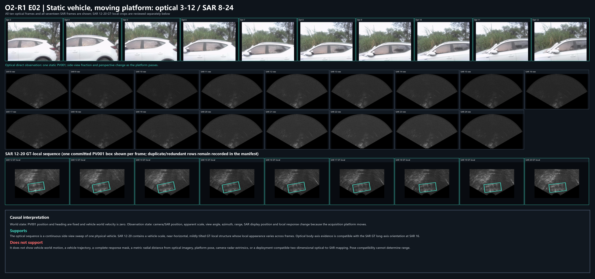
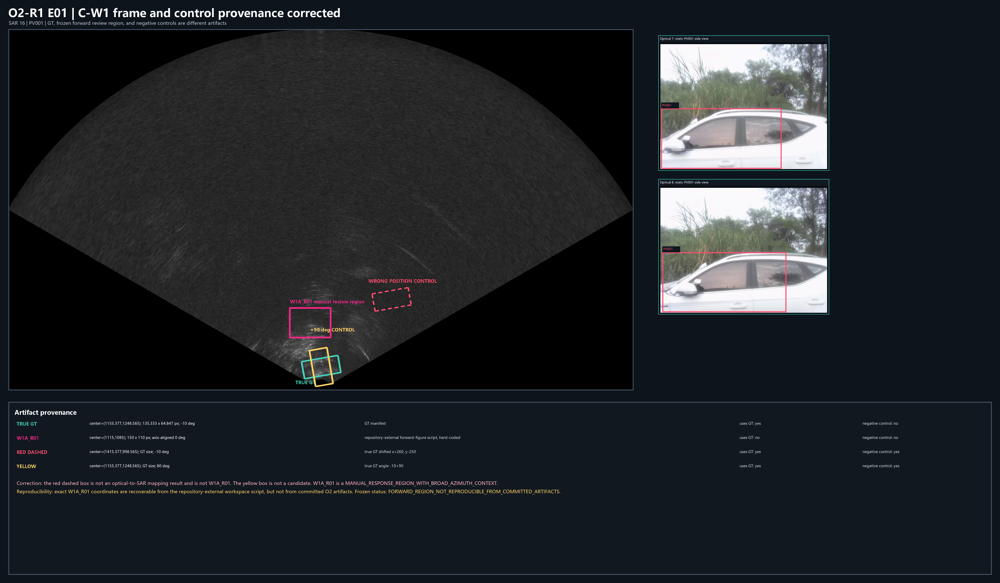
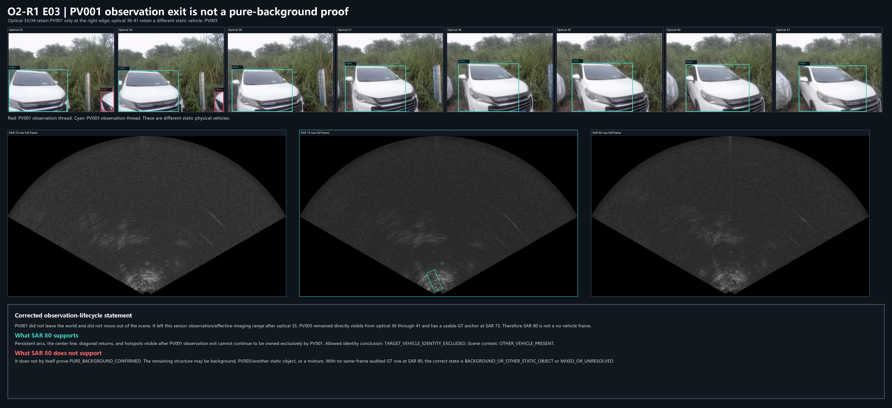

# OTY2-RSA2-O2-R1 静止场景采集事实与 O2 因果解释纠偏合同

日期：`2026-07-18`
状态：`O2_DIAGNOSED_MISSING_STATIC_WORLD_GEOMETRY`

## 1. 文件性质与边界

本文件登记 GM_RM011、GM_RM017、GM_RM019 的静止车辆采集事实，纠正此前把平台自运动诱导表观变化写成车辆运动、车辆轨迹或车辆世界进入/退出的解释，并修订 OTY2-RSA2-O2 的科学含义。

本文件不删除或覆盖历史文档，不修改 O2 正向冻结产物，不修改 GT，不提出定位算法，不授权候选生成、评分、阈值、selector、Mask、响应传播、INS 融合、多普勒处理或自动标注。

## 2. 用户确认的采集设计事实

用户确认：GM_RM011、GM_RM017、GM_RM019 中所有车辆均为静止车辆。发生运动的是搭载光学相机与毫米波雷达/SAR 采集系统的平台。

该事实是采集设计事实，不是依据图像临时推测的假设。对任一车辆：

```text
P_vehicle_world = constant
heading_vehicle_world = constant
velocity_vehicle_world = 0
```

世界中没有车辆轨迹需要传播。随时间改变的是静止车辆在移动平台、相机、雷达与 SAR 显示坐标中的投影。

## 3. 世界状态与观测状态必须分开

| 层级 | 固定或变化 | 当前允许解释 |
| --- | --- | --- |
| 车辆世界位置 | 固定 | 同一车辆在世界中不平移 |
| 车辆世界航向 | 固定 | 同一车辆车身方向不随采集帧变化 |
| 车辆世界速度 | `0` | 不存在车辆自身运动证据 |
| 平台世界位置与姿态 | 随时间变化 | 需要平台轨迹或逐帧位姿才能形成度量坐标链 |
| 相机图像位置、尺度与视角 | 随时间变化 | 平台自运动诱导的表观变化 |
| 雷达坐标中的方位与距离 | 随时间变化 | 静止目标在移动雷达坐标中的时变投影 |
| SAR 图像中的表观位置与方向 | 随时间变化 | 成像与坐标投影结果，不等于车辆世界运动 |
| 可见、截断、遮挡、准入/准出 | 随平台位置与遮挡关系变化 | 观测生命周期，不是车辆世界生命周期 |

后续文档必须优先使用：

- `观测生命周期`；
- `视场准入/准出`；
- `有效成像区域准入/准出`；
- `平台自运动诱导的表观变化`；
- `静止世界目标在传感器坐标中的时变投影`；
- `观测主体切换`。

不得继续笼统使用：

- 车辆运动；
- 车辆进入/退出世界场景；
- 车辆轨迹传播；
- 车辆响应沿图像运动。

## 4. “车辆生命周期”修订为“观测生命周期”

O1/O1-R1/O2 中的进入、退出和背景持续关系仍有约束价值，但其物理语义必须修订：

- PV001 世界中没有“退出”；它只在 optical 35 后退出当前传感器视场或有效成像观测范围；
- 后续出现的是其他静止车辆进入移动传感器的观测范围；
- 不同物理车辆的观测线程不能因为画面连续而合并；
- 某 SAR 结构在 PV001 观测退出后持续，只能排除 PV001 的持续所有权，不能自动证明该结构为纯背景。

## 5. SAR 16 与 optical 3–12 的直接复核



直接打开 optical 3–12、SAR 8–24 及 SAR 12–20 GT 局部连续裁剪后确认：

1. optical 3–12 为同一辆 PV001 的连续侧向多视角观察；车辆车身长轴稳定，画面中可见比例、尺度和视角随平台经过而变化；
2. SAR 16 采用的 PV001 GT 为中心 `(1155.377, 1248.565)`、尺寸 `(135.333, 64.847) px`、角度 `-10°`；
3. GT 内存在车辆尺度、近水平、轻微倾斜的局部结构，但 GT 不是车辆响应 Mask；
4. 光学侧向车身长轴与 SAR 16 GT 的近水平长轴在姿态层面相容；
5. 这种姿态相容不能单独决定雷达径向距离，不能给出 SAR 二维中心，也不能把光学姿态变成刚性模板。

## 6. C-W1 中四种框的来源必须分开



| 图层 | 精确几何 | 来源 | 使用目标 GT | 负控制 | 当前语义 |
| --- | --- | --- | --- | --- | --- |
| 青色框 | 中心 `(1155.377,1248.565)`；`135.333 × 64.847 px`；`-10°` | SAR 16 PV001 真实 GT | 是 | 否 | 研究期真实几何参考，不是响应 Mask |
| `W1A_R01` | 矩形 `(1040,1030)–(1190,1140)`；中心 `(1115,1085)`；`150 × 110 px`；轴对齐 `0°` | 仓库外工作区 `build_forward_figures.py:57` 人工硬编码 | 否 | 否 | `MANUAL_RESPONSE_REGION_WITH_BROAD_AZIMUTH_CONTEXT` |
| 红色虚线框 | GT 中心 `x+260, y-250`，即约 `(1415.377,998.565)`；GT 尺寸和 `-10°` | GT 人为平移 | 是 | 是 | 错误位置负控制；不是正向预测或映射结果 |
| 黄色框 | GT 中心和尺寸不变；角度 `-10+90=80°` | GT 原中心旋转 90° | 是 | 是 | 错误方向负控制；不是候选结果 |

`W1A_R01` 没有使用深度、距离、光学车辆姿态、平台位姿、相机—雷达外参或完整二维光学→SAR 公式，也没有使用 `11.809661°`。O2 正向 CSV 只记录“约 `150 × 110 px`”，没有中心、方向或四角，因此精确区域不能从已提交冻结产物独立恢复。当前状态为：

```text
FORWARD_REGION_NOT_REPRODUCIBLE_FROM_COMMITTED_ARTIFACTS
```

工作区生成脚本仍可追溯其精确硬编码坐标，但该脚本不属于冻结提交产物。

## 7. SAR 80 的背景结论降级



直接复核 optical 33/34、36–41 与 SAR 70/73/76–84 后确认：

- optical 33/34 中 PV001 仅保留在右侧边缘，PV003 为画面主要车辆；
- optical 35 是 PV001 的观测退出帧；
- optical 36–41 中 PV001 已不在当前观测范围，但静止车辆 PV003 仍直接可见；
- SAR 73 存在 PV003 usable GT；当前审计 manifest 在 SAR 80 没有同帧目标 GT 行；
- SAR 80 不是无车辆或纯背景控制帧。

SAR 80 可以支持：

- `TARGET_VEHICLE_IDENTITY_EXCLUDED`：持续结构不能继续独占归属 PV001；
- `OTHER_VEHICLE_PRESENT`：同一观测阶段仍有 PV003；
- 在具体结构无法区分时使用 `BACKGROUND_OR_OTHER_STATIC_OBJECT` 或 `MIXED_OR_UNRESOLVED`。

SAR 80 不能未经进一步证据直接支持：

- `PURE_BACKGROUND_CONFIRMED`；
- 所有持续结构都是背景；
- 所有持续结构都属于 PV003。

## 8. `11.809661°` 的准确来源

该数值不是 GM_RM011 的“历史预测角”。它是 optical 5 / SAR 10 历史旧线性方位模型的中心残差：

```text
old_linear_pred_theta_deg   = -14.683983642
sar_gt_center_theta_deg     =  -2.874323000
old_linear_center_error_deg = -11.809660642
```

当前真实存在的历史方位公式是：

```text
theta_SAR_display_deg = 0.0875154 * x_optical_reference_center_px - 40.413555
```

它只输出 SAR 显示扇区方位，不包含距离、车辆姿态、平台位姿、相机内参或相机—雷达外参；参数来自历史 GT/光学锚点审计，状态仍为 `MAPPING_BLOCKED`，不是部署兼容二维变换。

## 9. O2 `BIDIRECTIONALLY_CLOSED=0` 的修订解释

O2 的计数结果可以保留：13 个正向实例中 `BIDIRECTIONALLY_CLOSED=0`。但 O2 实际测试的输入是：

- 光学身份；
- 观测生命周期；
- 操作性时间映射；
- 宽方位代理；
- 人工选择的 SAR 响应审阅区；
- GT 揭示后的逆向与负控制。

O2 没有使用静止车辆世界位置、固定世界航向、平台逐帧位姿/轨迹、相机内参、相机—雷达外参、可靠径向距离或完整二维 SAR 投影。因此不得把 `BIDIRECTIONALLY_CLOSED=0` 扩大解释为“完整光学—SAR 联合假设的强版本失败”。

当前允许解释为：

> O2 暴露了静止世界二维几何链缺失。正确车辆身份与观测生命周期可以排除部分跨车和退出后错误，但不能单独替代距离、二维位置和平台坐标变换。

冻结状态：

```text
O2_DIAGNOSED_MISSING_STATIC_WORLD_GEOMETRY
```

## 10. 不能从 O2 推出的结论

O2-R1 不支持以下结论：

- SAR 响应本身不可解释；
- 光学身份或完整观测生命周期没有作用；
- 光学姿态对 SAR 方向没有约束作用；
- 完整静止世界几何链已经被实现并失败；
- 红色平移框是光学→SAR 预测；
- `W1A_R01` 是公式生成的几何框；
- SAR 80 是纯背景帧；
- `11.809661°` 是预测方位；
- 当前已有部署兼容二维光学→SAR 映射。

## 11. 后续静态几何研究边界

后续只可先审计世界、平台、相机、雷达和 SAR 显示坐标链所需资产、公式、时间基准与标定缺口。O2-R1 不授权实现求解、定位、候选、打分、阈值、传播、Mask 或自动标注。
