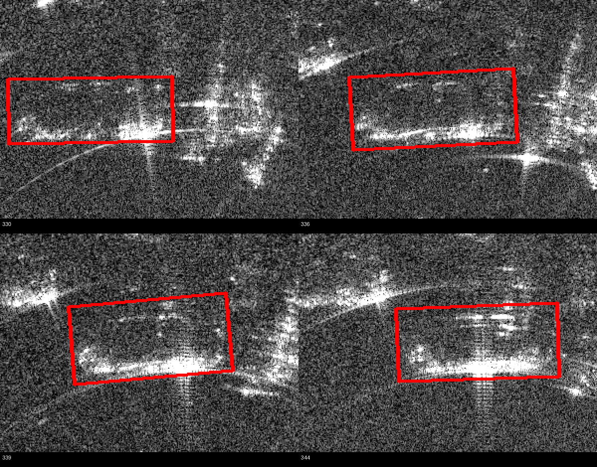
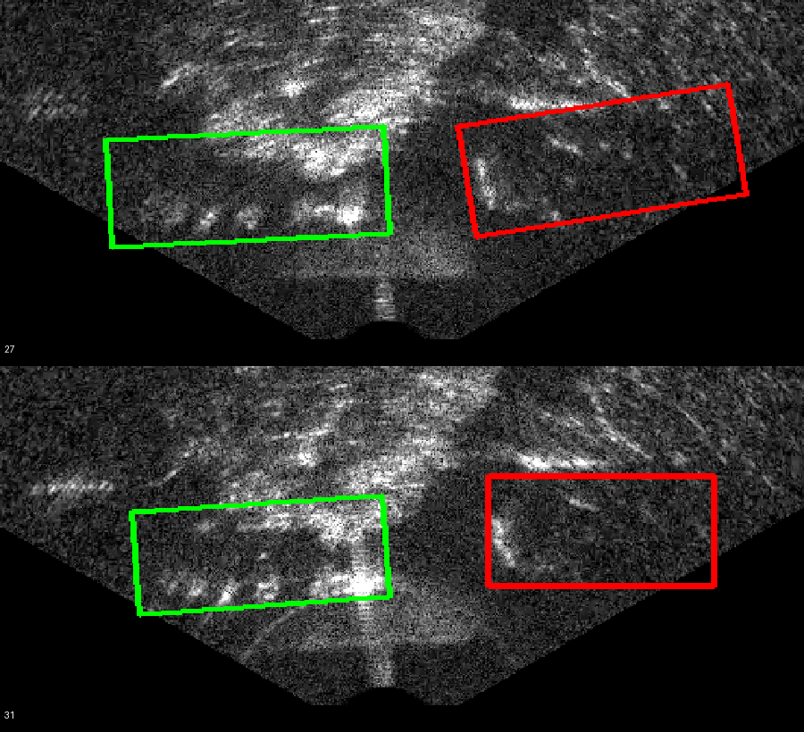

# OTY2 SAR 路线错误与遗漏全量深度复盘（2026-07-18）

> **文档性质：**全量错误与遗漏深度复盘；当前研究纠偏依据。
>
> **实施边界：**本文不包含下一步实现方案，不授权新的算法设计、实验、阈值调整、候选生成、打分、排序或自动标注实现。
>
> **冲突处理：**与旧文档冲突时，以本复盘中的纠偏解释作为当前研究口径；旧文档继续作为历史过程记录保留，不应被误读为当前已经成立的科学结论。

**DOCX 到 Markdown 转换完整性检查**

- 原始文件：`docs/reviews/source/OTY2_SAR路线错误与遗漏全量深度复盘_20260718.docx`
- 原始文件 SHA256：`737BF6754A56D182F1330B2CC052BD4A0F14A48D781DC116DD903E308A6D80CF`
- 原始页数：33 页（Microsoft Word 统计）。
- 原始章节数：23 个一级章节（复盘摘要、目录、正文十八章、附录 A/B/C）；63 个二级章节。
- Markdown 章节数：原始正文对应的 23 个一级章节和 63 个二级章节均已转换；本页标题与本检查说明属于仓库入库说明，不计入原始章节。
- 表格：原始 26 张，已转换 26 张；未转换表格 0 张。
- 图片与图注：原始内嵌图片 2 张，已按原始字节提取并在原位置引用；对应图 1、图 2 图注均保留；丢失图片或图注 0。
- 无法可靠转换的正文段落：0。正文段落、列表、标题和表格单元格均可从 OOXML 结构可靠提取。
- 转换限制：Markdown 不保留 Word 分页、页眉重复位置、页脚页码和目录页码版式。Word 已确认原件为 33 页；本机 Word PDF 导出持续挂起，因此未完成逐页 PDF/PNG 版式复核。两张内嵌证据图已逐图核对。

---

**OTY2 光学时序辅助毫米波 SAR 标注研究**

**错误、遗漏与认知偏差 全量深度复盘**

*冻结范围：OTY2-RSA1-A0 及此前研究链路｜补充 GM_RM017 / GM_RM019 SAR 实图审阅*

**文档性质：问题清算与研究史纠偏记录**

<!-- source-table: 01 -->
| **范围声明** 本文件只复盘已经发生的错误、被忽略的信息、概念偷换、证据误用和研究流程失真。本文不提出下一步算法、不安排新实验、不生成 Codex 提示，也不以“如何继续”为结尾。 |
| --- |

仓库：ccj-bot/optical-sar-visual-diagnosis 分支：feature/oty2-sar-gt-structure-foundation 冻结 HEAD：76ade12f13f802b1e853c521922c7814b09b2fe7 补充图像：GM_RM017 SAR 330–350；GM_RM019 SAR 20–60 复盘日期：2026-07-18 

**内部研究记录｜非论文结论｜非部署能力声明**

## 复盘摘要

本轮复盘的核心结论不是“现有算法还不够好”，而是：研究问题在多轮实现中被不断替换为更容易编码、验证和汇报的代理问题。用户原始设想是利用光学侧同车身份、完整生命线、相邻与非相邻帧之间的约束、车辆方向与尺度、深度变化、多车竞争和 SAR 的高帧率连续观测，共同解释同一辆物理车辆在 SAR 中稀疏、分裂、间歇出现的响应，并最终支撑自动或半自动标注。实际研究却多次退化为像素通道比较、阈值筛选、亮点频率、局部相关性、固定种子和直线段延伸。代理任务有时能得到干净指标，但并未真正检验原始研究假设。

对 0.03 m/px 的处理是一个典型错误。此前将“成像网格采样间隔不等于真实分辨率”错误扩大为“不能作为物理尺度”，导致 GT 中已经存在的车辆长、宽、方向和跨帧运动没有进入物理建模。补充审阅显示，GM_RM017 和 GM_RM019 多辆车的旋转 GT 尺寸乘以 0.03 m/px 后稳定落在正常车辆尺度，且车辆从图像左侧向右侧移动时框尺寸没有发生普通透视图像式的剧烈缩放。这足以支持在当前固定成像配置中把 0.03 m/px 视为有效的重建坐标物理网格尺度，同时继续区分它与真实空间分辨能力。

对“完整时序”的理解同样发生了根本性偏差。完整时序不等于把一组帧堆叠后计算频率、均值、最大值或相关性，也不等于给单帧候选增加一个 temporal score。相邻帧、几帧短窗、中等窗口和完整生命线承担不同约束：相邻帧限制突跳，短窗提供响应部件的互补显现，中窗建立车辆自身坐标和稳定部件关系，完整生命线解决身份归属、多车排他、遮挡维持、主体切换和退出。现有实现基本没有完成这种分层联合。

GT 原本使本项目成为“知道题目和答案的开卷机制发现”。然而为避免评价泄漏，研究逐渐把 GT 降格为中心对齐和事后指标，未充分使用旋转框的长、宽、角度、身份和连续帧关系去发现车辆坐标中的稳定响应结构。这不是严谨，而是把“部署期不能使用 GT”错误扩展为“研究期不能借助 GT 理解机制”。结果是最有价值的答案被保留在表格中，算法反而使用人工种子切线来近似车辆轴线。

RSA1-A0 的“部分支持”必须降格解释。代码预先沿人工种子切线构造共线线段，图像通道只负责接受或拒绝这些既定线段；连通性主要由构造保证。背景安全依赖逐帧人工垂直障碍线和人工歧义区硬否决。PV002 的局部通过只说明：在人工给定种子、方向、背景障碍和歧义区域后，固定直线探针在部分帧上能通过门控；PV003 完全不复现则直接暴露固定一维切线表达不足。零背景污染主要证明人工硬禁区生效，不能证明自动背景识别或响应对象传播成立。

因此，当前负面证据否定的是若干代理实现，而不是用户提出的“物理尺度 + 完整光学时序 + 多帧互补 + 身份约束能够帮助 SAR 标注”这一原始研究灵感。原始灵感至今并未被完整地实现和检验。

<!-- source-table: 02 -->
| **总判定** 本项目的主要损失不是某个阈值选错，而是“信息被逐层压扁”：米制几何被压成像素，车辆对象被压成亮点，完整时序被压成短窗统计，身份生命线被压成少量锚点，GT 开卷答案被压成中心对齐，物理结构被压成固定切线段。 |
| --- |

## 目录

一、复盘范围、证据层级与审阅边界

二、原始研究问题与实际代理问题的分离

三、0.03 m/px 物理尺度问题：一次过度保守造成的基础性偏差

四、完整时序被误解为通道聚合：多帧互补关系的丢失

五、光学同车生命线未闭合，却被反复当作已知输入

六、GT“开卷答案”被错误降格：研究期发现与部署期禁用的混淆

七、SAR 响应对象的连续误定义：框、Mask、亮点、骨架与对象之间的偷换

八、从 S1X 到 RSA0：高精度低召回被误读、术语被放大、失败被后置

九、RSA1-A0 代码与结论的逐项法证复盘

十、坐标系、映射与几何：把“不完美”误判为“不可使用”

十一、工程可复现性与科学有效性被混为一谈

十二、被忽略或未充分使用的信息总表

十三、错误如何形成连锁：两条研究漂移因果链

十四、术语纠偏账本：原名称与实际含义

十五、截至冻结点真正成立与尚未成立的事实

十六、研究协作与推理过程自身的错误

十七、全量错误登记表

十八、冻结结论：原始假设仍未被完整检验

附录 A：仓库证据索引

附录 B：补充图像审阅记录

附录 C：选定 GT 物理尺度换算

## 一、复盘范围、证据层级与审阅边界

### 1.1 冻结对象

本复盘覆盖仓库从路线重置、P0 数据基础、S0/S0-M 几何与 GT 审计、光学时序机制讨论、S1X 支撑恢复、RSA0 响应对象语义重置，到 RSA1-A0 人工种子引导微型试验的完整链路。冻结代码点为 76ade12f13f802b1e853c521922c7814b09b2fe7。复盘不修改仓库，也不将任何现阶段状态自动解释为后续实施授权。

补充证据来自用户本轮上传的两个压缩包：GM_RM017 场景 SAR 330–350 帧，共 21 张；GM_RM019 场景 SAR 20–60 帧，共 41 张。图像编号直接对应 SAR 帧号。复盘期间将仓库 GT 条目叠加到若干代表帧上，用于检查车辆尺度、响应位置和多帧互补现象。

### 1.2 证据分层

<!-- source-table: 03 -->
| **层级** | **证据类型** | **本复盘中的用途** | **限制** |
| --- | --- | --- | --- |
| A | 直接代码与配置 | 判断算法实际做了什么，而不是报告如何命名 | 不能单独证明视觉语义正确 |
| B | 仓库报告、协议、清单与 GT 表 | 还原研究承诺、阶段结论、输入来源与统计 | 报告中的视觉结论需与实图区分 |
| C | 本轮上传 SAR 实图与 GT 叠加 | 直接判断尺度、位置、跨帧响应差异和背景混合 | 只覆盖 GM17 330–350 与 GM19 20–60 |
| D | 用户长期反复陈述的研究目标与约束 | 判断实现是否偏离原问题 | 不是算法结果，但决定研究问题是否被正确实现 |

### 1.3 本次与上一轮复盘的差异

上一轮因无法访问 D 盘图像，只能依据代码、清单和仓库书面视觉记录进行法证。这一限制导致部分判断仍停留在“没有权威成像链，所以不能确认米制尺度”的审计口径。本轮获得真实 SAR 帧后，可以直接检查 GT 框与图像、跨帧位置和尺寸的一致性。因此，本文件明确撤回“0.03 m/px 不能作为物理尺度”的过度结论，并进一步把实图中可见的多帧互补响应纳入复盘。

### 1.4 复盘纪律

- 不把状态名、PASS、可复现哈希或干净工作树当成科学证据。

- 不因方法失败而推断原始研究灵感失败。

- 不把研究期使用 GT 发现结构，与部署期依赖 GT 混为一谈。

- 不将“无法严格证明”自动改写成“不得使用”。

- 不在本文件中提出后续路线、算法或实验。

## 二、原始研究问题与实际代理问题的分离

### 2.1 原始问题不是单帧分割

原始研究问题可以还原为：在光学和毫米波 SAR 都是同步时间序列、SAR 帧率更高、车辆具有真实物理尺寸和持续身份、SAR 响应稀疏且会随成像条件在不同部位间歇出现的前提下，能否利用光学同车生命线及其前后关联，约束 SAR 中对应车辆的存在、位置、方向、尺度、响应归属和标注范围。

其中，“完整时序”不是一个附加特征，而是问题定义的一部分。车辆可能在世界坐标中近似静止，但因为传感器扫描、平台运动、视场边界和成像过程，在光学和 SAR 图像中产生进入、移动、遮挡、局部显现和退出。研究对象始终是同一辆物理车辆，而不是每帧独立亮斑。

### 2.2 实际代理问题逐步变成了什么

<!-- source-table: 04 -->
| **原始对象** | **逐步被替换为** | **损失的信息** |
| --- | --- | --- |
| 同一辆物理车辆的完整生命线 | 少量配对帧、短窗口或锚点 | 身份连续性、遮挡维持、主体切换、退出 |
| 车辆尺度与方向 | 像素壳层、中心偏移或人工种子切线 | 车长、车宽、车辆自身坐标、部件相对位置 |
| 多帧互补观测 | 频率、均值、最大值、NCC、阈值面积 | 不同帧各自贡献的部件及其关系 |
| 稀疏多部件响应对象 | 亮像素子集、连通分量、骨架或共线段 | 潜在对象、缺失部件、部件间物理约束 |
| 多车身份与排他 | 人工 seed 或已选定 GT 对齐对象 | 自动归属、竞争、错车风险 |
| 研究期机制发现 | 无泄漏评价管线 | 利用答案理解机制的能力 |

### 2.3 根本偏差：把“能计算什么”当成“应该研究什么”

多轮实现的共同模式是：先从代码便利性出发选择可计算量，再把这些量命名为“支撑”“对象”“物理事件”或“传播”。当用户提出车辆长度、方向、前后帧互补、同车完整生命线和 GT 开卷机制发现时，实际实现往往只吸收其中最容易编码的一部分，例如中心、局部相关性、亮度、面积或固定方向。语义上似乎响应了用户，计算上却没有实现其核心关系。

<!-- source-table: 05 -->
| **关键错误** 研究没有因为缺少数据而停止，而是在数据和答案已经存在时，把高层关系压成低层统计。问题不是“1+1 是否大于 1.5”的性能比较，而是从未真正构造用户所说的那个 1+1。 |
| --- |

## 三、0.03 m/px 物理尺度问题：一次过度保守造成的基础性偏差

### 3.1 原判断的错误位置

此前判断正确地区分了“像素网格采样间隔”和“系统真实分辨率”，但随后错误地把这一谨慎扩大为：0.03 m/px 不能直接作为物理距离使用，meter 字段应保持空白，车辆尺度不能进入正式推理。这个推导不成立。

只要当前 SAR 图像由固定成像坐标网格生成，0.03 m/px 就可以作为该重建图中的绝对米制坐标换算。它未必意味着两个相距 3 cm 的散射体可以被独立分辨，也未必等于系统的距离分辨率或方位分辨率，但它仍然规定了图上位置、长度、宽度、位移和搜索范围的物理量纲。

### 3.2 实图与 GT 尺度的一致性

<!-- source-table: 06 -->
| **场景** | **车辆** | **SAR帧** | **GT长×宽（px）** | **按0.03换算（m）** |
| --- | --- | --- | --- | --- |
| GM_RM017 | PV002 | 330 | 164.000 × 66.194 | 4.920 × 1.986 |
| GM_RM017 | PV002 | 339 | 158.313 × 78.952 | 4.749 × 2.369 |
| GM_RM017 | PV002 | 344 | 160.347 × 74.382 | 4.810 × 2.231 |
| GM_RM017 | PV003 | 340 | 167.553 × 76.508 | 5.027 × 2.295 |
| GM_RM019 | PV001 | 27 | 179.453 × 75.617 | 5.384 × 2.269 |
| GM_RM019 | PV002 | 27 | 182.277 × 72.100 | 5.468 × 2.163 |
| GM_RM019 | PV002 | 31 | 163.923 × 68.652 | 4.918 × 2.060 |

多辆车、多个帧的旋转框换算后均稳定落在正常乘用车或较大车辆的物理量级。GM17 PV002 在图中持续向右移动，但长宽大体保持在约 4.7–5.1 m 和 1.9–2.4 m 的范围，并未出现普通透视图像中因左右位置变化造成的剧烈尺度变化。这一事实与“固定米制重建网格”高度一致。

### 3.3 “绝对尺度”应怎样准确表述

<!-- source-table: 07 -->
| **说法** | **判定** | **原因** |
| --- | --- | --- |
| 0.03 m/px 是当前重建图坐标中的米制网格尺度 | 成立 | 可用于长度、宽度、位移、物理邻域和跨帧几何 |
| 0.03 m/px 等于系统能分辨 3 cm 目标间隔 | 不成立 | 采样间隔不等于点扩散宽度和真实分辨率 |
| 缺少上游权威配置，所以完全不能使用 0.03 m/px | 错误 | 缺少链路证明影响不确定度声明，不应抹掉强实证一致性 |
| GT 尺寸与真实车辆量级高度一致，可以作为物理先验 | 成立 | 跨车、跨帧一致，不是单个偶然样本 |

### 3.4 该错误造成的连锁损失

- 车辆长宽被留在像素字段中，没有转化为可比较的米制车体范围。

- GT 旋转框没有自然地转化为车辆自身坐标系。

- 部件间距无法用“距车头、车尾、长轴、短轴多少米”描述，只能用局部像素关系。

- 搜索窗口、背景隔离和跨帧位移被迫依赖经验像素阈值。

- 跨车辆比较失去尺度归一化，最终退化为亮度、面积和相关性比较。

- 人工 seed 切线被用来代替本可由旋转 GT 和车辆尺度提供的结构方向。

<!-- source-table: 08 -->
| **纠错记录** 此前“不能把 0.03 m/px 当作物理尺度”的结论应撤回。正确的限制是：它可作为固定重建网格的绝对米制坐标尺度，但不能被夸大为 3 cm 的独立物理分辨能力。 |
| --- |

## 四、完整时序被误解为通道聚合：多帧互补关系的丢失

### 4.1 “时序”在现有实现中的常见退化

现有工作多次使用 temporal frequency、世界稳定栈、GT 对齐栈、邻帧 NCC、前后向重复或短窗支持等形式。这些计算并非没有价值，但它们大多将时序压成每个像素或固定几何位置的统计量。它们回答的是“这个位置在多帧中是否经常亮、是否相似”，而不是“不同帧显示了同一车辆的哪些不同部件，以及这些部件如何共同约束一个潜在车辆响应体”。

用户反复强调的重点是前后关联带来的约束：每几帧提供不同信息，这些信息能否联合起来。该问题要求保留帧与帧之间的角色差异，而不是在聚合后消去差异。

### 4.2 四个时间尺度承担不同任务

<!-- source-table: 09 -->
| **时间层级** | **真正提供的约束** | **现有工作主要做成了什么** | **丢失内容** |
| --- | --- | --- | --- |
| 相邻 1–2 帧 | 限制中心、方向、尺度和部件位置的非物理突跳 | 相同位置或固定段的相关性 | 对象状态转移与局部部件接续 |
| 短窗 3–7 帧 | 不同响应部件轮流显现并互相补全 | 频率、最大值、交集/并集式支持 | 每帧贡献了什么、缺失意味着什么 |
| 中窗 10–30 帧 | 建立稳定车辆自身坐标、长短轴和部件相对关系 | 局部 atlas 或少量锚点窗口 | 米制结构与车辆级稳定性 |
| 完整生命线 | 身份归属、多车排他、遮挡维持、主体切换、退出 | 少量确认线程或人工选择窗口 | 全局最优和错误回溯 |

### 4.3 GM17 实图直接显示“多帧互补”

<!-- source-image: media/image1.png -->

图 1  GM_RM017 PV002：SAR 330、336、339、344 帧及对应旋转 GT。四帧中的强响应位置和完整程度不同，但框的车辆尺度与整体位置关系稳定。

在 GM17 PV002 的四个代表帧中，框内响应并不是一个稳定的致密区域：某些帧右侧和下侧更强，某些帧中央下方形成连续带，另一些帧左侧热点、上方短段或右端局部更明显。任一单帧都不足以描述完整车辆响应；多帧也不能简单取交集，因为那只会保留极少的稳定亮点；简单取并集则会吸收背景。真正的信息是“各帧显现的部件不同，但这些部件在稳定车辆尺度和方向下可以共同解释”。

### 4.4 现有时序指标为何无法代替联合解释

- 频率高只能说明一个位置常亮，不能区分固定背景、持续强散射部件和重复经过的非目标结构。

- NCC 高只能说明补丁外观相似，不能证明属于同一车辆，也不能处理不同部件交替显现。

- 最大值会放大任一帧背景，交集会丢掉间歇部件，中位数会抹平稀疏强响应。

- 面积或覆盖率是结果统计，不提供部件拓扑、车辆坐标和身份归属。

- 前向/反向一致如果沿同一预设几何计算，只证明同一假设被重复检查，不等于从两个方向独立发现同一对象。

### 4.5 核心误解

<!-- source-table: 10 -->
| **错误定义** 完整时序曾被理解为“更多帧共同给一个通道投票”。用户真正提出的是“每个时间尺度提供不同种类的约束，多个不完整观测共同解释同一物理车辆”。二者不是同一问题。 |
| --- |

## 五、光学同车生命线未闭合，却被反复当作已知输入

### 5.1 仓库其实已经记录了问题

光学时序相关协议明确承认：跟踪器 ID、P4G ID 或片段编号不是身份真值；多框竞争、漏框、遮挡、恢复、切换和退出必须由全局机制处理；review_required 只是停止状态，不是解决方案；GM_RM011 应作为压力测试而不是场景补丁。这些原则本身是正确的。

然而在 SAR 路线中，光学身份常被简化为少量已确认锚点、局部时间窗或预先指定的车辆 ID。于是“光学完整生命线尚未稳定建立”这一上游未解问题，在后续实验中被隐性地当成已知条件。

### 5.2 被忽略的具体矛盾

- 同一帧多框竞争最终可能仍是一辆物理车，但检测框和关联器会把它拆成多个候选。

- 可见未框车辆说明“没有检测框”不能等同于“车辆不存在”。

- 遮挡期间主体框可能被邻车、阴影或局部部件替代，单帧主导框不等于身份切换。

- 车辆进入和退出来自视场与扫描过程，不能只靠置信度或框面积判定生命周期。

- SAR 帧率高于光学，光学一个状态对应多个 SAR 观测，不能把最近帧配对当成完整时序关联。

- 在多车场景中，身份约束不仅是“哪个更像”，还必须包含排他：同一 SAR 响应不能同时属于两辆车。

### 5.3 上游未解如何污染下游

当光学生命线不稳定时，SAR 侧无法知道一个弱响应应归于前一辆车、后一辆车，还是背景。为了绕开这一困难，实验逐渐依赖 GT 对齐、人工 seed 或预先确认车辆窗口。这样虽然能够研究局部响应，却把最初要求的“光学身份帮助 SAR 自动标注”移出了实验。最终得到的是“已知目标在哪里时，能否在其附近找亮结构”，而不是“能否由光学完整时序约束 SAR 目标归属”。

### 5.4 过程错误

最严重的问题不是暂时没有解决光学生命线，而是多轮讨论中已经知道它没有解决，却仍继续向下把它当作可用输入。研究状态在文字上保持谨慎，实际试验却通过人工确认和 GT 对齐绕过了身份问题。这导致后续结果无法回答原始跨模态问题。

## 六、GT“开卷答案”被错误降格：研究期发现与部署期禁用的混淆

### 6.1 GT 中实际包含的答案

当前旋转 GT 并不只是一个评价框。它至少包含：车辆中心、长轴尺寸、短轴尺寸、旋转角、帧号、场景、检测或补充来源、规范车辆身份链接、光学对应帧、可见状态、竞争状态和质量标签。连续帧还形成同一车辆在 SAR 图中的轨迹和尺度序列。

### 6.2 实际使用被缩减到什么程度

<!-- source-table: 11 -->
| **GT 信息** | **本可回答的问题** | **实际主要用途** | **遗漏** |
| --- | --- | --- | --- |
| 中心 | 车辆在 SAR 中的轨迹和局部坐标原点 | 对齐栈、评价中心偏差 | 与方向、尺度、身份联合不足 |
| 长与宽 | 车辆物理范围、部件最大间距、尺度归一化 | 大多仅记录像素字段 | 未进入米制结构分析 |
| 旋转角 | 车辆自身坐标和长轴方向 | 质量审计或展示 | 未替代人工 seed tangent |
| 连续帧身份 | 多帧部件归属和生命周期 | 选取少量窗口或锚点 | 未进行完整车辆级机制发现 |
| 多车 GT | 竞争、排他和错车边界 | 邻车风险标签 | 未构成全局归属约束 |
| 完整答案 | 研究期发现 SAR 响应规律 | 主要用于无泄漏评价 | 开卷优势被主动放弃 |

### 6.3 “避免泄漏”被扩大成“拒绝学习答案”

部署期不得依赖目标 GT 是正确约束，评价集不得用 GT 调参也是正确约束。但研究机制发现阶段必须允许借助 GT 回答：同一车辆的响应在车体坐标中是什么样、哪些部件跨帧互补、背景结构如何与车辆结构分离、不同车辆之间是否重复。否则 GT 只剩下裁判功能，无法发挥教材功能。

现有路线多次担心 GT 进入候选生成、阈值或 mapping 会造成“泄漏”，最终连研究期的车辆坐标归一化和部件关系发现都没有充分进行。这种做法表面严格，实际上使算法只能从无标签亮度中猜结构，然后再由 GT 宣判失败。

### 6.4 “开卷考试”没有真正被做成机制发现

<!-- source-table: 12 -->
| **用户指出的实质** 题目、答案、连续帧、车辆身份和多模态审阅能力都存在。问题不应被缩成某个通道是否优于另一个通道，而应利用答案反向发现“为什么这些稀疏响应共同属于这辆车”。过去的实现主要在找可评分像素，没有充分理解答案的结构。 |
| --- |

## 七、SAR 响应对象的连续误定义：框、Mask、亮点、骨架与对象之间的偷换

### 7.1 五个不同概念被反复混用

<!-- source-table: 13 -->
| **概念** | **真实含义** | **不应等同于** |
| --- | --- | --- |
| 旋转 GT 框 | 车辆标注范围与位置、方向、尺度答案 | 可见响应像素 Mask |
| 可见响应 | 某帧中与该车辆有关、当前被成像显现的散射结构 | 完整车辆本体 |
| 潜在响应对象 | 同一物理车辆跨帧可解释的多部件状态 | 单帧连通分量或一条线 |
| 亮像素子集 | 高强度且相对保守的观测 | 对象完整支撑 |
| 最终标注对象 | 面向任务需要的车辆位置、尺度、身份或支撑范围 | 必须是像素级致密 Mask |

### 7.2 从“框不是 Mask”走向了另一个极端

RSA0 正确纠正了“GT 框等于车辆可见响应 Mask”的错误，也正确指出 SAR 响应是稀疏、多部件、间歇和背景混合的。然而随后研究对象被定义成短窗可见响应对象，并进一步在 RSA1 中实现为人工 seed 附近的局部线段。这相当于从“过度致密”跳到“过度细线化”。

图 1 显示，车辆框内同时可能出现下侧主带、右侧增强、左侧热点、上方短段和中间弱结构。它们不一定在单帧连通，也不一定共线；但在稳定车辆尺度下可能属于同一个潜在对象。固定骨架或直线段只能表达其中一种局部形态。

### 7.3 “对象”必须允许不可见和不完整

物理车辆在每一帧都存在，但某个响应部件可能不出现、变弱、被背景混合或移出有效成像区域。若对象定义要求每帧均由可见亮像素完整支撑，就会把成像可见性误当作物理存在性。S1X 和 RSA0 已经发现这一矛盾，但后续仍主要围绕“当前帧可接受哪些像素或线段”展开。

### 7.4 Mask 问题被放在了错误层级

项目曾在“是否必须得到响应 Mask”上反复摇摆。实质上，Mask 只是可能的输出表达之一，不是研究对象本身。车辆尺度、方向、存在、身份、响应部件和不确定性可以先于 Mask 被定义。把是否能生成漂亮 Mask 当成机制是否成立的判断，会促使方法追求局部高精度亮区，而忽略车辆级召回和多帧互补。

## 八、从 S1X 到 RSA0：高精度低召回被误读、术语被放大、失败被后置

### 8.1 S1X 的数字实际说明什么

S1X 在 PV002 和 PV003 上获得约 0.62–0.94 的精度、约 0.95–0.96 的壳层收缩率，但目标覆盖仅约 0.11–0.12。随后 RSA0 直接可见响应召回进一步被重新估计到约 0.0265。高精度与高收缩说明方法找到了一小部分保守亮像素，并未说明恢复了车辆响应对象。

“support recovery”这一名称掩盖了实际结果：如果只覆盖约十分之一甚至几百分之一的目标结构，它更接近“保守亮响应子集提取”，而不是支撑恢复。术语先于证据升级，使阶段判断显得比实际更接近完整对象。

### 8.2 “component continuity”被误命名

RSA0 法证审计将所谓 component continuity 更名为 high-intensity pixel frequency，即高强度像素出现频率。这一纠正揭示了此前常见问题：像素统计被赋予了对象级术语。频率可以作为观测量，但不能自动获得“部件”“连续性”或“物理事件”的语义。

### 8.3 R1 几何漂移暴露评价链问题

R1 中图像保持不变，却按 proxy-minus-GT 进行几何偏移，导致如 PV003 SAR384 出现约（-22.643，+130.210）像素的漂移。R2 修正了 RAW、WORLD、GT、PROXY 栈并重新计算时序通道。这说明此前部分失败和指标并非纯方法现象，而含有几何管线错误。

更重要的是，即使 R2 工程上修正，S1D0 因果联合 F1、主响应召回和间歇响应召回仍极低，表明核心问题并未随管线修复消失。此时正确结论应是对象表达和输入语义未闭合，而不是继续在同类通道上寻找门限。

### 8.4 失败被推迟到 RSA1，而不是在问题定义处终止

RSA0 已经明确写出 NEXT_PROPAGATION_DESIGN=NOT_AUTHORIZED，原因包括仅两个窗口、atlas 点问题、缺少热点控制和背景安全通道。RSA1-A0 虽声明不推翻该冻结，却通过人工 seed、人工背景障碍和人工歧义区开启了局部微试验。这样做把尚未解决的对象定义和背景分离问题转移给了人工输入，使试验可以运行，却不能消除原来的科学阻塞。

## 九、RSA1-A0 代码与结论的逐项法证复盘

### 9.1 报告名称与代码行为的差异

<!-- source-table: 14 -->
| **报告/协议表述** | **代码实际行为** | **问题** |
| --- | --- | --- |
| 人工种子引导响应对象扩展 | 沿 seed 两端定义的固定轴预构造左右共线线段 | 对象扩展被缩成一维直线探针接受 |
| 局部结构 primitive 重建 | 固定长度 12 px、固定半宽 4 px 的 segment/patch | primitive 不是从图像发现，而是人工模板 |
| 连通路径 | 相邻 segment 本来就首尾连续 | 连通性主要由构造保证 |
| 背景安全 | 与逐帧人工垂直障碍线距离过近即拒绝 | 证明人工 veto 生效，不是自动识别背景 |
| 歧义停止 | 进入人工多边形即停止 | 歧义由人工提供，没有被算法发现 |
| 时间传播 | 邻帧同序号几何补丁 NCC 支持 | 检查固定假设的稳定性，不是跟踪对象几何 |
| 冻结规则复现 | 同一代码无调参重放 PV003 | 工程复现成立，但科学机制未复现 |

### 9.2 固定切线表达是第一处算法性失败

build_segments() 并不在图像中搜索方向、曲率、分支或多个部件。它从种子端点计算一个轴，然后按 12 像素步长向左右构造最多 10 个共线段。后续 ridge、contrast、orientation、width ratio、temporal NCC 等只决定这些预设段是否通过。

因此，方法从一开始就假设：真实响应可以被一条由人工 seed 决定的直线依次覆盖。PV002 隐藏骨架大体近水平，与该假设高度相容；PV003 的失败则出现 73.566° 方向差、0.142857 宽度比和负 temporal NCC，直接说明固定切线不能表达其局部响应。

### 9.3 “零背景污染”的实际含义

hidden_background_reference.csv 逐帧提供置信度 0.95 的人工 CONFIRMED_VERTICAL_BACKGROUND 折线，并在注释中标明 hard propagation veto；同时还提供人工 ARC_OR_CLUTTER_AMBIGUOUS_ZONE 多边形。算法靠与障碍线保持缓冲、进入歧义区即停止，获得零背景交叠与零跨越。

所以该结果不能被解释为“算法区分了车辆响应与背景”，更准确的解释是“人工已标明的背景禁区被正确执行”。如果移除这类人工信息，当前证据无法说明背景安全仍成立。

### 9.4 PV002 与 PV003 结果的真实解释

<!-- source-table: 15 -->
| **对象** | **报告结果** | **可以支持的结论** | **不能支持的结论** |
| --- | --- | --- | --- |
| PV002 | 双向模式新增隐藏骨架覆盖 56 px；背景 0 | 固定切线探针在人工输入充分时可覆盖部分近共线结构 | 自动发现响应对象、自动背景分离、跨车泛化 |
| PV003 | GT 对齐无支持扩展；新增 0 px | 同一冻结规则工程重放完成；固定切线假设不复现 | “只是阈值稍差”或“数据偶然困难” |
| 整体 | MICROPILOT_PARTIALLY_SUPPORTED | 人工约束下的局部探针在一个对象上部分成立 | 对象传播机制被部分验证 |

### 9.5 术语应降格

<!-- source-table: 16 -->
| **严格重述** RSA1-A0 的实际结论是：在逐帧人工种子、人工主方向、人工背景障碍、人工歧义区和研究期 GT 对齐坐标的条件下，固定共线段接受器在 PV002 的部分帧上通过，在 PV003 上未复现。 |
| --- |

### 9.6 为什么这不是“小问题”

若只是阈值不合适，PV003 应主要表现为分数略低；但方向差、宽度比和几何不匹配说明表示空间本身排除了真实结构。此时继续调 ridge、contrast 或 NCC 门限，只会在错误表示中改变接受比例，不能恢复被固定一维轴排除的部件。

## 十、坐标系、映射与几何：把“不完美”误判为“不可使用”

### 10.1 已存在的多个坐标系没有被充分分工

<!-- source-table: 17 -->
| **坐标系** | **应表达的内容** | **实际问题** |
| --- | --- | --- |
| SAR 图像像素坐标 | 显示位置和局部纹理 | 被过度承担物理结构和跨场景比较 |
| 扇形/极坐标几何 | 方位、径向有效区和固定成像边界 | 主要用于 mask 和黑区排除 |
| 世界稳定坐标 | 固定背景与平台扫描关系 | 被压成背景 NCC 或稳定频率 |
| GT 车辆坐标 | 车辆中心、长短轴、尺度和跨帧部件关系 | 未被系统构造 |
| 光学车辆状态坐标 | 身份、方向、尺度、深度趋势、可见性 | 常被缩成中心或局部窗口 |

### 10.2 Mapping blocked 不等于几何关系不可用

S0/S0-M 正确指出：正式光学到 SAR 映射尚未跨场景、跨姿态冻结；65 个完整锚点全部来自 GM_RM017 左侧主导姿态，开发映射仅一个完整车辆，旧线性角度公式只能作为诊断先验。

错误发生在解释层：由于映射不能被宣布为部署级精确映射，研究中连强相关的方位走向、宽搜索走廊、方向趋势和物理尺度也被过度弱化。一个关系可以是不确定但有用的先验，不必在“绝对正确”和“完全禁用”之间二选一。

### 10.3 广走廊覆盖与精确定位被混淆

报告显示宽 corridor 可以覆盖完整 GT 区间，但这种 100% 覆盖若范围过宽，不能证明定位能力。然而它仍可证明光学信息在排除大部分 SAR 扇区方面具有约束。过去经常因为它不能单独完成最终标注，就将其视为不足，从而忽略它与车辆尺度、方向、多帧响应和多车排他联合后的潜在价值。

### 10.4 几何不确定性没有被当作变量

当前路线常以 freeze / blocked / authorized 的状态管理几何。状态管理有利于审计，但也诱发了二元思维：没有冻结就不进入物理推理。实际上，中心误差、角度区间、尺度区间和时间偏移本可以以不确定范围存在。因为没有这样表达，后续只能靠更宽壳层或人工 seed 吸收误差。

## 十一、工程可复现性与科学有效性被混为一谈

### 11.1 工程证据确实成立

- 固定 HEAD、commit、push、divergence 0/0 和 clean worktree 提供了可追溯性。

- 输入清单、配置、报告和重放哈希能够证明同一程序在同一输入上可复现。

- R2 修正几何栈、黑区归一化和 AUC 计算，提升了管线可信度。

- PV003 无调参重放证明没有为单一对象临时改规则。

### 11.2 但这些证据不能证明什么

- 不能证明输入语义与部署条件一致。

- 不能证明人工 seed、障碍线和歧义区可以自动获得。

- 不能证明“segment”是车辆响应部件。

- 不能证明零背景污染来自算法识别。

- 不能证明同一车辆多帧响应被联合解释。

- 不能证明跨车辆、跨姿态或跨场景机制成立。

### 11.3 状态名造成的认知放大

诸如 COMPLETE、PASS、SUPPORTED、RECOVERY、PROPAGATION、PHYSICAL EVENT 等词语具有强完成感。当指标对应的对象只是高强度像素频率、固定直线探针或人工硬禁区时，这些命名会让团队误判研究距离目标的远近。RSA0 已经纠正了一部分术语，但 RSA1 又以“对象扩展”重新放大了一个局部探针。

### 11.4 Validator PASS 不等于科学有效

<!-- source-table: 18 -->
| **复盘原则** 验证器只能证明文件、字段、规则、输入输出和约束按设计执行。若设计对象本身与研究问题错位，验证器越严格，只会越稳定地复现错位。 |
| --- |

## 十二、被忽略或未充分使用的信息总表

<!-- source-table: 19 -->
| **被忽略的信息** | **它本来能提供什么** | **实际如何被弱化** |
| --- | --- | --- |
| 0.03 m/px | 车辆米制尺寸、位移、部件间距、搜索范围 | 被因分辨率争议整体搁置 |
| 旋转 GT 长宽 | 车长/车宽和尺度归一化 | 多停留在审计字段 |
| 旋转 GT 角度 | 车辆自身长轴、跨帧统一方向 | 被人工 seed tangent 替代 |
| 同车连续 GT | 跨帧部件互补和车辆级轨迹 | 只取少量窗口/锚点 |
| 完整光学生命线 | 身份、遮挡、恢复、退出、排他 | 尚未闭合却被当作已知 |
| 光学方向与尺度趋势 | SAR 方向区间和物理范围 | 多被压成中心/壳层 |
| SAR 高帧率 | 一个光学状态下的多次互补观测 | 多做最近帧配对或固定短窗 |
| 车辆世界静止/平台扫描 | 解释图上运动与背景稳定关系 | 只纠正“预进入背景”错误，未形成模型 |
| 多车竞争 | 响应归属的全局排他 | 主要成为风险标签或人工复核 |
| 缺失响应 | 部件未显现而车辆仍存在 | 常被统计为低召回或无支持 |
| 负证据 | 某结构与车辆坐标不一致、属于背景 | 依赖人工障碍线而非关系发现 |
| 多模态直接审阅 | 发现方法首个偏差和人类可判断机制 | 此前过度依赖统计与报告 |
| GT 作为教材 | 反推稳定部件关系 | 被限制为裁判和对齐 |
| 完整车辆物理范围 | 防止局部亮点冒充对象 | 被局部高精度指标遮蔽 |
| 不同帧的角色差异 | 响应部件互补 | 被聚合通道抹平 |

### 12.1 GM19 多车实图进一步说明归属问题

<!-- source-image: media/image2.png -->

图 2  GM_RM019 SAR 27 与 31：两个车辆旋转 GT 的位置、方向和框内响应变化。多车同时存在时，局部亮度或连通性不足以独立决定响应归属。

GM19 的代表帧显示两个车辆处于不同方位和旋转方向，框内响应强弱随帧变化，且周围存在明显扇形背景、竖向结构和弧形纹理。只在局部窗口内比较亮度、面积或连通分量，既可能吸收背景，也可能把邻车响应误分。此处需要的是身份、物理尺度、方向和时间排他的联合解释，但现有工作主要把“neighbor risk”记录为标签。

## 十三、错误如何形成连锁：两条研究漂移因果链

### 13.1 物理结构被压扁的链条

1. 对 0.03 m/px 过度保守，meter 字段保持空白；

1. 车辆长宽和旋转角没有转成米制车体坐标；

1. 跨帧结构只能在图像像素或固定补丁中比较；

1. 多帧被压成频率、亮度、NCC 和面积；

1. 高精度低召回亮像素被命名为 support recovery；

1. 对象被进一步缩成 skeleton / seed；

1. seed 方向被固化成直线段序列；

1. PV002 局部近共线结构通过，获得“部分支持”；

1. 原始的车辆级、多部件、多帧互补问题仍未被检验。

### 13.2 身份问题被绕开的链条

1. 光学检测存在碎片、多框竞争、漏框和遮挡；

1. 完整同车生命线尚未形成稳定自动机制；

1. 为推进 SAR 实验，选取人工确认车辆、GT 对齐窗口或 manual seed；

1. 身份和归属不再由方法解决，而作为输入被预先给定；

1. SAR 侧只需在已知局部区域判断亮结构；

1. 背景安全再由人工 barrier 和 ambiguity zone 保证；

1. 实验可以得到干净的局部结果，但不再回答“光学时序如何帮助自动 SAR 标注”；

1. 最后将局部执行成功误认为跨模态机制部分成立。

### 13.3 两条链的共同根因

两条链都体现了同一倾向：为了让下一阶段可运行，把尚未解决的问题改成人工输入或弱化成局部统计。每次替换都可以被单独解释为“最小验证”“有界微试验”或“避免泄漏”，但累积后，原始研究问题已经被移出实验。

## 十四、术语纠偏账本：原名称与实际含义

<!-- source-table: 20 -->
| **旧术语** | **更准确的事实描述** | **为何原术语过度** |
| --- | --- | --- |
| support recovery | 保守高强度响应子集提取 | 覆盖率约 0.11 甚至更低，未恢复完整支撑 |
| response object | 人工/GT 条件下定义的车辆相关可见响应参考 | 尚非自动可识别对象 |
| component continuity | 高强度像素出现频率 | 没有证明部件或连续性 |
| physical event | 阈值连通分量或通道相关事件 | 物理语义未独立建立 |
| object propagation | 沿人工 seed 切线的固定段接受 | 没有二维搜索、曲线、分支或多部件 |
| temporal propagation | 邻帧固定几何补丁的一致性支持 | 没有跟踪对象几何状态 |
| structure primitive | 固定 12 px 线段与窄补丁 | 不是从数据中发现的部件原语 |
| background-safe | 人工 barrier / ambiguity zone 下不越界 | 不是自动背景判别 |
| cross-scene replay | 同场景不同车辆冻结重放或有限迁移 | 不等于跨场景泛化 |
| bidirectional closure | 沿同一预设轴前后方向均能接受若干段 | 不等于独立证据闭环 |
| hard sync | 帧 0 共同起点的操作性假设 | 不是硬件时钟证明 |
| mapping anchor | 满足当前筛选条件的 GT/光学配对样本 | 不等于部署期可获得锚点 |
| MICROPILOT_PARTIALLY_SUPPORTED | 一个对象上局部固定探针通过、另一个对象不复现 | 不应读作对象传播机制部分成立 |

## 十五、截至冻结点真正成立与尚未成立的事实

### 15.1 真正成立

<!-- source-table: 21 -->
| **方面** | **截至冻结点可确认的事实** |
| --- | --- |
| 数据资产 | 三场景光学 24 fps、SAR 50 fps，SAR 灰度帧完整编号，图像尺寸固定。 |
| 操作性同步 | 帧 0 共同起点可作为当前实验假设，但未被硬件时钟证明。 |
| 扇形有效区 | 固定有效扇区和黑区可以确定，适合排除无效成像区域。 |
| GT 身份审计 | 存在大量规范车辆链接、质量标签和旋转框，可用于研究期机制发现。 |
| 物理尺度一致性 | 0.03 m/px 与多车 GT 长宽换算后的真实车辆量级高度一致。 |
| SAR 视觉事实 | 车辆响应稀疏、多部件、间歇、与背景弧线/竖线/固定热点混合。 |
| 多帧互补事实 | 同一 GT 车辆在不同 SAR 帧中显现不同局部响应，单帧不完整。 |
| 工程可追溯 | 冻结配置、清单、报告和重放过程可审计。 |
| RSA1 局部事实 | 人工约束下固定切线段在 PV002 部分通过，在 PV003 不复现。 |

### 15.2 尚未成立

<!-- source-table: 22 -->
| **未成立的能力** | **原因** |
| --- | --- |
| 光学完整生命线自动建立 | 多框竞争、漏框、遮挡、恢复和退出尚未形成跨场景稳定闭环。 |
| 部署级光学-SAR 映射 | 映射锚点单场景、单姿态集中，未跨场景冻结。 |
| 自动车辆响应对象发现 | 当前依赖 GT 对齐、人工 seed 或人工参考语义。 |
| 自动背景分离 | RSA1 背景安全依赖人工 barrier 和 ambiguity zone。 |
| 车辆级多帧部件模型 | 尚未在米制车体坐标中系统发现与验证。 |
| 多车全局归属与排他 | 邻车风险被记录，但未形成自动车辆级解释。 |
| 跨车辆/跨场景泛化 | PV003 已显示固定切线不复现；GM19 未形成同等机制闭环。 |
| 最终自动/半自动标注能力 | 当前阶段没有证明从光学输入到 SAR 标注输出的完整链路。 |

### 15.3 不能由当前失败推出的结论

- 不能推出 0.03 m/px 不含有效物理尺度。

- 不能推出完整光学时序对 SAR 标注没有价值。

- 不能推出多帧互补无法形成车辆级结构。

- 不能推出 GT 机制发现路线不可行。

- 不能推出 SAR 响应只能表示为亮点或固定主线。

- 不能推出原始研究灵感已经被否定。

## 十六、研究协作与推理过程自身的错误

### 16.1 口头理解与实现理解分离

多轮讨论中，回答往往能复述“物理结构优先”“完整时序”“身份生命线”“不要回到候选打分”等原则，但落到实现审阅时，仍接受了通道阈值、面积、NCC、局部段门控等替代物。这说明理解停留在叙述层，没有在进入实现前核对：代码中的数据结构和运算是否真的能表达用户提出的关系。

### 16.2 过度偏好最小可运行实验

“最小修复”“微型试验”“有界验证”本应降低成本，但被使用过度后，复杂的车辆对象被裁剪成能在短窗口、单一车辆、人工种子和人工背景区下运行的局部任务。最小性从控制变量变成了删掉关键变量。

### 16.3 对科学谨慎的机械化理解

缺少硬件时钟证明，就不敢充分利用帧率和连续性；缺少上游成像 lineage，就不敢使用 0.03 m/px；mapping 未冻结，就弱化几何相关性；担心 GT 泄漏，就不充分利用 GT 发现机制。这些做法都把“不确定”处理成“禁用”，导致研究保守到失去可发现性。

### 16.4 没有在执行前把分歧讨论清楚

用户明确表示：如果不理解灵感，应先讨论清楚，而不是每次以为理解后继续错误执行。此前多次在概念尚未闭合时直接生成 Codex 任务，使错误被代码、报告和状态名固化。协作过程缺少一项最基本的检查：用反例说明我们理解的“完整时序”“物理尺度”“响应对象”与用户是否一致。

### 16.5 多模态能力没有被优先使用

本项目本质上包含大量视觉可判断问题。此前审阅常先看 CSV 指标、通道统计和报告摘要，再把图像作为附属证据；甚至在图像不可访问时仍推进方法结论。用户所说“知道答案、知道题目”要求先直接看同车连续帧和 GT，寻找人能使用的结构关系，再判断方法首个失败点。这个顺序没有被持续遵守。

### 16.6 对用户重复提醒的吸收不足

用户长期重复强调：同一辆车最终只有一个身份；多框竞争不能停在 review；静态车辆与扫描造成表观时序；要用车长车宽、扇形、航向和深度压缩范围；GT 可以用于分析验证；不要回到候选工程；人眼可行时应找方法失败点而不是解释失败。多个提醒虽被写入协议，却没有稳定成为代码审查的硬条件。

<!-- source-table: 23 -->
| **责任记录** 本轮应明确承认：不是用户的核心想法表达不清，而是研究协作多次把这些想法翻译成更容易实现但语义不足的代理任务，并在报告阶段对代理结果命名过度。 |
| --- |

## 十七、全量错误登记表

<!-- source-table: 24 -->
| **编号** | **类别** | **错误** | **级别** | **直接后果** |
| --- | --- | --- | --- | --- |
| E01 | 基础事实 | 将采样间隔不等于分辨率，扩大成 0.03 m/px 不能用于物理尺度 | 严重 | 米制车辆几何被排除 |
| E02 | 问题定义 | 把车辆级跨模态标注问题缩成单帧/局部响应提取 | 严重 | 原问题被替换 |
| E03 | 时序语义 | 把完整时序理解为频率、均值、NCC 或投票 | 严重 | 帧间互补被抹平 |
| E04 | 时间层级 | 未区分相邻、短窗、中窗和完整生命线的不同约束 | 高 | 所有时序被同一种统计处理 |
| E05 | 身份 | 光学完整同车线程未闭合却被当作已知输入 | 严重 | 跨模态归属被绕过 |
| E06 | 多车 | 多车竞争主要记录为风险标签，没有形成排他约束 | 高 | 错车问题无法从机制上解决 |
| E07 | GT 使用 | 将研究期机制发现和部署期禁用 GT 混淆 | 严重 | 开卷答案没有用于发现规律 |
| E08 | GT 几何 | 中心被使用，长宽和角度未系统进入车体坐标 | 严重 | 人工 seed 替代真实车辆轴线 |
| E09 | 对象语义 | GT 框、可见响应、潜在对象、Mask 和最终标注混用 | 严重 | 输出和研究对象反复漂移 |
| E10 | 指标解释 | 高精度低召回亮子集被命名为 support recovery | 高 | 阶段成熟度被放大 |
| E11 | 术语 | 高强度像素频率被命名为 component continuity | 高 | 像素统计获得虚假对象语义 |
| E12 | 几何管线 | R1 图像不动却按 proxy-GT 偏移几何 | 严重 | 评价与时序通道被污染 |
| E13 | 失败响应 | 管线修复后召回仍极低，却未立即回到对象定义 | 高 | 继续在错误表示中调门限 |
| E14 | RSA1 表示 | 沿 seed 固定切线预构造共线段 | 严重 | 曲线、分支、多部件被排除 |
| E15 | 连接性 | 预设相邻段的构造连通被解释为路径闭合 | 高 | 证据独立性不足 |
| E16 | 背景安全 | 人工 barrier 硬否决的零污染被解释为背景安全 | 严重 | 自动背景识别被虚增 |
| E17 | 歧义处理 | 人工 ambiguity zone 停止被当成机制保守性 | 高 | 歧义发现本身未解决 |
| E18 | 时间传播 | 同序号固定几何 NCC 被称为 temporal propagation | 高 | 没有对象状态传播 |
| E19 | 泛化 | PV002 成功、PV003 失败仍使用 partially supported 名称 | 高 | 读者易误判机制复现 |
| E20 | 映射 | 未冻结映射被机械解释为几何关系不可用 | 高 | 强相关先验被浪费 |
| E21 | 不确定性 | 将几何状态做成 authorized/blocked 二元状态 | 中高 | 无法携带角度、尺度和时间误差区间 |
| E22 | 工程/科学 | Git、validator、byte-identical replay 被赋予科学证明感 | 高 | 可复现性与有效性混淆 |
| E23 | 多模态审阅 | 先看统计和报告，未始终先直接看连续图像与 GT | 严重 | 首个失败点被后置 |
| E24 | 协作流程 | 概念分歧未闭合即生成实现任务 | 严重 | 误解被代码和文档固化 |
| E25 | 方法选择 | 最小实验删掉了身份、尺度和多帧互补等关键变量 | 严重 | 实验不再检验原始假设 |
| E26 | 结论边界 | 代理方法失败被接近解释为原路线受限 | 高 | 原始灵感遭到不当削弱 |

### 17.1 最严重的五项

- E02：研究问题被替换。

- E03：完整时序被压成统计聚合。

- E05：光学身份生命线未解却被当作输入。

- E07/E08：GT 开卷答案未用于车体坐标和机制发现。

- E14/E16：RSA1 用固定切线和人工背景硬禁区替代对象发现与背景分离。

## 十八、冻结结论：原始假设仍未被完整检验

截至冻结点，可以确认当前若干代理方法失败或证据不足：S1X 主要提取保守亮子集；S1D0 在响应入口处失败；RSA0 纠正了若干术语和几何问题，但没有建立可部署响应对象；RSA1-A0 只验证了人工约束下的固定直线探针，并在 PV003 上不复现。

这些结果不能被合并成“完整时序 + 物理尺度 + 光学身份对 SAR 标注帮助有限”。因为该联合假设从未以完整形式进入实验。0.03 m/px 没有系统转成车辆米制坐标；GT 长宽角度没有用于多帧部件发现；完整光学生命线尚未稳定；多个时间尺度没有分工；多车排他没有进入全局解释；不同帧互补部件被压成通道统计。

因此，最准确的历史判定是：研究投入大量工作验证了若干局部代理和工程基础，也通过失败暴露了许多陷阱，但尚未真正执行用户提出的核心思想。当前负面结果约束的是这些代理表示，不是原始科学问题。

本次复盘同时撤回一种错误姿态：因为缺少绝对权威链路而拒绝使用强相关物理信息。0.03 m/px、车辆长宽稳定性、旋转 GT、完整时间序列和多帧互补都是已经存在的证据。科学严谨应表现为注明不确定度和验证边界，而不是把可用信息清零。

最后需要记录的不是“下一步做什么”，而是以后解释这段研究史时必须保持的边界：RSA1-A0 没有证明对象传播；零背景污染没有证明自动背景分离；PV003 失败不是简单阈值问题；S1X 的高精度不等于恢复；meter 字段空白不等于物理尺度不存在；完整时序至今主要被统计化，而没有被对象化。

<!-- source-table: 25 -->
| **最终冻结判定** 用户提出的核心灵感——利用物理尺度、同车完整时序、不同帧的互补信息、身份与多车约束，联合解释稀疏 SAR 车辆响应——尚未被完整实现，也尚未被证伪。 |
| --- |

## 附录 A：仓库证据索引

- [S01] docs/OTY2_SESSION_START_HERE.md：阶段阅读顺序、RSA1 不推翻 R2 禁止传播设计。

- [S02] docs/OTY2_RESEARCH_ROUTE_RESET_RECORD_20260713.md：顶层目标、P0–P7 路线、光学身份为主要身份载体。

- [S03] reports/oty2/oty2_p0_data_asset_and_hard_sync_audit_20260713.md：三场景资产、帧率、SAR 尺寸、缺少原始复数数据和权威配置。

- [S04] docs/OTY2_P0_EXIT_AND_P1_ENTRY_DECISION_20260713.md：帧0共同起点仅为操作性同步假设。

- [S05] reports/oty2/oty2_s0_m_sar_gt_structure_foundation_audit_20260715.md：GT 结构、锚点数量、场景与姿态偏置、mapping blocked。

- [S06] docs/OTY2_S0_OPTICAL_TO_SAR_AZIMUTH_MAPPING_CONTRACT.md：旧映射仅为诊断先验、同场景重拟合与冻结边界。

- [S07] docs/OTY2_OPTICAL_STREAM_GENERALIZATION_PROTOCOL.md：跨场景光学身份压力测试、检测连续性与身份机制区分。

- [S08] docs/OTY2_OPTICAL_STREAM_MECHANISM_ADJUSTMENT_DESIGN.md：tracker ID 非身份真值、多框竞争、review_required 不是解决方案。

- [S09] docs/OTY2_DATA_FOUNDATION_AND_GLOBAL_IDENTITY_ROUTE_RESET.md：离线全局身份、排他分配、准入/遮挡/恢复/退出。

- [S10] reports/oty2/oty2_s1x_optical_conditioned_joint_temporal_support_recovery_20260717.md：S1X 精度、覆盖率、壳层收缩和同场景重放。

- [S11] docs/OTY2_RSA0_GLOBAL_ROUTE_RESET_AND_RESEARCH_CONTRACT.md：响应对象语义重置、8位显示图能力边界、S1X 再解释。

- [S12] docs/OTY2_RSA0_FAILURE_LESSONS_AND_NON_NEGOTIABLES.md：人类现实优先、生命周期不等于响应存在、GT框不等于Mask。

- [S13] docs/OTY2_RSA0_VISIBLE_RESPONSE_OBJECT_SEMANTICS.md：可见响应对象、确定/可能/间歇/背景/未决语义。

- [S14] reports/oty2/oty2_rsa0_r2_pipeline_forensic_audit_20260717.md：R1 几何漂移、R2 修复、指标重命名与传播未授权。

- [S15] docs/OTY2_RSA1_A0_SEED_OBJECT_EXTENSION_MICROPILOT_CONTRACT.md：人工 seed 微型试验的输入、成功条件和隐藏参考。

- [S16] tools/diagnostics/oty2_rsa1_a0_common.py：固定共线 segment 构造、门控、人工 barrier 与 ambiguity stop。

- [S17] manifests/oty2/oty2_rsa1_a0_hidden_skeleton_reference.csv：PV002/PV003 隐藏骨架与 seed 几何。

- [S18] manifests/oty2/oty2_rsa1_a0_hidden_background_reference.csv：人工垂直背景线、弧线/杂波歧义区与 hard veto。

- [S19] reports/oty2/oty2_rsa1_a0_seed_object_extension_micropilot_20260717.md：PV002/PV003 结果、零背景、部分支持结论。

- [S20] S0-M 冻结 GT 结构明细 CSV（HEAD 76ade12）：连续帧旋转框中心、长宽、角度、车辆身份和质量字段。

## 附录 B：补充图像审阅记录

### B.1 GM_RM017 330–350

图像包共 21 帧。代表车辆 PV002 的 GT 中心从约 x=1051（帧330）移动至 x=1157（帧346），y 基本维持在约 1004–1011；框长宽保持车辆量级，角度大多接近水平。连续图中可见：框内主响应带的完整度、左右端热点和上/下侧局部结构随帧变化，固定背景结构则以不同几何方式穿过或邻接车辆区域。

视觉上不能把单帧最亮区域等同于完整车辆，也不能把跨帧稳定亮点自动归为车辆，因为部分竖向或弧形背景同样稳定。最明显的信息是车辆尺度和方向稳定，而当前可见响应部件不稳定；这正是多帧互补而非简单像素持续性的证据。

### B.2 GM_RM019 20–60

图像包共 41 帧。帧27 和帧31 同时存在两个车辆 GT，分别位于左右不同方位。框周围有扇形边界、中心竖向强结构、弧线纹理和局部热点。车辆框内响应在短时间内发生明显强弱与完整度变化。

该场景说明多车归属和背景混合不能靠“哪个局部更亮”解决。车辆身份、旋转方向、尺度、帧间连续性和排他关系必须共同参与，否则同一固定背景或邻车响应会在局部指标中获得高分。

### B.3 图像审阅对既有结论的修正

- 确认 0.03 m/px 与车辆尺度高度一致，撤回完全禁用物理尺度的判断。

- 确认同一车辆多帧显现不同响应部件，完整时序不能被频率图替代。

- 确认固定水平/近水平 seed 在 PV002 上可能偶然契合局部主带，但不能代表通用对象形态。

- 确认 GM19 多车和背景结构使单纯通道阈值更容易产生归属错误。

- 确认直接看图应处于机制判断前端，而非仅用于最终展示。

## 附录 C：选定 GT 物理尺度换算

换算公式仅用于重建图坐标尺度：长度（m）= 长度（px）× 0.03 m/px。该换算不声明 3 cm 的独立空间分辨能力。

<!-- source-table: 26 -->
| **场景/车辆** | **帧** | **中心（px）** | **长（px/m）** | **宽（px/m）** | **角度** |
| --- | --- | --- | --- | --- | --- |
| GM17 PV002 | 330 | 1050.984, 1010.790 | 164.000 / 4.920 | 66.194 / 1.986 | -1° |
| GM17 PV002 | 339 | 1111.398, 1005.798 | 158.313 / 4.749 | 78.952 / 2.369 | 355° |
| GM17 PV002 | 344 | 1140.293, 1009.731 | 160.347 / 4.810 | 74.382 / 2.231 | 178° |
| GM17 PV003 | 340 | 950.810, 945.983 | 167.553 / 5.027 | 76.508 / 2.295 | 178° |
| GM19 PV001 | 27 | 1296.876, 1186.528 | 179.453 / 5.384 | 75.617 / 2.269 | -9° |
| GM19 PV002 | 27 | 1063.710, 1203.789 | 182.277 / 5.468 | 72.100 / 2.163 | -3° |
| GM19 PV002 | 31 | 1072.055, 1205.403 | 163.923 / 4.918 | 68.652 / 2.060 | -4° |

注：部分角度以 355°/178° 等方式记录，与 -5°/-2° 在旋转框主轴的周期表示中近似等价；这也提示角度数据在使用时必须统一周期和长短轴定义，但不影响其作为车辆方向信息的价值。

**—— 复盘冻结于 2026-07-18；本文不包含后续实施方案 ——**
