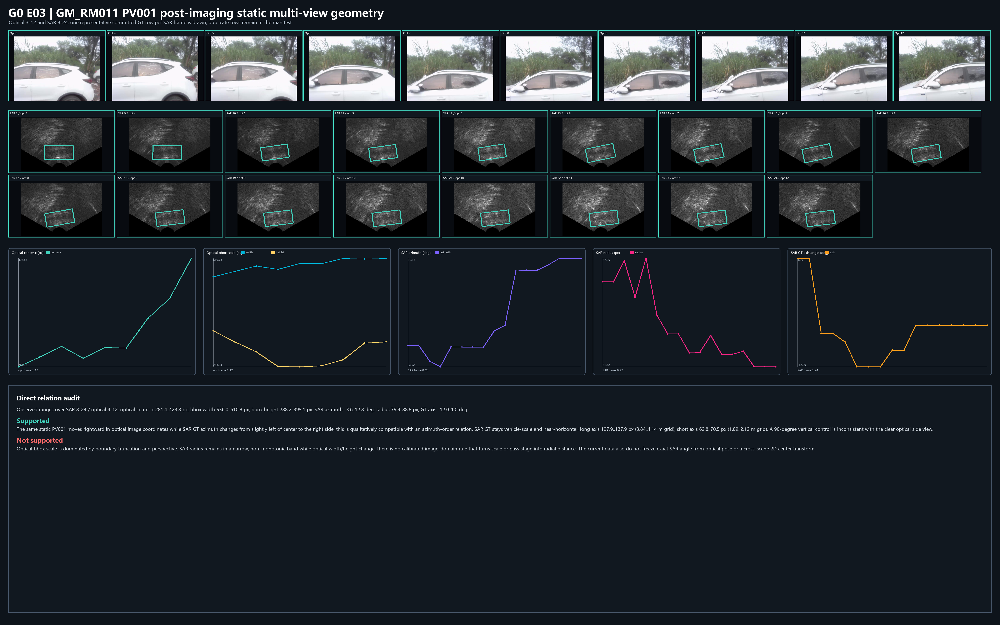
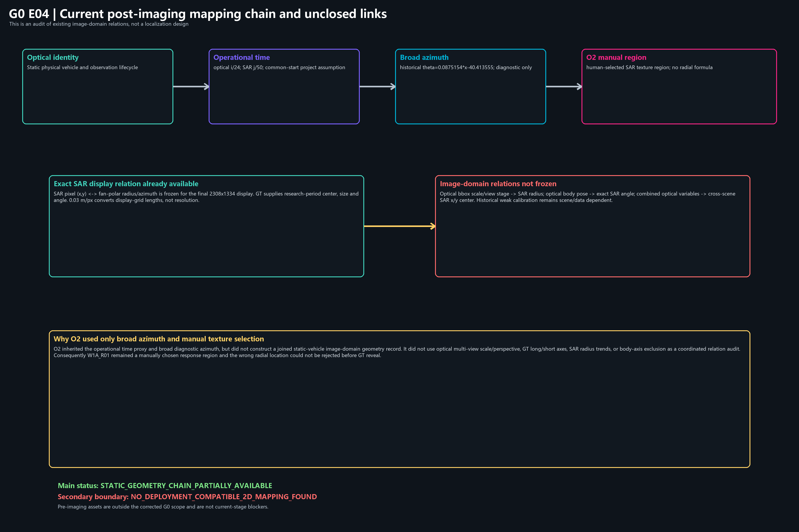

# OTY2-RSA2-G0 成像后静止车辆多视角几何关系审计报告

日期：`2026-07-18`
分支：`feature/oty2-sar-gt-structure-foundation`
主状态：`STATIC_GEOMETRY_CHAIN_PARTIALLY_AVAILABLE`
次级边界：`NO_DEPLOYMENT_COMPATIBLE_2D_MAPPING_FOUND`

## 1. 审计问题

本报告回答：在三个场景车辆全部静止、采集平台运动的事实下，现有**成像后图像域**资料能否建立光学多视角变量与 SAR GT 中心、径向距离、方位、长宽和角度之间的稳定关系；以及 O2 为什么只使用宽方位上下文和人工纹理区，没有利用这些关系。

本轮不实现定位，不拟合新模型，不调整阈值，不生成候选，不修改 GT，不处理多普勒，不实现 INS/IMU 融合或动态车辆模型。

## 2. 紧急范围修正及保留痕迹

用户在 G0 执行期间明确修正范围：不再寻找或要求原始复数回波、ADC、距离—多普勒、距离—方位中间结果、成像前逐帧轨迹、高精度 INS/IMU 或重成像产物；这些缺失不得作为当前 G0 阻塞条件。

范围修正前已经完成的只读关键词和候选文件名检索痕迹没有删除，继续保存在仓库外：

- `D:/profile/research/workspace/output/oty2_rsa2_o2_r1_g0_static_geometry_audit/g0_keyword_hits.csv`；
- `D:/profile/research/workspace/output/oty2_rsa2_o2_r1_g0_static_geometry_audit/g0_candidate_filenames.csv`。

范围修正后没有继续该搜索。这两份痕迹不参与 G0 主状态判定，也没有进入 Git。

## 3. 实际读取的数据

### 3.1 图像与视频事实

- 三场景最终光学帧：每场景 `368` 帧，`800 × 600`，源 MP4 为 `24 fps`；
- 三场景最终 SAR 灰度帧：每场景 `766` 帧，`2308 × 1334`，源 MP4 为 `50 fps`；
- PNG 编号连续，P0 已确认抽查帧与源 MP4 解码逐像素一致；
- GM_RM019 伪彩源容器的帧率冲突不影响本轮只使用 SAR 灰度 `50 fps` 的操作性时间基准。

### 3.2 身份、生命周期和 GT

- `manifests/oty2/oty2_p1e_canonical_vehicle_frame_states.csv`：`8,096` 行、`22` 个物理车辆线程，提供光学身份、观测生命周期、可见性和参考框；
- `manifests/oty2/oty2_s0_sar_gt_quality_audit.csv`：`442` 行、`18` 个 canonical vehicle，提供 SAR GT 中心、半径、方位、长宽、角度、GT 质量和 identity link；
- 研究期 GT 只用于开卷关系审阅，不作为部署输入或响应 Mask。

### 3.3 时间、坐标和 O2 法证

- `manifests/oty2/oty2_p0_hard_sync_optical_to_sar.csv`；
- `manifests/oty2/oty2_p0_hard_sync_sar_to_optical.csv`；
- `docs/OTY2_S0_SAR_COORDINATE_AND_GRID_CONTRACT.md`；
- `manifests/oty2/oty2_s0_sar_coordinate_contract.csv`；
- `docs/OTY2_S0_OPTICAL_TO_SAR_AZIMUTH_MAPPING_CONTRACT.md`；
- `manifests/oty2/oty2_s0_optical_to_sar_azimuth_mapping_audit.csv`；
- O2-R1 框来源法证与结论纠偏账本。

## 4. 审计实施与数据连接

仓库外辅助脚本：

`D:/profile/research/workspace/tasks/oty2_rsa2_o2_r1_g0_static_geometry_audit/build_g0_post_imaging_audit.py`

该脚本只执行：

1. 按 canonical vehicle 和操作性 optical frame 连接光学状态与研究期 SAR GT；
2. 读取光学参考框中心、宽高和可见状态；
3. 读取 SAR GT 中心、半径、方位、长宽和角度；
4. 使用已冻结 `0.03 m/px` 计算显示网格长度；
5. 排版四张证据图。

它没有拟合映射、没有检测响应、没有生成候选、没有打分、没有阈值、没有自动归属，也没有修改仓库脚本或 GT。

仓库外连接表：

`D:/profile/research/workspace/output/oty2_rsa2_o2_r1_g0_static_geometry_audit/g0_post_imaging_joined_rows.csv`

连接结果：

| 场景 | 有光学框的连接行 | canonical vehicle 数 |
| --- | ---: | ---: |
| GM_RM011 | 193 | 10 |
| GM_RM017 | 207 | 3 |
| GM_RM019 | 22 | 4 |

连接表保留全部 GT 质量和 identity link 状态；诊断行、duplicate 和 identity conflict 没有被静默删除。该临时表不提交到仓库。

## 5. 坐标和时间关系

### 5.1 精确成立的最终 SAR 显示关系

```text
r_px = hypot(x - 1154.0, y - 1330.6)
theta_deg = atan2(x - 1154.0, 1330.6 - y)
x = 1154.0 + r_px * sin(theta)
y = 1330.6 - r_px * cos(theta)
```

该关系在三个场景的 `2308 × 1334` 灰度显示画布上成立。它把最终 SAR 显示像素转换为最终显示扇极坐标，不是光学到 SAR 变换，也不等于上游成像物理链。

### 5.2 操作性时间关系

```text
t_optical = optical_frame / 24
t_sar = sar_frame / 50
```

当前按共同 frame-0 起点假设进行最近帧或插值连接。固定帧率由源 MP4 确认；共同起始仍没有公共时钟、硬件触发或逐帧时间戳独立证明。因此本轮可以做操作性连接，不能宣称硬同步真值。

### 5.3 `0.03 m/px`

按当前最高优先级深度复盘，`0.03 m/px` 是有效的 SAR 重建显示网格物理尺度，可用于研究期车辆长宽、局部间距、搜索范围和跨帧移动的网格量表达；它不等于 3 cm 的独立距离/方位分辨率、PSF 或车辆部件可分辨能力。

## 6. GM_RM011 PV001 重点窗口



重点窗口使用全部 optical 3–12 与 SAR 8–24；连接到 optical 4–12 的 GT 行给出：

| 变量 | 范围 |
| --- | ---: |
| optical center x | `281.4–423.8 px` |
| optical bbox width | `556.0–610.8 px` |
| optical bbox height | `288.2–395.1 px` |
| SAR azimuth | `-3.6–12.8°` |
| SAR radius | `79.9–88.8 px` |
| SAR GT long axis | `127.9–137.9 px` / `3.84–4.14 m` grid |
| SAR GT short axis | `62.8–70.5 px` / `1.89–2.12 m` grid |
| SAR undirected axis | `-12–1°` |

直接图像判断：

- PV001 是同一辆静止车辆，平台经过造成车辆在光学图像中由侧后向正侧再向侧前的观察角变化；
- 光学横向位置增加与 SAR 方位由接近中心左侧到右侧的变化定性相容；
- SAR GT 长短轴保持车辆尺度，方向保持近水平微斜；
- SAR 16 的 `-10°` GT 与光学侧视长轴相容；
- 同中心旋转 90° 的黄色控制框近竖直，可被光学侧视姿态排除；
- optical bbox 宽高变化明显，但 SAR 半径只在窄且非单调的区间内变化，不能从该窗口冻结尺度到距离的公式。

## 7. 三场景关系审阅

### 7.1 光学横向位置与 SAR 方位

在 GM_RM011 PV001、GM_RM017 PV002/PV003/PV004 以及部分 GM_RM019 线程中，光学车辆中心随平台经过从画面一侧移动到另一侧时，SAR GT 方位也保持相同的顺序变化。该关系具有定性辨识力，可用于宽方位和左右顺序审阅。

但 S0-M 的完整可用锚点只覆盖 GM_RM017、只覆盖 `left_side_dominant` 姿态。历史式：

```text
theta = 0.0875154 * x - 40.413555
```

和 GM_RM017 development refit：

```text
theta = 0.091778579301 * x - 40.421051198963
```

都依赖研究期 GT 锚点。后者只有一个开发车辆，无法做开发车辆 leave-one-out；两者均不得冻结为跨场景部署映射。

### 7.2 光学尺度、视角与 SAR 半径

完整较长线程中可以看到：平台靠近、经过和远离时，光学框尺度与 SAR 半径存在某种线程内顺序关系；GM_RM017 三个车辆线程尤为明显。但当前不能把这种趋势升级成稳定距离关系，原因包括：

- 光学框语义随边界截断和可见车身比例变化；
- 侧后、正侧、侧前观察角改变投影宽高；
- 同一尺度可能对应不同通过阶段；
- GM_RM019 的连接行较少；
- 历史 WGV3.5A 的 GM_RM011/GM_RM019 相对深度状态为 `RELATIVE_DEPTH_UNSTABLE`；
- 历史弱径向标定为 `CLOSED_SCENE_SPECIFIC_WEAK_CALIBRATION_ONLY`，不具备跨场景部署资格。

允许结论：光学尺度、视角和平台经过阶段可以作为待审阅的径向趋势证据。
禁止结论：当前已能由光学 bbox 或相对深度可靠计算 SAR 半径或米制距离。

### 7.3 车辆姿态与 SAR 方向

清晰侧视车辆的长轴证据能够排除明显的 90° 错误方向；这是本轮最明确的方向反证。它不能单独决定精确 SAR GT 角度，因为 SAR 响应可能局部、分裂、背景混合，GT 角度本身也有质量和 duplicate 问题。

### 7.4 GT 长宽和物理网格

GT 长短轴在同一静止车辆窗口中保持车辆尺度量级，证明过去只用中心和平移负控制浪费了研究期开卷信息。长宽和角度适合用于关系审阅与错误方向排除，但不等于响应 Mask、固定散射部件或部署模板。

## 8. 公式法证结论

完整清单见：

- `manifests/oty2/oty2_rsa2_g0_coordinate_transform_chain.csv`；
- `manifests/oty2/oty2_rsa2_g0_mapping_formula_forensics.csv`。

当前公式分为四类：

1. **精确最终显示关系**：SAR `x/y <-> r/theta`；
2. **操作性时间关系**：`24/50 fps` 和共同起始假设；
3. **研究期诊断方位关系**：历史 `x -> theta` 线性式和 GM_RM017 refit；
4. **未建立关系**：光学尺度/视角到 SAR 半径、光学姿态到精确 SAR 角度、光学变量到跨场景 SAR `x/y`。

`11.809661°` 不是公式输出角。它是 optical 5 / SAR 10 旧线性预测 `-14.683983642°` 与 GT 中心 `-2.874323°` 的中心残差 `-11.809660642°` 的绝对量级。

## 9. O2 为什么没有利用这些关系



O2 正向阶段实际使用：

- 光学身份；
- 观测生命周期；
- 操作性时间关系；
- 宽方位上下文；
- 人工 SAR 纹理选择。

O2 没有构造同一静止车辆的光学中心/尺度/视角与 SAR GT 半径/方位/长宽/角度连接记录；没有利用车辆尺度、方向 90° 排除、平台经过阶段或 GT 长宽。因此 `W1A_R01` 只是硬编码区域：

```text
(1040,1030)–(1190,1140)
center = (1115,1085)
size = 150 × 110 px
angle = 0°
```

它没有使用光学横坐标、车辆姿态、车辆真实尺寸、距离、深度、平台位姿、相机内参、相机—雷达外参或 `11.809661°`。红框是 GT 平移 `x+260,y-250` 的错误位置控制，黄色框是 GT 同中心旋转 90° 的错误方向控制；二者均不是正向预测。

所以 O2 的 `BIDIRECTIONALLY_CLOSED=0` 应解释为：身份、生命周期、宽方位和人工纹理区不能替代静止车辆图像域二维几何关系。它没有证明 SAR 响应本身不可解释，也没有检验完整联合假设的强版本。

## 10. 资产审计结论

完整资产表见 `manifests/oty2/oty2_rsa2_g0_geometry_asset_inventory.csv`。

当前可立即使用：

- 最终光学连续帧；
- 最终 SAR 灰度连续帧；
- 光学 canonical identity 和观测生命周期；
- 研究期 SAR GT 中心、半径、方位、长宽、角度和质量；
- `24/50` 操作性时间连接；
- SAR 最终显示扇极坐标；
- `0.03 m/px` 显示网格尺度；
- O2 正向区域与负控制来源。

当前可用但未标定：

- 光学尺度与平台经过阶段的径向趋势；
- 光学侧视姿态与 SAR 长轴的定性相容关系。

当前没有定位到已冻结、可直接用于严格部署的：

- 相机内参；
- 相机—雷达外参；
- 平台逐帧位姿/轨迹；
- 地面平面/道路几何标定；
- 跨场景二维光学→SAR 中心映射。

这些项目只登记为未来严格部署需求，不作为当前图像域审计阻塞项。

## 11. 四张核心图

| 图 | 字节数 | SHA-256 | 支持什么 | 不支持什么 |
| --- | ---: | --- | --- | --- |
| `E01_STATIC_WORLD_MOVING_PLATFORM_CAUSAL_MODEL.png` | 157,494 | `45a4241664cd3ba33a8d1adf23335e4084309f1dea79ab349117a638a7ccd023` | 静止车辆、移动平台和两个最终图像域的因果分离 | 完整传感器或成像前坐标链 |
| `E02_IDENTITY_AZIMUTH_RANGE_HEADING_SEPARATION.png` | 130,770 | `a32f00fcfa5f84422cef84caa05d8b6ffbd5fe09324c443c47dbd6987ddf3573` | 四类约束的职责边界 | 单一位置分数或自动融合 |
| `E03_GM11_PV001_STATIC_MULTIVIEW_GEOMETRY_EVIDENCE.png` | 3,060,431 | `8a3769f7d2a482fbd2c387133af0851408246d36a594418265557b89d4806299` | optical 3–12 / SAR 8–24 的方位、尺度和方向关系 | 光学尺度到 SAR 距离公式或精确角度映射 |
| `E04_CURRENT_MAPPING_CHAIN_AND_MISSING_LINKS.png` | 187,729 | `2081857a7743dd834791272ea7e1fa9e5dbcb41378249fd65d1afe5d7e7e5c7e` | 当前实际链及 O2 未使用的关系 | 部署兼容二维定位链 |

## 12. G0 状态判定

主状态：

```text
STATIC_GEOMETRY_CHAIN_PARTIALLY_AVAILABLE
```

理由：身份、观测生命周期、操作性时间连接、最终 SAR 显示坐标、`0.03 m/px`、研究期 GT 几何、宽方位顺序和粗方向排除都已经存在，足以继续进行成像后关系审阅。

次级边界：

```text
NO_DEPLOYMENT_COMPATIBLE_2D_MAPPING_FOUND
```

理由：当前没有冻结光学尺度/视角到 SAR 半径、光学姿态到精确 SAR 角度、或多变量到跨场景 SAR `x/y` 的关系。这个边界不阻止当前图像域研究，只禁止把现有关系宣传为部署映射。

## 13. 对六个重点问题的直接回答

1. **光学多帧变化**：同一静止车辆的图像位置、可见尺度、边界截断、车身侧面比例和观察角随平台经过连续变化。
2. **SAR GT 变化**：同一静止车辆的 GT 中心、显示半径、方位、长宽和角度随平台相对位置变化；长短轴保持车辆尺度量级，角度通常近水平微斜但存在质量与 duplicate 边界。
3. **稳定关系**：光学横向顺序与 SAR 方位有定性稳定关系；GT 长短轴与车辆尺度相容。尺度/视角到半径和姿态到精确角度没有跨场景冻结。
4. **90° 错误方向**：清晰光学侧视可以排除 SAR 同中心旋转 90° 的明显错误方向，但不能精确决定 SAR 角度。
5. **径向趋势**：尺度、视角和平台经过阶段可提供线程内趋势线索；当前不能可靠换算 SAR 径向位置或米制距离。
6. **O2 缺失原因**：O2 没有建立成像后多视角连接表，只继承宽方位并人工选择纹理区域，因此没有使用尺度、半径、长宽、角度和通过阶段关系。

## 14. 下一阶段资格与禁止事项

当前有资格进入后续**成像后静止车辆二维关系验证**，条件是继续保持研究期开卷 GT 与部署期输入分离，并把跨车辆、跨场景、跨姿态复现作为证据问题。G0 不提出实现方法，也不授权定位、自动候选、评分、阈值、selector、响应传播、GT 修正或自动标注。

动态车辆、INS/IMU 自运动补偿和多普勒联合处理只登记为未来扩展，本轮没有展开。

## 15. 最终科学结论

当前不能先把 O2 的失败归因于 SAR 响应无法解释。更基础、且已由本轮法证确认的问题是：此前没有建立静止车辆在移动平台观测下，从最终光学多视角变量到最终 SAR 二维几何的稳定关系。现有资料已经支持方位顺序、车辆尺度和粗方向排除；径向距离、精确角度和部署二维中心映射仍未闭合。
