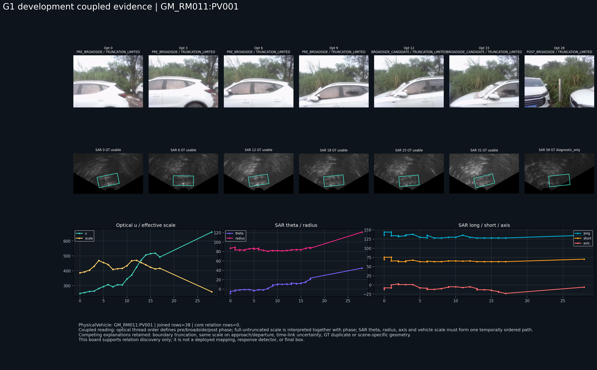
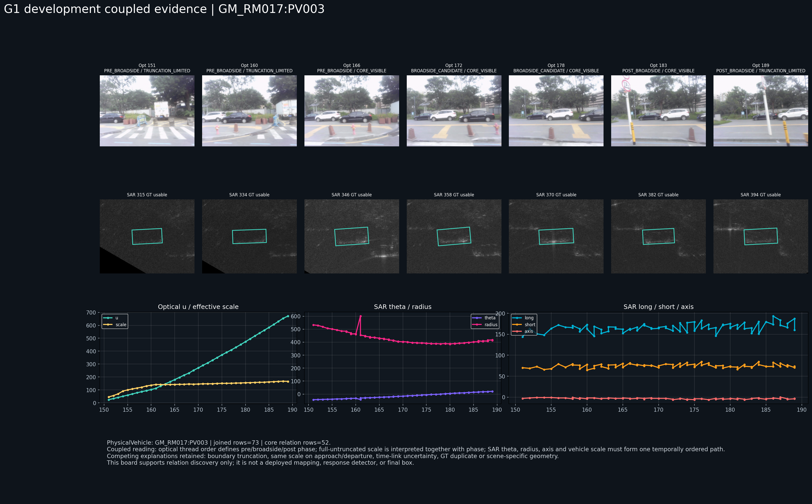
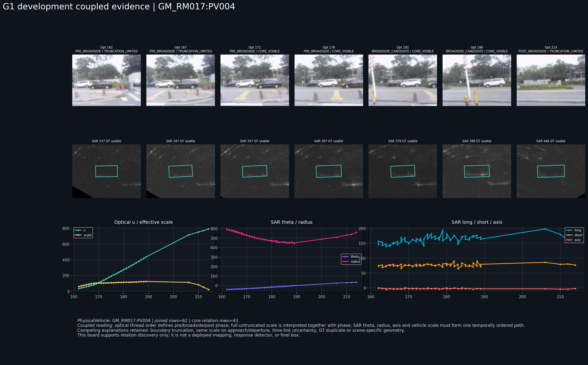
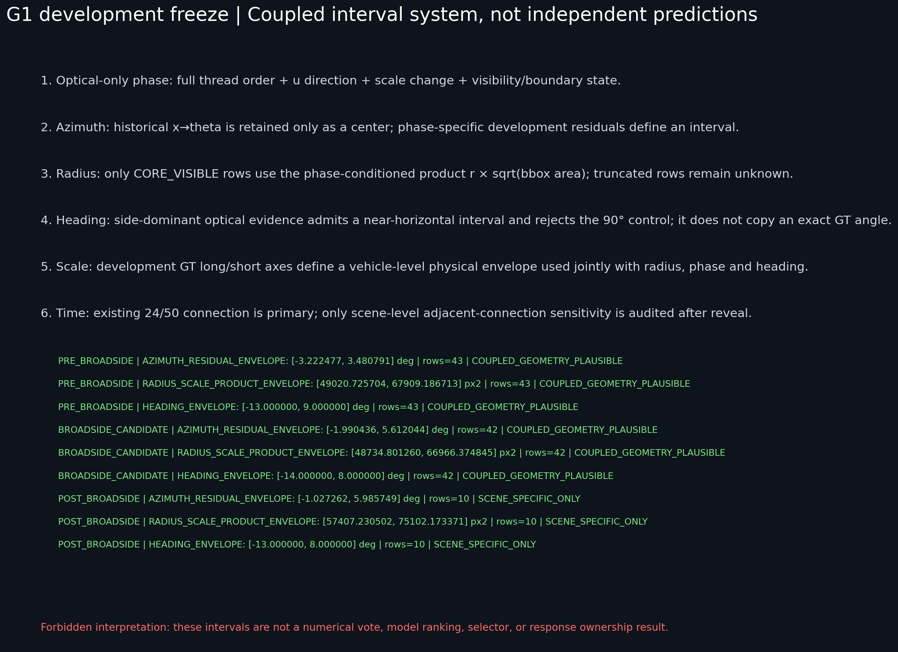

# OTY2-RSA2-G1 静止车辆成像后耦合几何关系发现报告

日期：2026-07-18

阶段结论：`DEVELOPMENT_RELATIONS_FROZEN_PENDING_HELDOUT_VALIDATION`

## 1. 本阶段实际完成了什么

本阶段从 G0 的图像域盘点进入实际关系发现：先冻结车辆级开发/留出划分，再使用开发车辆的真实光学连续帧、真实 SAR 灰度帧和研究期 GT，建立仅由光学定义的观察阶段，并冻结方位、半径、方向和车辆尺度的阶段条件化解释边界。

本阶段没有读取任何成像前资产，没有恢复成像链，没有实现 SAR 响应检测、最终车辆定位、候选评分、排名、selector 或 winner，也没有在宽方位扇区内人工挑选 SAR 亮区。

## 2. 数据划分先于关系结果冻结

[split manifest](../../manifests/oty2/oty2_rsa2_g1_data_split.csv) SHA-256：

```text
abe6f24491c48c32da8f90b912c010a151202d69d217338af67fa905822e81ff
```

| 角色 | 场景与车辆 | usable/gold | high-link | 完整无截断核心行 | 作用 |
| --- | --- | ---: | ---: | ---: | --- |
| 开发截断参考 | `GM_RM011:PV001` | 60 | 49 | 0 | 只审阅截断和 O2 边界，不拟合核心径向关系 |
| 开发核心 | `GM_RM017:PV003` | 67 | 67 | 52 | 核心关系发现 |
| 开发核心 | `GM_RM017:PV004` | 61 | 61 | 43 | 核心关系发现 |
| 同场景留出 | `GM_RM017:PV002` | 66 | 66 | 37 | 冻结后正向验证 |
| 跨场景留出 | `GM_RM019:PV001/PV002/PV004` | 4/5/4 | 4/5/4 | 0/0/1 | 冻结后跨场景验证 |
| 明确排除 | `GM_RM019:PV003` | 0 | 0 | 0 | 不静默替换，不进入验证 |
| 压力留出 | `GM_RM011:PV002/PV006/PV007/PV010` | 7/4/5/5 | 7/4/4/5 | 均为 0 | 截断、短线程和阶段边界压力测试 |

划分选择没有查看 G1 关系是否在某辆车上表现更好。

## 3. 光学阶段定义及其部署可观察性

[光学观察阶段表](../../manifests/oty2/oty2_rsa2_g1_optical_observation_phase.csv) 共 376 行。每条线程先由首尾 `u` 中位方向确定平台经过的图像横向顺序，再依据 5%–95% 有效横向范围把线程划分为 `PRE_BROADSIDE`、`BROADSIDE_CANDIDATE` 和 `POST_BROADSIDE`。同时记录 bbox 宽高、面积、有效尺度、宽高比、边界接触、可见状态和相邻变化方向。

阶段定义只使用光学 canonical identity 和光学帧状态，所有行均记录：

```text
phase_source = OPTICAL_ONLY_CENTER_SCALE_VISIBILITY_AND_THREAD_ORDER
target_sar_gt_used_for_phase = false
```

因此阶段标签可在不读取目标 SAR GT 的正向阶段重现。但它只是光学观察顺序，不是平台精确最近点或世界几何真值；最近通过是否真正落在 `BROADSIDE_CANDIDATE` 必须由留出 GT 审计。

## 4. 三条开发线程的真实图像证据

### 4.1 `GM_RM011:PV001`：截断参考，不提供核心径向关系



连接范围为 optical `0–28`、SAR `1–58`。光学中心约从 `u=248.6` 推进到 `659.8 px`，SAR GT 方位约从 `-4.8°` 推进到 `44.8°`，左右顺序相容；但 38 个连接行没有一个完整无截断核心行。有效尺度同时受到左/下边界截断和后段右侧截断影响，不能被解释为完整车身投影，因此该线程不进入 `r × sqrt(bbox area)` 核心包络。

这条反例直接阻止了“bbox 越大即 SAR 半径越小”的无条件规则。它还保留 O2-R1 的纠偏：近水平侧视可排除明显 90° 错误方向，但不能独自决定径向位置。

### 4.2 `GM_RM017:PV003`：接近—近侧—远离的完整径向转折



线程范围为 optical `151–189`、SAR `315–393`，其中 52 行为完整无截断核心行。

| 光学阶段 | optical | SAR | `u` 变化 | 有效尺度变化 | SAR 方位变化 | SAR 半径变化 |
| --- | --- | --- | --- | --- | --- | --- |
| `PRE_BROADSIDE` | 162–170 | 338–354 | 130.2→270.8 | 141.5→145.7 | -28.8°→-16.4° | 444.5→402.2 px |
| `BROADSIDE_CANDIDATE` | 171–182 | 357–379 | 290.5→517.7 | 147.3→158.1 | -13.0°→8.5° | 400.6→392.2 px |
| `POST_BROADSIDE` | 183–188 | 382–391 | 539.9→654.1 | 158.8→167.5 | 9.2°→17.8° | 393.8→408.1 px |

方位随 `u` 保持同一推进方向。半径在接近和近侧阶段下降，过近侧后回升；这不是单调全局回归，而是明确的阶段条件化转折。相近光学尺度可同时出现在接近和远离侧，因此尺度必须与阶段和完整时序共同解释。

### 4.3 `GM_RM017:PV004`：支持接近段，但后段被截断



线程范围为 optical `162–214`、SAR `338–446`，43 行为完整无截断核心行。

| 光学阶段 | optical | SAR | `u` 变化 | 有效尺度变化 | SAR 方位变化 | SAR 半径变化 |
| --- | --- | --- | --- | --- | --- | --- |
| `PRE_BROADSIDE` | 169–180 | 353–374 | 95.5→274.2 | 104.1→114.9 | -32.8°→-16.9° | 535.5→475.2 px |
| `BROADSIDE_CANDIDATE` | 181–189 | 378–393 | 291.6→435.2 | 115.4→124.8 | -14.1°→-1.5° | 465.5→445.3 px |

该车辆支持接近段中 `u` 增加、方位增加、尺度增加、半径下降的共同顺序；但 `POST_BROADSIDE` 的完整核心行不足，后段尺度快速下降主要来自右侧离场截断。它不能独立验证 PV003 的远离段径向回升。

## 5. 冻结的耦合关系边界



[关系假设表](../../manifests/oty2/oty2_rsa2_g1_coupled_relation_hypotheses.csv) 共 13 行。核心边界如下：

| 阶段 | 方位中心残差 | `r × sqrt(area)` | 无向长轴 | 光学宽高比支持 | 开发支持 |
| --- | --- | --- | --- | --- | --- |
| `PRE_BROADSIDE` | [-3.222477, 3.480791]° | [49020.725704, 67909.186713] px² | [-13, 9]° | [2.145573, 2.884255] | PV003+PV004，43 行 |
| `BROADSIDE_CANDIDATE` | [-1.990436, 5.612044]° | [48734.801260, 66966.374845] px² | [-14, 8]° | [2.109622, 3.072972] | PV003+PV004，42 行 |
| `POST_BROADSIDE` | [-1.027262, 5.985749]° | [57407.230502, 75102.173371] px² | [-13, 8]° | [2.240770, 2.605332] | 仅 PV003，10 行 |

车辆尺度联合包络为：

```text
long axis  = [133.706, 202.666] px = [4.011, 6.080] m display-grid quantity
short axis = [58.277, 96.716] px   = [1.748, 2.901] m display-grid quantity
```

`0.03 m/px` 在这里只是当前 SAR 重建显示网格的有效物理尺度，不等于 3 cm 的真实独立距离或方位分辨率。

## 6. 哪些关系获得开发支持，哪些没有

开发证据支持：

- 在 GM17 两条核心线程的接近段，光学 `u` 顺序与 SAR 方位顺序一致；
- `PRE_BROADSIDE` 和 `BROADSIDE_CANDIDATE` 中，完整无截断尺度、阶段和 SAR 半径可以共同形成有界关系；
- 近水平无向长轴在两条核心线程中相容，可作为 90° 错误方向的粗排除责任；
- PV003 明确显示半径在近侧后转折，证明阶段不能由单一尺度替代。

开发证据尚不支持：

- 跨场景统一关系；
- `POST_BROADSIDE` 的双车辆支持；
- 截断线程的有界半径；
- 从光学姿态直接得到精确 SAR 角度；
- 从方位、半径和尺度得到完整车辆响应边界；
- 邻车互换已经被开发关系自动排除。

因此 `PRE_BROADSIDE` 和 `BROADSIDE_CANDIDATE` 暂记 `COUPLED_GEOMETRY_PLAUSIBLE`；`POST_BROADSIDE` 必须保持 `SCENE_SPECIFIC_ONLY`，等待同场景及跨场景留出审计。

## 7. 与三个基线的关系

- Baseline A（旧宽方位）只有方位中心及宽扇区，不提供半径、方向或尺度联合边界。
- Baseline B（单帧 optical x→SAR theta）可保留左右顺序，但无法解释同一 `u` 在不同阶段对应不同半径，也不能识别截断。
- Baseline C（只看 bbox 尺度）会把接近与远离侧的相近尺度混为同一距离，并在 GM11 PV001 与 GM17 PV004 离场截断处产生错误语义。
- G1 冻结关系只在阶段、完整可见、宽高比支持和线程方向共同相容时形成二维扇环域；证据不足时主动退回半径未知。

这不是四个模型的投票或排名。其科学责任是暴露关系在哪些具体阶段成立、在哪些具体截断或跨场景条件下失效。

## 8. 时间映射边界

开发关系使用现有 24/50 fps 操作性连接。共同 frame-0 起点仍未独立冻结，因此本阶段不将单帧连接视为硬同步真值。留出揭示后只进行场景级统一 SAR 帧偏移 `-2…+2` 审计；不得逐车辆调时，也不得用偏移修改冻结正向区间。

## 9. 开发产物完整性

| 产物 | 行数/字节 | SHA-256 |
| --- | ---: | --- |
| `oty2_rsa2_g1_data_split.csv` | 12 行 | `abe6f24491c48c32da8f90b912c010a151202d69d217338af67fa905822e81ff` |
| `oty2_rsa2_g1_optical_observation_phase.csv` | 376 行 | `e4d5285e4b16d11083e87e2cb5cae5790b8543de968d7866abbf06f6fe48516f` |
| `oty2_rsa2_g1_coupled_relation_hypotheses.csv` | 13 行 | `2cbc7f984db64dbd942dae74aaa4946c4d9e1a5758469e884e9b9346b61a950a` |
| `D_GM_RM011_PV001_COUPLED_EVIDENCE.png` | 1,582,362 B | `d2f50f29c9630c1768da5e5f695bec935b5eeac6ceaaf5a2e188dfdd260c231c` |
| `D_GM_RM017_PV003_COUPLED_EVIDENCE.png` | 1,994,331 B | `7f8c746452c9b463aec7fe1d2ad91a024a9dda70a7048f2ad6ec9b211dccf0bf` |
| `D_GM_RM017_PV004_COUPLED_EVIDENCE.png` | 1,964,451 B | `87c86a8281e930493a114c1c8fae53491e12d7afa7c77f3db1a784f670583b3e` |
| `D04_DEVELOPMENT_COUPLED_RELATION_FREEZE.png` | 348,384 B | `d3a8c566b60af8c2c3dd2591dc0d33bed1eb453bac2607f7cb047c23b9fb894c` |

以上边界在留出正向阶段前冻结。留出结果不得反向改写本报告中的关系区间。
