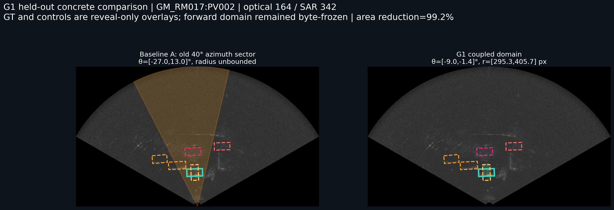
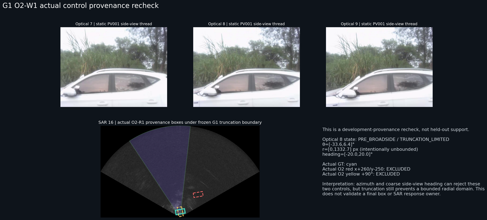

# OTY2-RSA2-G1 静止车辆成像后耦合几何留出验证报告

日期：2026-07-18

主状态：`COUPLED_GEOMETRY_WITHIN_SCENE_ONLY`

次级状态：`PHASE_CONDITIONAL_GEOMETRY_SUPPORTED`

边界状态：`STATIC_GEOMETRY_SCENE_SPECIFIC`

下一阶段资格：`NOT_QUALIFIED_TO_REENTER_SAR_LOCAL_RESPONSE_RESEARCH`

## 1. 研究结论先行

隐藏目标 SAR GT 时冻结的 G1 关系只在同场景 `GM_RM017:PV002` 的两个完整无截断案例形成了真正有界的二维扇环域。GT 揭示后，这两个案例同时覆盖真实中心、方向和车辆尺度，并排除 O2 来源一致的错误平移、同尺寸 `+200 px` 错误径向、同中心 90° 错误方向和同帧邻车。

但该结果没有跨场景成立：全部 GM19 正向重点帧以及全部 GM11 压力车辆都因边界截断、宽高比越出开发支持或缺少同帧 GT 而保持径向全扇区或无法审计。24 个正向案例中只有 2 个达到 `COUPLED_GEOMETRY_SUPPORTED`，22 个为 `UNRESOLVED`；没有真正的跨场景有界关系证据。

因此 G1 证明的是一个有限、阶段条件化、同场景内可复现的几何缩域现象，不是部署兼容的跨场景二维映射，也不是最终 SAR 车辆定位算法。

## 2. 数据划分与实际帧域

开发/留出划分沿用 Commit 1 冻结的 [split manifest](../../manifests/oty2/oty2_rsa2_g1_data_split.csv)，未在 GT 揭示后修改。

| 角色 | 车辆 | GT-linked optical 范围 | SAR GT 记录域 | 本轮正向重点帧 |
| --- | --- | --- | --- | --- |
| 开发截断参考 | `GM_RM011:PV001` | 0–28 | 0–58 | 不计入留出；另做 O2-W1 来源复核 |
| 开发核心 | `GM_RM017:PV003` | 151–189 | 315–394 | 不计入留出 |
| 开发核心 | `GM_RM017:PV004` | 162–214 | 337–446 | 不计入留出 |
| 同场景留出 | `GM_RM017:PV002` | 145–185 | 302–386 | optical 154/164/173 → SAR 321/342/361 |
| 跨场景留出 | `GM_RM019:PV001` | 0–13 | 0–27 | optical 0/7/14 → SAR 0/15/30 |
| 跨场景留出 | `GM_RM019:PV002` | 13–42 | 27–88 | optical 5/24/43 → SAR 11/50/90 |
| 跨场景留出 | `GM_RM019:PV004` | 151–170 | 315–354 | optical 149/166/183 → SAR 311/346/382 |
| 压力留出 | `GM_RM011:PV002` | 0–3 | 0–7 | optical 0/2/4 → SAR 0/5/9 |
| 压力留出 | `GM_RM011:PV006` | 117–136 | 244–284 | optical 110/125/140 → SAR 230/261/292 |
| 压力留出 | `GM_RM011:PV007` | 117–151 | 244–315 | optical 116/134/151 → SAR 242/280/315 |
| 压力留出 | `GM_RM011:PV010` | 212–245 | 442–510 | optical 211/228/245 → SAR 440/475/511 |

重点帧由冻结光学阶段表独立选择；GT 揭示后没有改选到“更容易成功”的帧，也没有使用最近 GT 帧替换缺失同帧 GT。

表中的 optical 范围来自 GT 质量 manifest 的已连接行，不是完整光学线程边界；正向重点帧来自 canonical 光学线程，因此可位于该 GT-linked 范围之外。这正是部分重点帧在揭示后没有同帧 GT 的原因之一。

## 3. 正向阶段的数据隔离与冻结

正向阶段允许访问：

- 冻结 split；
- 仅光学生成的阶段与限制状态；
- 开发车辆冻结的关系包络；
- canonical 光学身份、完整观察线程和 bbox；
- 现有 24/50 fps 操作性时间连接；
- 原始最终光学帧与最终 SAR 灰度帧；
- SAR 显示坐标与 `0.03 m/px` 有效显示网格。

正向阶段禁止访问并实际未打开：留出车辆目标 SAR GT 中心、长宽、角度、目标 GT overlay、GT 裁剪或由目标 GT 决定的重点帧。

[正向访问审计](../../manifests/oty2/oty2_rsa2_g1_data_access_audit.csv) 与 [正向冻结 manifest](../../manifests/oty2/oty2_rsa2_g1_forward_freeze_manifest.csv) 在 GT 揭示前冻结。共冻结 10 个产物：1 份正向区间 CSV、1 份访问审计和 8 张 F 图。

```text
forward CSV SHA-256
171fb7c113b558bab66896ff0c6340bb6f0be6ffedb59e79dee153d6d2f467d6

forward freeze manifest SHA-256
29c2ca19de6011aca610b4b920b78c52b508cbb5818dcf60a888e57e020d3bd3
```

揭示前逐项验证全部 SHA 后才打开目标 GT；揭示结束后再次验证，10/10 产物字节完全一致。F 图没有被重绘，正向 CSV 没有补理由或改结论。

需要明确的操作性隔离限制是：开发发现阶段的程序打开了仓库共享 GT manifest，并在内存中立即拒绝非开发车辆；关系表只使用 `GM_RM011:PV001`、`GM_RM017:PV003/PV004`，没有使用留出值，但这属于程序过滤，不是物理分离的密码学盲审。留出正向阶段本身没有发现目标 GT 值泄漏。

## 4. 24 个冻结正向几何域

[正向区间 CSV](../../manifests/oty2/oty2_rsa2_g1_forward_frozen_geometry_intervals.csv) 中所有案例共享长轴 `[133.7,202.7] px`、短轴 `[58.3,96.7] px` 的研究期车辆尺度包络；下表列出方位、半径、方向和状态。

| case | 车辆 | opt/SAR | 阶段/限制 | 方位 θ | 半径 r px | 无向角 | 缩减 | 正向状态 |
| --- | --- | --- | --- | --- | --- | --- | ---: | --- |
| G1F0001 | GM17 PV002 | 154/321 | PRE/CORE | [-30.1,-23.4]° | [316.5,438.5] | [-13,9]° | 99.13% | `COUPLED_GEOMETRY_PLAUSIBLE` |
| G1F0002 | GM17 PV002 | 164/342 | BROADSIDE/CORE | [-9.0,-1.4]° | [295.3,405.7] | [-14,8]° | 99.17% | `COUPLED_GEOMETRY_PLAUSIBLE` |
| G1F0003 | GM17 PV002 | 173/361 | POST/CORE，但宽高比越界 | [-6.1,33.9]° | [0,1332.7] | [-20,20]° | 0% | `PHASE_AMBIGUOUS` |
| G1F0004 | GM19 PV001 | 0/0 | PRE/TRUNC | [-24.2,15.8]° | [0,1332.7] | [-20,20]° | 0% | `TRUNCATION_LIMITED` |
| G1F0005 | GM19 PV001 | 7/15 | BROADSIDE/TRUNC | [-7.3,32.7]° | [0,1332.7] | [-20,20]° | 0% | `TRUNCATION_LIMITED` |
| G1F0006 | GM19 PV001 | 14/30 | POST/TRUNC | [6.1,46.1]° | [0,1332.7] | [-90,90]° | 0% | `TRUNCATION_LIMITED` |
| G1F0007 | GM19 PV002 | 5/11 | PRE/TRUNC | [-56.2,-16.2]° | [0,1332.7] | [-90,90]° | 0% | `TRUNCATION_LIMITED` |
| G1F0008 | GM19 PV002 | 24/50 | BROADSIDE/TRUNC | [-29.5,10.5]° | [0,1332.7] | [-20,20]° | 0% | `TRUNCATION_LIMITED` |
| G1F0009 | GM19 PV002 | 43/90 | POST/TRUNC | [8.5,48.5]° | [0,1332.7] | [-90,90]° | 0% | `TRUNCATION_LIMITED` |
| G1F0010 | GM19 PV004 | 149/311 | PRE/TRUNC | [-56.3,-16.3]° | [0,1332.7] | [-90,90]° | 0% | `TRUNCATION_LIMITED` |
| G1F0011 | GM19 PV004 | 166/346 | BROADSIDE/TRUNC | [-33.4,6.6]° | [0,1332.7] | [-20,20]° | 0% | `TRUNCATION_LIMITED` |
| G1F0012 | GM19 PV004 | 183/382 | POST/TRUNC | [7.7,47.7]° | [0,1332.7] | [-90,90]° | 0% | `TRUNCATION_LIMITED` |
| G1F0013 | GM11 PV002 | 0/0 | PRE/TRUNC | [5.7,45.7]° | [0,1332.7] | [-90,90]° | 0% | `TRUNCATION_LIMITED` |
| G1F0014 | GM11 PV002 | 2/5 | POST/TRUNC | [7.2,47.2]° | [0,1332.7] | [-90,90]° | 0% | `TRUNCATION_LIMITED` |
| G1F0015 | GM11 PV002 | 4/9 | POST/TRUNC | [7.0,47.0]° | [0,1332.7] | [-90,90]° | 0% | `TRUNCATION_LIMITED` |
| G1F0016 | GM11 PV006 | 110/230 | PRE/TRUNC | [-50.8,-10.8]° | [0,1332.7] | [-90,90]° | 0% | `TRUNCATION_LIMITED` |
| G1F0017 | GM11 PV006 | 125/261 | BROADSIDE/TRUNC | [-22.1,17.9]° | [0,1332.7] | [-90,90]° | 0% | `TRUNCATION_LIMITED` |
| G1F0018 | GM11 PV006 | 140/292 | POST/TRUNC | [5.2,45.2]° | [0,1332.7] | [-90,90]° | 0% | `TRUNCATION_LIMITED` |
| G1F0019 | GM11 PV007 | 116/242 | PRE/TRUNC | [-57.4,-17.4]° | [0,1332.7] | [-90,90]° | 0% | `TRUNCATION_LIMITED` |
| G1F0020 | GM11 PV007 | 134/280 | BROADSIDE/TRUNC | [-32.5,7.5]° | [0,1332.7] | [-20,20]° | 0% | `TRUNCATION_LIMITED` |
| G1F0021 | GM11 PV007 | 151/315 | POST/TRUNC | [4.8,44.8]° | [0,1332.7] | [-90,90]° | 0% | `TRUNCATION_LIMITED` |
| G1F0022 | GM11 PV010 | 211/440 | PRE/TRUNC | [-55.5,-15.5]° | [0,1332.7] | [-90,90]° | 0% | `TRUNCATION_LIMITED` |
| G1F0023 | GM11 PV010 | 228/475 | PRE/TRUNC | [-34.9,5.1]° | [0,1332.7] | [-20,20]° | 0% | `TRUNCATION_LIMITED` |
| G1F0024 | GM11 PV010 | 245/511 | POST/TRUNC | [6.8,46.8]° | [0,1332.7] | [-90,90]° | 0% | `TRUNCATION_LIMITED` |

二维可行域是方位—半径扇环加方向和车辆尺度约束，不是候选框。只有 G1F0001/0002 的半径有界；其余案例即使方位有所收缩，也没有形成可验证的二维定位域。

## 5. 每辆留出车辆的正向—揭示证据

| 车辆 | 目标 GT 隐藏 F 图 | GT 揭示/反例 R 图 |
| --- | --- | --- |
| GM17 PV002 | [F_GM_RM017_PV002_G1F0002](../../docs/reviews/assets/20260718_rsa2_g1_coupled_geometry/F_GM_RM017_PV002_G1F0002.png) | [R_GM_RM017_PV002_G1F0002](../../docs/reviews/assets/20260718_rsa2_g1_coupled_geometry/R_GM_RM017_PV002_G1F0002.png) |
| GM19 PV001 | [F_GM_RM019_PV001_G1F0005](../../docs/reviews/assets/20260718_rsa2_g1_coupled_geometry/F_GM_RM019_PV001_G1F0005.png) | [R_GM_RM019_PV001_G1F0005](../../docs/reviews/assets/20260718_rsa2_g1_coupled_geometry/R_GM_RM019_PV001_G1F0005.png) |
| GM19 PV002 | [F_GM_RM019_PV002_G1F0008](../../docs/reviews/assets/20260718_rsa2_g1_coupled_geometry/F_GM_RM019_PV002_G1F0008.png) | [R_GM_RM019_PV002_G1F0008](../../docs/reviews/assets/20260718_rsa2_g1_coupled_geometry/R_GM_RM019_PV002_G1F0008.png) |
| GM19 PV004 | [F_GM_RM019_PV004_G1F0011](../../docs/reviews/assets/20260718_rsa2_g1_coupled_geometry/F_GM_RM019_PV004_G1F0011.png) | [R_GM_RM019_PV004_G1F0011](../../docs/reviews/assets/20260718_rsa2_g1_coupled_geometry/R_GM_RM019_PV004_G1F0011.png) |
| GM11 PV002 | [F_GM_RM011_PV002_G1F0014](../../docs/reviews/assets/20260718_rsa2_g1_coupled_geometry/F_GM_RM011_PV002_G1F0014.png) | [R_GM_RM011_PV002_G1F0014](../../docs/reviews/assets/20260718_rsa2_g1_coupled_geometry/R_GM_RM011_PV002_G1F0014.png) |
| GM11 PV006 | [F_GM_RM011_PV006_G1F0017](../../docs/reviews/assets/20260718_rsa2_g1_coupled_geometry/F_GM_RM011_PV006_G1F0017.png) | [R_GM_RM011_PV006_G1F0017](../../docs/reviews/assets/20260718_rsa2_g1_coupled_geometry/R_GM_RM011_PV006_G1F0017.png) |
| GM11 PV007 | [F_GM_RM011_PV007_G1F0020](../../docs/reviews/assets/20260718_rsa2_g1_coupled_geometry/F_GM_RM011_PV007_G1F0020.png) | [R_GM_RM011_PV007_G1F0020](../../docs/reviews/assets/20260718_rsa2_g1_coupled_geometry/R_GM_RM011_PV007_G1F0020.png) |
| GM11 PV010 | [F_GM_RM011_PV010_G1F0023](../../docs/reviews/assets/20260718_rsa2_g1_coupled_geometry/F_GM_RM011_PV010_G1F0023.png) | [R_GM_RM011_PV010_G1F0023](../../docs/reviews/assets/20260718_rsa2_g1_coupled_geometry/R_GM_RM011_PV010_G1F0023.png) |

每张图同时显示真实光学线程、光学阶段、限制状态、完整 SAR 上下文和冻结二维域。缺少同帧 GT 时，R 图明确标记 `NO SAME-FRAME TARGET GT`，没有使用最近帧替代。

## 6. GT 揭示结果

[揭示审计](../../manifests/oty2/oty2_rsa2_g1_heldout_reveal_audit.csv) 共 24 行，其中 9 行存在同帧目标 GT：7 行 usable、2 行 diagnostic-only；15 行没有同帧目标 GT。

| case | GT θ/r/axis | GT 长×短 px | GT 中心覆盖 | O2 平移 | +200 px 径向 | 90° | 邻车 | 结论 |
| --- | --- | --- | --- | --- | --- | --- | --- | --- |
| G1F0001 GM17 PV002 | -26.18° / 363.09 / 0° | 154.42×74.50 | 是 | 排除 | 排除 | 排除 | 排除 PV003 | `COUPLED_GEOMETRY_SUPPORTED` |
| G1F0002 GM17 PV002 | -4.77° / 322.79 / -2° | 149.05×69.70 | 是 | 排除 | 排除 | 排除 | 排除 PV003/PV004 | `COUPLED_GEOMETRY_SUPPORTED` |
| G1F0003 GM17 PV002 | 16.71° / 336.00 / -3° | 162.50×71.04 | 落入宽域 | 未排除 | 未排除 | 排除 | 邻车排除 | `UNRESOLVED`：正向半径无界 |
| G1F0004 GM19 PV001 | 10.01° / 134.60 / 1° | 145.81×64.50 | 落入宽域 | 排除 | 未排除 | 排除 | 无同帧邻车 | `UNRESOLVED`：跨场景半径无界 |
| G1F0013 GM11 PV002 | 33.53° / 213.99 / 48° | 145.12×70.70 | 落入宽域 | 未排除 | 未排除 | 未排除 | 排除 PV001 | `UNRESOLVED` |
| G1F0014 GM11 PV002 | 38.10° / 229.35 / -29° | 147.83×78.74 | 落入宽域 | 未排除 | 未排除 | 未排除 | 排除 PV001 | `UNRESOLVED` |
| G1F0017 GM11 PV006 | 10.00° / 136.43 / 0° | 185.46×84.49 | 落入宽域 | 排除 | 未排除 | 未排除 | 排除 PV005/PV007 | `UNRESOLVED`，GT diagnostic-only |
| G1F0020 GM11 PV007 | -22.13° / 193.98 / 2° | 190.71×79.43 | 落入宽域 | 排除 | 未排除 | 排除 | 排除 PV006 | `UNRESOLVED`，GT diagnostic-only |
| G1F0021 GM11 PV007 | 43.08° / 166.42 / 9° | 142.84×70.11 | 落入宽域 | 排除 | 未排除 | 未排除 | 未排除 PV008 | `UNRESOLVED` |

“GT 落入 `[0,1332.7] px`”没有辨识力，不能算成功。只有在正向域原本有界且主要负控制被排除时才升级为支持，因此最终只有 G1F0001/0002 两行支持。

## 7. 两个同场景支持案例为什么成立

### 7.1 G1F0001：GM17 PV002 optical 154 / SAR 321

光学线程处于 `PRE_BROADSIDE/CORE_VISIBLE`，侧身长轴清楚、bbox 宽高比 `2.8066` 落入开发 PRE 支持范围。冻结域为 θ `[-30.132,-23.429]°`、r `[316.517,438.475] px`、无向角 `[-13,9]°`。揭示 GT 为 θ `-26.176°`、r `363.086 px`、axis `0°`，长短轴 `154.423×74.500 px`，全部落入域内。

同帧 PV003 位于 θ `-40.232°`、r `506.307 px`，同时违反方位和半径域；GT 平移 `x+260/y-250`、同尺寸 `+200 px` 径向框和 90° 框也全部被排除。该域相对旧 40° 全半径扇区面积缩小 `99.1312%`。

### 7.2 G1F0002：GM17 PV002 optical 164 / SAR 342

光学线程处于 `BROADSIDE_CANDIDATE/CORE_VISIBLE`，宽高比 `2.7592` 位于开发 BROADSIDE 支持范围。冻结域为 θ `[-8.984,-1.381]°`、r `[295.274,405.736] px`、无向角 `[-14,8]°`。揭示 GT 为 θ `-4.770°`、r `322.788 px`、axis `-2°`，长短轴 `149.050×69.700 px`。

PV003 位于 θ `-26.426°`、r `434.358 px`，PV004 位于 θ `-38.570°`、r `576.189 px`，两者均被排除；三类错误位置/方向控制也全部排除。相对旧宽方位面积缩小 `99.1714%`。



这两个成功依赖同场景 GM17 的完整可见尺度和开发车辆关系，不可扩大为跨场景结论。

## 8. 正确保留未知与具体失败

- G1F0003 的光学宽高比 `2.9848` 超出 POST 开发支持 `[2.2408,2.6053]`，尽管目标 GT 落入宽方位，径向仍回退全扇区；O2 平移和 `+200 px` 径向控制都不能排除。保持未知是正确结果。
- GM19 三辆车的代表图均直接显示边界截断或部分可见；9 个跨场景正向点中没有一个形成有界半径。GM19 PV001 的 SAR 0 GT 落入宽域不能证明跨场景关系，另 8 个 GM19 重点点没有同帧 GT。
- GM11 PV002 的近场大车身被边界截断，方向区间退回 `[-90,90]°`，错误平移和 90° 均可能被同样解释。
- GM11 PV006 optical 125 的宽高比 `1.5957` 刚低于侧身支持门槛，方向退回未知；同尺寸错误径向仍在域内。
- GM11 PV007 optical 151 / SAR 315 不仅半径和方向无界，邻车 PV008 的 GT 中心也落入同一域，直接暴露多车互换未闭合。
- GM11 PV010 三个重点帧都没有同帧目标 GT；没有用稀疏 GT 反向选择更有利的重点帧。

## 9. 负控制结果

[负控制表](../../manifests/oty2/oty2_rsa2_g1_negative_controls.csv) 对 9 个同帧 GT 案例生成 38 个标准控制，另增加 2 个 O2-W1 实际来源控制。

| 控制 | 排除/总数 | 科学解释 |
| --- | ---: | --- |
| GT `x+260/y-250` 平移 | 6/9 | 只有方位或有界半径足够窄时可排除 |
| 同中心 90° | 5/9 | 只有近水平侧视方向约束未退回 `[-90,90]°` 时可排除 |
| 同尺寸 `+200 px` 径向 | 2/9 | 仅 G1F0001/0002 的有界半径具有真正距离辨识力 |
| 同帧邻车交换 | 10/11 | GM11 PV007 / PV008 在 SAR 315 仍可交换 |

O2-R1 实际 W1 红框中心 `(1415.377,998.565)`、黄色 `80°` 框在 GM11 PV001 optical 8 的冻结 G1 截断边界下都被排除：红框方位 `38.210°` 超出 `[-33.6,6.4]°`，黄色 `80°` 超出 `[-20,20]°`。但该案例的半径仍是 `[0,1332.7] px`，所以它只是开发来源复核，不是留出二维关系支持。



## 10. 时间映射敏感性

[场景级时间敏感性表](../../manifests/oty2/oty2_rsa2_g1_scene_level_time_sensitivity.csv) 只检查统一 SAR 帧偏移 `-2,-1,0,+1,+2`，没有逐车辆调时。

- GM17 的两个有界案例在可取得同帧 GT 的 `-2…+2` 邻接连接中都保持方位和半径覆盖；这说明结论不依赖为 PV002 单独挑一个最优偏移，但也说明当前窄邻域不足以识别唯一 frame-0 偏移。
- GM11 在全部偏移下有界案例数始终为 0；更换统一偏移不能恢复被截断尺度的径向语义。
- GM19 在全部偏移下有界案例数始终为 0，且 GT 稀疏；时间偏移不能把跨场景未知变成有效关系。

所以本轮不是 `TIME_ALIGNMENT_BLOCKS_VALIDATION`。时间连接仍是操作性的，但当前主要阻塞来自截断、跨场景尺度/姿态不一致和同帧 GT 稀疏。没有证据要求或授权逐车辆调时。

## 11. 三个基线被哪些具体反例否定

### Baseline A：旧宽方位

它能给出大致左右顺序，但半径全域、方向和尺度未联合。GM17 PV002 SAR 342 的旧域覆盖多个邻车和错误位置；G1 同场景有界域才将面积缩小 99.17%。然而该缩减没有跨场景复制。

### Baseline B：单帧 optical x→SAR theta

GM17 PV002 G1F0003 的单帧 `u` 仍能给出包含 GT 的方位，却无法排除错误径向；GM11/GM19 截断案例也常能得到看似合理的 40° 方位。单帧方位覆盖不等于二维几何成立。

### Baseline C：只用 bbox 尺度预测半径

GM11 PV001/PV002、GM19 三车和 GM17 PV004 离场段直接显示边界截断会让 bbox 尺度下降或失真；同一尺度还可能分别位于接近和远离阶段。只有把完整可见状态、宽高比、阶段和线程方向一起使用，GM17 的两个案例才能形成有界半径。

因此被具体反例推翻的是“全局单调 bbox→radius”和“所有场景共享同一完整可见尺度语义”，不是“光学多视角永远不能约束 SAR”。

## 12. 光学与 SAR 变量实际如何耦合

- 光学 `u` 在线程内提供稳定的左右顺序；GM17 完整线程中 SAR 方位同向推进，这是最稳定的单调关系。
- 光学有效尺度不是全局单调距离。GM17 PV003 半径在 PRE/BROADSIDE 下降，POST 回升，形成接近—近侧—远离的阶段转折。
- 光学姿态只在侧身主导且无遮挡时提供近水平粗方向责任；宽高比或边界状态不相容时必须退回未知。
- SAR 方位、半径、方向和车辆尺度只有共同形成连续线程并排除邻车/错误位置时才构成支持；任何一个宽域都可能让 GT 与反例同时落入。
- 当前二维域是研究期几何先验壳，不是最终预测框；SAR 仍需在壳内承担精确局部定位责任，但本轮未开始该研究。

## 13. 最终状态与后续资格

主状态选择 `COUPLED_GEOMETRY_WITHIN_SCENE_ONLY`，因为 GM17 留一车辆的两个完整可见阶段通过了 GT 与全部主要负控制。

次级状态选择 `PHASE_CONDITIONAL_GEOMETRY_SUPPORTED`，因为径向关系只在 PRE/BROADSIDE 的完整可见和开发宽高比支持下成立，POST 与截断行必须保持未知。

边界状态为 `STATIC_GEOMETRY_SCENE_SPECIFIC`，因为 GM19 没有任何有界正向案例，GM11 压力案例也没有有界径向支持；不存在真正跨场景证据。

本轮没有资格重新进入 SAR 局部响应研究，原因是：

1. 留出 GT 没有被跨场景有界域稳定覆盖；
2. O2 来源一致的平移控制只在 6/9 个同帧案例排除；
3. 90° 控制只在 5/9 个案例排除；
4. 同尺寸错误径向仅 2/9 排除；
5. 邻车交换仍有 1/11 未排除；
6. 只有 2/24 个正向域相对旧宽方位产生实质二维缩小；
7. GM19 还缺少足够同帧 GT 来完成跨场景验证。

## 14. 严格未执行事项

本轮没有修改 GT、阈值或配置，没有搜索成像前资产，没有使用 `old_work`，没有提交原始帧、ZIP、NPZ 或大数据副本，没有实现自动响应检测、候选生成、评分、排名、selector、winner、传播、Mask、自动身份修正或最终标注。

所有判断均来自显式光学阶段、冻结区间、真实最终图像、GT 揭示审计和具体负控制；没有把完整时序压缩成得分，也没有把近水平方向升级为固定物理部件或响应模板。
