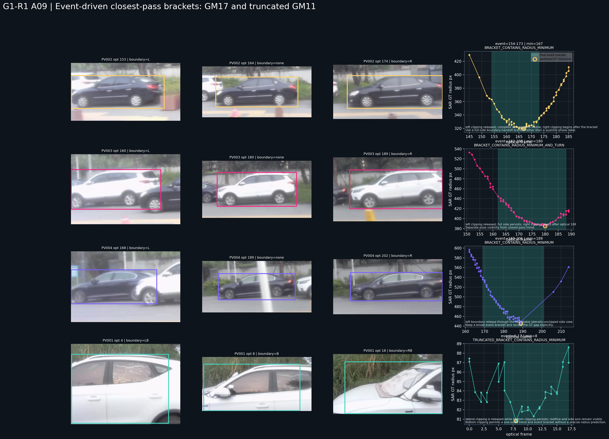
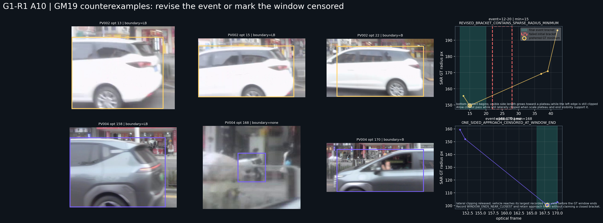
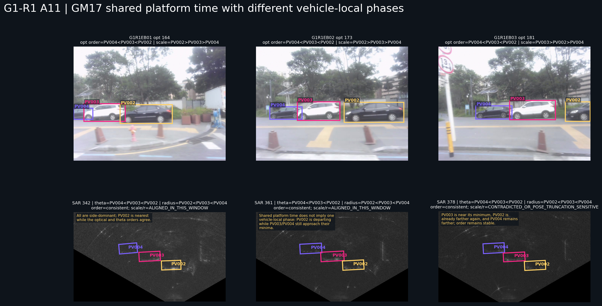
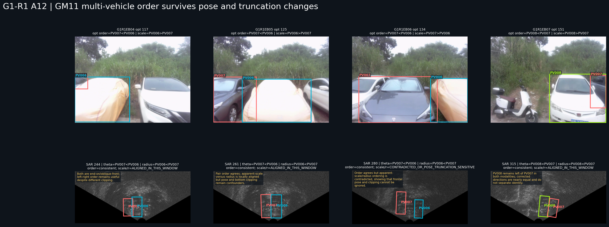

# OTY2-RSA2-G1-R1 事件最近通过 bracket 与多车共享平台开放实验

日期：2026-07-18

性质：继 G1-R1 机制再理解和旋转框长轴纠偏之后的两个小规模开放实验。

本报告不建立新的全局硬包络，不拟合统一回归，不计算证据分数，不生成候选、排名、selector、winner、最终 SAR 框或自动标注。研究期 GT 只用于开放式机制检查，不是部署输入，也不是响应 Mask。

## 1. 研究问题

实验 A 回答：

> 不使用每车横坐标固定分位时，真实光学边界交接、侧面展开、端部显露和尺度平台，能否给出最近通过时间 bracket，并解释 bracket 前后的 SAR GT 半径趋势？

实验 B 回答：

> 同一场景的多辆静止车辆共享平台时刻时，光学左右顺序、观察姿态、截断和相对尺度能否联合解释 SAR 方位与相对半径，并排除邻车交换？

两项实验都允许保留多个解释。失败必须区分变量定义错误、表达错误、数据不足和机制反例。

## 2. 实验 A：事件驱动最近通过 bracket

### 2.1 实验方式

每条线程先直接查看光学连续帧，记录：

- 左/右/底部截断分别何时出现或解除；
- 完整侧面或端部何时显露；
- 可见长轴何时增长、进入平台或下降；
- 窗口是否覆盖接近与离开两侧；
- 旧 PRE/BROADSIDE/POST 与真实图像哪里不一致。

然后冻结一个事件 bracket，再读取 preferred usable/gold、高身份链接 GT 半径轨迹，检查最小半径或转折是否落入。bracket 不是精确帧预测；GT 稀疏时只判断当前证据能否支持。

[事件案例表](../../manifests/oty2/oty2_rsa2_g1_r1_event_bracket_cases.csv) 共 6 行。

### 2.2 GM17 与 GM11 的清楚案例



| 车辆 | 事件 bracket | preferred GT 最小半径帧 | 结果 | 物理解释 |
| --- | --- | ---: | --- | --- |
| GM17 PV002 | 154–173 | 167 | 包含 | 左截断解除后保持完整侧视，右截断在 bracket 后开始；半径先降后升 |
| GM17 PV003 | 162–188 | 180 | 包含并观察到转折 | 完整侧视跨越旧三个阶段，半径在 180 附近由降转升 |
| GM17 PV004 | 169–201 | 189 | 包含 | 完整侧视 bracket 包含最小值；189–206 的 GT 空档限制精确转折时刻 |
| GM11 PV001 | 6–17 | 8 | 包含 | 始终底部截断，但左右截断解除、车顶线和侧轴清楚，仍给出单侧趋势 |

这些案例共同说明：旧 G1 横坐标分位不是必要条件。对 GM17，真正有解释力的是完整侧视与边界交接；对 GM11 PV001，底部截断没有消除横向展开和半径趋势。

### 2.3 GM19：先失败，再修改解释



#### `GM19 PV002`

初始想法是用左右完全显露的 22–28 作为最近通过 bracket。真实最小 GT 半径却在 optical 15，因此：

```text
LATERALLY_UNCLIPPED == CLOSEST_PASS
```

被具体反例否定。

回看 optical 13–22：车辆虽然仍左侧截断，但底部接触已出现，可见侧面长度快速增长并在 optical 15–20 附近进入平台。将 bracket 修订为 12–20 后，optical 15 的最小 GT 半径落入。

该结果只能称为 `REVISED_BRACKET_CONTAINS_SPARSE_RADIUS_MINIMUM`，因为 GT 从 optical 15 直接稀疏到 37；不能把它升级为精确最近点机制。

#### `GM19 PV004`

车辆从左侧截断进入较完整侧视，GT 半径由 optical 151 的约 `159.3 px` 降至 optical 168 的约 `100.4 px`。166–170 bracket 包含当前最小值，但 optical 170 后没有 GT 验证回升，线程也没有完整观察到离开侧。

正确状态是：

```text
APPROACH_OBSERVED
WINDOW_ENDS_NEAR_CLOSEST
POST_BRACKET_REBOUND_NOT_OBSERVED
```

这属于数据窗口不足，不是机制失败，也不能写成闭合的最近通过 bracket。

### 2.4 实验 A 的当前结论

- 光学事件能够给出比每车分位更符合真实图像的最近通过时间区间；
- bracket 前后可以在 GM17 判断半径下降与回升；
- GM11 PV001 证明截断线程仍能给出单侧趋势和包含最小值的 bracket；
- “横向完全显露就是最近点”真实失败；
- 修订后的候选关系是“边界交接 + 侧面/端部展开 + 尺度平台 + 完整线程趋势”；
- 窗口没有覆盖离开侧时，必须记录 censoring，不能把线程末段命名为 POST。

## 3. 实验 B：同帧多车共享平台状态

### 3.1 实验方式

选取 7 个同时存在同车光学状态和同帧 SAR GT 的窗口：

- GM17 optical/SAR `164/342`、`173/361`、`181/378`；
- GM11 `117/244`、`125/261`、`134/280`、`151/315`。

每个窗口记录车辆光学中心、表观尺度、边界接触、SAR theta、SAR 半径，并分别比较：

```text
optical left-to-right order
SAR theta negative-to-positive order
apparent scale large-to-small order
SAR radius near-to-far order
```

表观尺度只用于窗口内解释，不形成跨场景尺度规则。[共享平台窗口表](../../manifests/oty2/oty2_rsa2_g1_r1_shared_platform_windows.csv) 共 17 个车辆行、7 个窗口。

### 3.2 GM17：同一平台时刻不等于同一车辆局部阶段



三个窗口的 optical 左右顺序与 SAR theta 顺序始终为：

```text
PV004 < PV003 < PV002
```

但车辆局部阶段不同：

- optical 164：PV002 最近，三车表观尺度大到小与 SAR 半径近到远一致；
- optical 173：PV002 已越过自己的最小半径并开始离开，PV003/PV004 仍接近各自最小值；
- optical 181：PV003 表观尺度超过 PV002，但 SAR 半径仍是 PV002 更近，尺度—相对半径排序发生反例。

所以共享平台状态应写成：

```text
shared scene progress s(t)
plus vehicle-specific closest offset s_i*
```

而不是要求同一时刻所有车辆都属于同一个 PRE/BROAD/POST。

### 3.3 GM11：方位顺序稳定，表观尺度受姿态和截断影响



4 个 GM11 窗口的 optical 左右顺序与 SAR theta 顺序全部一致：

- optical 117/125/134：`PV007 < PV006`；
- optical 151：`PV008 < PV007`。

但 optical 134 / SAR 280 中，PV007 的表观尺度大于 PV006，SAR 半径却是 PV006 更近。真实图像显示两车为近正面/斜正面，并存在不同方向的截断；这反驳了“同帧更大 bbox 必然更近”的无条件关系。

因此：

- 方位顺序在当前窗口中比尺度排序稳定；
- 相对尺度必须条件化于观察姿态和截断方向；
- 同帧邻车可反驳某车的独立阶段解释；
- 共享平台状态提供共同时间背景，但每车仍有自己的最近点和观察姿态。

### 3.4 PV007/PV008 是否仍可交换

在 optical 151 / SAR 315：

- optical：PV008 在左、PV007 在右；
- SAR theta：PV008 `≈17.49°`、PV007 `≈43.08°`；
- 修正长轴：PV008 `≈-85°`、PV007 `≈-81°`。

方向只差约 4°，仍不能区分两车；但左右/方位顺序与完整交接线程一致，身份交换受到明确反证。

所以当前责任分离为：

```text
direction separation: insufficient
pairwise order exclusion: supported
absolute radius mapping: not established
local SAR response ownership: not yet established
```

## 4. 哪些关系稳定，哪些被反例推翻

### 4.1 当前稳定关系

- 7/7 多车窗口中 optical 左右顺序与 SAR theta 顺序一致；
- GM17 三车的 vehicle-specific 最近点不同，可由完整半径线程解释；
- 截断方向和侧面/端部展开能够恢复旧 `TRUNCATION_LIMITED` 案例的部分趋势；
- PV007/PV008 可由成对顺序排除交换，即使方向不可分。

### 4.2 当前不稳定或失败关系

- 每车横坐标分位不能表示真实姿态；
- 横向完全显露不等于最近点；
- 同帧表观尺度排序不总等于相对半径排序；
- 同一平台时刻不等于所有车辆拥有相同局部阶段；
- 方向相近不能承担 PV007/PV008 身份排他。

实验 B 中表观尺度—相对半径排序有 5 个窗口局部一致，2 个窗口出现明确反例。该数字只描述这 7 个窗口，不是准确率或评分。

## 5. 对旧 `UNRESOLVED` 的重新拆解

### 5.1 恢复出部分信息

- `GM11 PV001`：恢复左右边界事件、单侧半径趋势和最近通过 bracket；
- `GM11 PV006/PV007/PV008`：恢复真实端视姿态、多车方位顺序和身份排他；
- `GM19 PV002`：恢复“仍截断时可能已最近”的事件机制反例；
- `GM19 PV004`：恢复接近侧半径下降和窗口末 censoring；
- `GM17 PV002 optical 173`：恢复“完整侧视仍存在但车辆已越过自身最近点”的联合解释。

### 5.2 仍无法唯一判断

- PV007/PV008 不能靠方向区分；
- GM19 PV004 缺少窗口后段 GT，无法验证半径回升；
- GM19 PV002 optical 15–37 GT 稀疏，修订 bracket 仍不够精确；
- 表观尺度受车型、姿态和截断共同影响，不能单独给绝对半径；
- 当前实验没有分析 GT 框内具体响应属于车辆、背景还是混合，因此没有形成局部响应所有权。

## 6. 五类问题必须分开记录

| 类型 | 本轮具体案例 | 当前处理 |
| --- | --- | --- |
| 计算实现错误 | height 边更长时仍使用 raw angle | 已以四角最长边纠正；历史 G1 不改写 |
| 表达方法错误 | PRE/BROAD/POST 分位；所有截断退回全未知 | 改用姿态、截断维度、事件 bracket 和窗口 censoring |
| 数据确实不足 | GM19 PV004 无后段 GT；PV002 中段 GT 稀疏 | 保留单侧趋势或稀疏 bracket，不宣称闭环 |
| 机制真实失败 | 完全显露=最近点；无条件尺度大=半径近 | 由 GM19 PV002、GM17 181 和 GM11 134 反例否定 |
| 尚有信息未利用 | 多车顺序、车头/车尾、边界交接、完整半径线程 | 已在实验 A/B 中恢复为部分约束 |

不能再用一个 `UNRESOLVED` 覆盖以上五类情况。

## 7. 下一步最值得验证的新机制

当前最小机制不是一个新包络，而是：

```text
场景共享平台进度
  + 每车最近点偏置
  + 真实姿态与分方向截断事件
  + 半径趋势和窗口 censoring
  + 同帧多车方位顺序与排他
```

下一步最有价值的是对这一表达做小规模留出复核：冻结光学事件和多车顺序后，再检查新的车辆线程能否维持 bracket、趋势和排他关系。相对尺度只能作为姿态/截断条件下的辅助解释，不能先升级为统一半径模型。

只有在身份、方位、方向和多车排他已经成立的具体案例中，才适合继续研究 SAR GT 邻近的局部响应结构。光学约束仍只是先验边界，最终精确位置必须由 SAR 图像证据决定。

## 8. 产物与严格未执行事项

新增：

- 本报告；
- [6 行事件 bracket 表](../../manifests/oty2/oty2_rsa2_g1_r1_event_bracket_cases.csv)；
- [17 行多车共享平台表](../../manifests/oty2/oty2_rsa2_g1_r1_shared_platform_windows.csv)；
- A09–A12 四张证据图。

辅助脚本和中间输出位于 `D:/profile/research/workspace/tasks/oty2_rsa2_g1_r1_open_experiments/` 与 `workspace/output/oty2_rsa2_g1_r1_open_experiments/`。

本轮没有修改 GT、历史 G1 报告、配置或阈值，没有读取 `old_work`，没有建立回归、包络、评分、排名、selector、winner、响应检测、候选生成、自动传播、最终框或自动标注。
