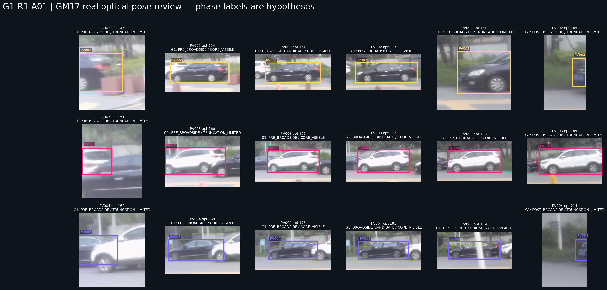
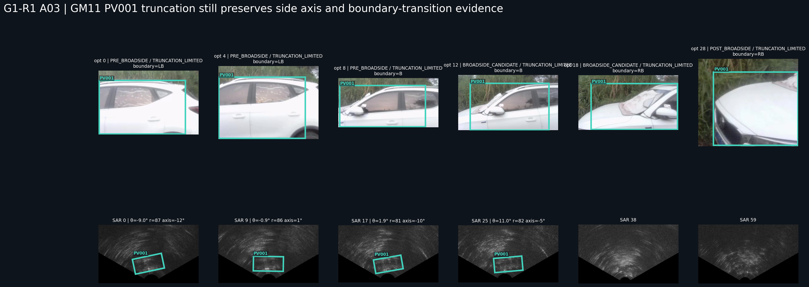
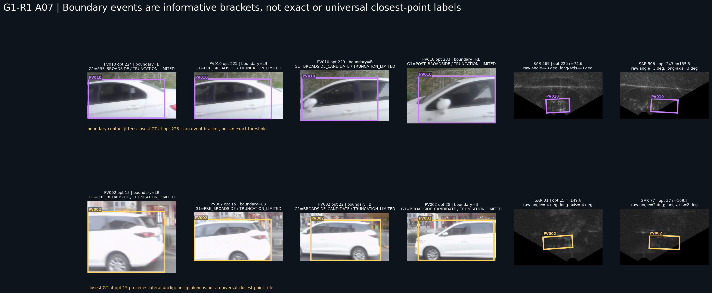
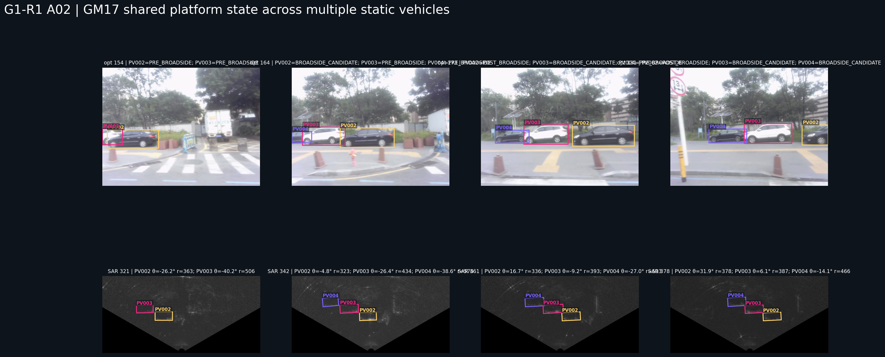
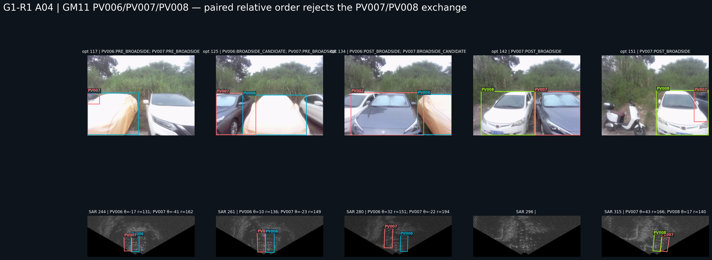
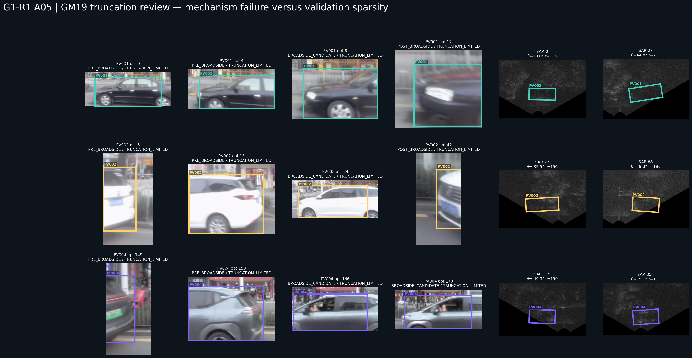
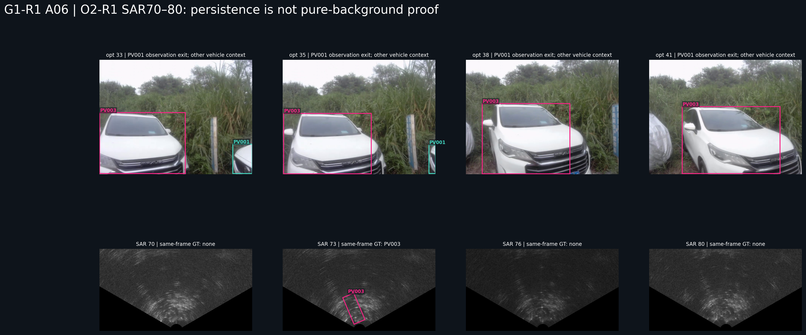

# OTY2-RSA2-G1-R1 静止车辆多模态几何机制再理解与开放探索

日期：2026-07-18

性质：开放使用研究期 GT 的成像后机制发现与既有 G1 表达纠偏。

当前结论不是新的全局定位模型，也不是自动标注资格判定。它只冻结以下更保守但更接近真实图像的认识：

> G1 的主要问题不只是跨场景包络失效，而是把“每车横坐标分位”“边界是否接触”“旋转框原始 angle”和“完整/截断二分”当成了真实观察姿态、最近通过事件、车辆长轴和信息可用性的替代物。回到连续图像后，方向、边界事件、半径趋势和同场景多车相对顺序仍有明确研究价值；其中半径趋势与多车顺序比跨场景绝对半径更稳定。

本报告不实现 SAR 响应检测、候选生成、评分、排名、selector、winner、自动传播、自动身份修正、最终框或自动标注。光学与多车关系只提供可解释的几何和身份约束；任何后续精确 SAR 定位仍必须由 SAR 图像证据在约束域内完成。

## 1. 审阅范围与研究方式

本轮直接审阅最终光学连续帧、最终 SAR 灰度连续帧、canonical 光学车辆线程、操作性光学—SAR 映射和研究期 SAR GT。研究期 GT 用于理解机制和发现 G1 错误，不是部署输入，也不是车辆响应 Mask。

重点车辆与窗口：

- `GM_RM017:PV002/PV003/PV004`；
- `GM_RM011:PV001/PV006/PV007/PV008/PV010`；
- `GM_RM019:PV001/PV002/PV004`；
- O2-R1 的 optical 3–12、SAR 8–24、optical 33–41、SAR 70–80；
- G1 开发证据板、8 组正向—揭示图及其 CSV。

具体方法不是重新拟合 G1，而是逐案例循环：观察真实图像；写出物理解释；提出竞争解释；用相邻帧、同场景其他车辆和 GT 几何反驳；再修改表达。小型案例账本见 [G1-R1 case reasoning](../../manifests/oty2/oty2_rsa2_g1_r1_case_reasoning.csv)。

## 2. 首要纠偏：G1 的阶段不是车辆真实观察姿态

G1 对每条车辆线程独立取光学横坐标有效范围的分位，并强制划成：

```text
PRE_BROADSIDE
BROADSIDE_CANDIDATE
POST_BROADSIDE
```

这种定义可描述“该车在线程中的早、中、晚横向位置”，但不能自动解释成侧后、正侧、侧前，更不能自动解释成平台接近、最近通过、离开。



直接反例包括：

- `GM17 PV002` optical 154–173 都保持清楚的完整侧视，optical 173 已被 G1 标成 `POST_BROADSIDE`，但图像并未进入一个与此前明显不同的“侧前”姿态；
- `GM17 PV003/PV004` 的完整侧视持续跨越多个 G1 阶段，真正变化主要是左侧截断解除、完整可见、右侧截断以及前景遮挡；
- `GM11 PV006/PV007/PV008` 是近正面或斜正面观察，G1 仍机械产生 PRE/BROAD/POST；这些标签不能表示侧后—正侧—侧前；
- `GM19 PV001` 的窗口从最小记录半径开始，后续半径增加，故线程开头不能称为物理意义的 PRE；
- `GM19 PV004` 到最后一条可用 GT 仍在接近最近点，不能因为位于线程后 1/3 就称为 POST。

因此真实表达至少应分开三类状态：

1. **观察姿态**：`REAR_END_DOMINANT`、`FULL_SIDE_VISIBLE`、`FRONT_END_DOMINANT`、`OBLIQUE_END_VISIBLE`、`POSE_AMBIGUOUS`；
2. **截断状态**：`LEFT_LATERAL_CLIPPED`、`LATERALLY_UNCLIPPED`、`RIGHT_LATERAL_CLIPPED`、`BOTTOM_CLIPPED`，各维独立记录；
3. **通过事件**：`APPROACH_OBSERVED`、`CLOSEST_PASS_BRACKET`、`DEPARTURE_OBSERVED`、`WINDOW_STARTS_AFTER_CLOSEST`、`WINDOW_ENDS_BEFORE_CLOSEST`。

这些是图像事实与研究语义，不是新分类算法。

## 3. 第二项纠偏：G1 的 SAR 长轴方向存在实现错误

G1 生成开发关系时先用：

```text
long_axis  = max(width, height)
short_axis = min(width, height)
```

但方向直接使用旋转框的原始 `angle` 做无向归一化。旋转框的 `angle` 描述 width 边方向；当 `height > width` 时，真实长轴应为：

```text
long_axis_angle = angle + 90 deg
```

然后再按 180° 无向角归一化。G1 漏掉了这一步。

| 案例 | GT width×height | 原始 angle | G1 当作长轴 | 正确长轴 |
| --- | --- | ---: | ---: | ---: |
| GM17 PV002 SAR 342 | 149.0×69.7 | 178° | -2° | -2° |
| GM11 PV006 SAR 261 | 84.5×185.5 | 0° | 0° | 90° |
| GM11 PV007 SAR 280 | 74.4×166.9 | 0° | 0° | 90° |
| GM11 PV007 SAR 315 | 70.1×142.8 | 9° | 9° | -81° |
| GM11 PV008 SAR 315 | 73.9×163.1 | 5° | 5° | -85° |

后果是：

- GM17 两个支持案例 `width > height`，其近水平长轴解释没有受到此错误影响；
- GM11 多个近正面车辆 `height > width`，G1 将真实近竖直长轴记录成近水平；
- 对这些 GM11 案例，既有“近水平相容”和“90° 控制被排除”可能恰好被颠倒；
- G1 关于 GM11 方向辨识率的统计不能继续作为科学结论引用，必须先按真实长轴重算。

完整四角最长边复核见 [旋转框长轴方向语义纠偏](../../docs/OTY2_RSA2_G1_R1_ROTATED_BOX_LONG_AXIS_SEMANTIC_CORRECTION.md) 和 [31 行审计表](../../manifests/oty2/oty2_rsa2_g1_r1_long_axis_semantics_audit.csv)。修正后，9 个 G1 同帧揭示案例中目标方向覆盖由 `9/9` 变为 `8/9`，同中心 90° 控制排除由 `5/9` 变为 `4/9`。变化集中在 `G1F0020 / GM11 PV007 / SAR 280`：目标长轴由错误的 `2°` 修正为约 `-88°`，90° 控制由错误的 `92°` 修正为约 `2°`，原方向结论完全翻转。

GM17 两个支持案例与 O2-W1 黄色框不受影响。PV007/PV008 在 SAR 315 的修正长轴约为 `-81°/-85°`，仍不能依靠方向区分；其交换由多车方位顺序反驳，而不是由方向反驳。

这不是阈值问题，而是变量定义错误。

## 4. 截断不是信息全部消失

G1 将所有边界接触统一归为 `TRUNCATION_LIMITED`，并把径向区间退回完整扇区。这样避免了虚假的精确半径，但同时过度丢弃了仍可见的信息。



### 4.1 `GM11 PV001`

optical 0–4 同时左侧和底部截断；optical 6–17 左右截断解除、仅底部截断；optical 18 后转为右侧和底部截断。即使车底不可见，图像仍保留：

- 稳定车顶线和近水平车身长轴；
- 车头/车尾的连续交接；
- 未截断横向长度或其下界；
- 左进入、完整横向展开、右离开的边界顺序；
- 相邻帧中可见端部与透视的变化。

最小 usable GT 半径为 `80.815 px`，对应 optical 8，正好位于 6–17 的左右不截断区间。optical 8 因此不是普通的 `PRE_BROADSIDE`，而是最近通过候选窗口中的一帧。

该案例仍不足以从截断图像给出精确半径，但足以排除 O2 的红色错误位置和黄色 90° 方向控制。应写成“方向与通过事件提供部分约束”，而不是“截断所以全部径向信息未知”。

### 4.2 不能把边界阈值当精确事件



`GM11 PV010` 在 optical 224–235 之间，bbox 的 `x1≤8` 和 `x2≥792` 标志出现单帧抖动：224 不触左边界、225–228 又触左边界；233–234 触右边界、235 又暂时不触。真实图像显示的是一辆持续经过的大型侧视车辆，不是物理状态来回跳变。

它的最小 usable GT 半径出现在 optical 225，仍与左边界交接邻域相容；但边界事件只能用时间容差表示为 bracket，不能以单一像素阈值冻结精确最近帧。

`GM19 PV002` 则是更强反例：最小 usable GT 半径出现在 optical 15，而左右完整可见主要在 22–28。车辆在 optical 15 仍左侧截断，但已接近最近记录位置。这证明：

```text
LATERALLY_UNCLIPPED  !=  CLOSEST_PASS
```

边界解除只是候选证据，必须与尺度平台、真实观察姿态和半径趋势联合使用。

## 5. 同场景共享平台状态具有直接价值

同一场景中的所有车辆静止，平台运动对它们共享。更合理的表达不是让所有车辆同一时刻拥有相同 PRE/BROAD/POST，而是：

```text
scene progress s(t) 单调变化
vehicle i 有自己的最近点偏置 s_i*
vehicle-local pass state 由 s(t) 与 s_i* 的关系决定
```

这只表达共享平台进度和车辆各自不同的最近点，不要求已知世界坐标或平台轨迹。



本轮选取的 5 个同帧多车时刻全部满足：

```text
optical left-to-right order == SAR theta negative-to-positive order
```

| 场景 | optical / SAR | 光学从左到右 | SAR θ 从负到正 | 结果 |
| --- | --- | --- | --- | --- |
| GM17 | 164 / 342 | PV004 < PV003 < PV002 | PV004 < PV003 < PV002 | 一致 |
| GM17 | 173 / 361 | PV004 < PV003 < PV002 | PV004 < PV003 < PV002 | 一致 |
| GM17 | 181 / 378 | PV004 < PV003 < PV002 | PV004 < PV003 < PV002 | 一致 |
| GM11 | 125 / 261 | PV007 < PV006 | PV007 < PV006 | 一致 |
| GM11 | 151 / 315 | PV008 < PV007 | PV008 < PV007 | 一致 |



这直接修订 G1 报告中“GM11 PV007/PV008 仍可交换”的表述。单独看 PV007 的宽方位域，PV008 确实也落入；但在 optical 151，PV008 位于 PV007 左侧；在 SAR 315，PV008 `θ≈17.49°`、PV007 `θ≈43.08°`，顺序一致。把两辆车作为同一时刻的排他关系联合检查后，身份交换受到明确反证。

该结论仍是小样本配对证据，不是跨场景全局标定，也不是自动身份分配器。

## 6. 逐案例重新理解

### 6.1 GM17：两个 G1 成功案例真正依赖什么

G1 的 `GM17 PV002` optical 154 / SAR 321 与 optical 164 / SAR 342 的有界域确实覆盖 GT，并排除主要错误位置、90° 和邻车控制。这一事实可信。但真实成功机制不应简化为“数值落入 `r × sqrt(area)` 包络”。两例共同具备：

- 车辆完整侧面可见，长轴清楚；
- 左右横向截断已解除；
- 光学多车顺序与 SAR 方位顺序一致；
- 同场景中 PV002 视觉尺度更大，同时 SAR 半径比 PV003/PV004 更近；
- 近水平光学侧轴与 `width > height` 的 SAR GT 长轴相容；
- 邻车同时存在，因而提供真实排他关系，而不是任意平移框。

所以这两个案例支持的是“事件窗口 + 相对方位顺序 + 同场景相对尺度/半径 + 方向相容”的联合机制。G1 的硬包络只是把这一组关系编码成了一个极窄区间，不能反过来证明包络形式是唯一或可迁移的机制。

`PV003/PV004` 进一步说明，完整侧视持续跨越多个 G1 阶段；它们的最小半径分别对应 optical 180 和 189，都落在各自左右不截断区间，但真实阶段应由接近—最近通过—离开和边界事件描述。

### 6.2 GM11 PV006/PV007/PV008：不是“全未知”，而是不同能力分开成立

这些车辆的单车绝对半径仍不稳定，底部截断严重，GT 也含 diagnostic-only 行；因此不能直接恢复全局二维定位。但以下关系已经可用：

- 真实观察姿态为近正面或斜正面，而非 G1 所称的侧后/正侧/侧前；
- `height > width` 时 SAR 长轴应增加 90°，可纠正既有方向解释；
- optical 125 / SAR 261 的 PV007—PV006 顺序一致；
- optical 151 / SAR 315 的 PV008—PV007 顺序一致，可排除身份交换；
- 同帧邻车使方位关系具有排他责任。

因此正确结论不是“具备跨场景二维定位”，也不是“必须全部未知”，而是“方向定义需修正；相对方位和多车排他可继续使用；绝对半径仍未闭合”。

### 6.3 GM19：不能简单称为机制失败



- `PV001` 的最小记录半径就在 optical 0，后续由约 `134.6 px` 增到 `202.9 px`，窗口明显从最近点或离开段开始；
- `PV002` 的最小半径在 optical 15，早于完整横向可见段，是“解除截断等于最近点”的反例；
- `PV004` 半径由约 `159.3 px` 降至约 `100.4 px`，到窗口末仍处在接近最近点的阶段，不能叫 POST；
- 多数 G1 正向重点帧没有同帧目标 GT，无法对硬包络做充分揭示；
- 图像中的大量 `TRUNCATION_LIMITED` 实际是底部裁切，仍保留长轴、可见端部和前后帧变化。

所以 GM19 同时暴露：阶段定义错误、截断表达过粗、场景尺度偏置和验证 GT 稀疏。它证明 G1 的绝对包络没有跨场景复现，但尚不足以证明相对顺序、半径趋势和通过事件机制不存在。

### 6.4 O2-R1 SAR 70–80：退出只能排除 PV001 独占



PV001 离开当前光学观察范围时，PV003 和其他场景结构仍存在；SAR 73 有 PV003 GT，SAR 70/76/80 没有同帧 GT。持续结构因此只能支持“不是 PV001 独占”，不能支持“纯背景”。这再次说明完整场景上下文和多车关系不能被单车生命周期规则替代。

## 7. 最近通过事件的初步证据与边界

以严格 bbox 接触统计得到的原始审计如下：

| 车辆 | 左右不截断区间 | 最小 GT 半径对应 optical | 当前解释 |
| --- | --- | ---: | --- |
| GM17 PV002 | 154–173 | 167 | 落入事件区间 |
| GM17 PV003 | 162–188 | 180 | 落入事件区间 |
| GM17 PV004 | 169–201 | 189 | 落入事件区间 |
| GM11 PV001 | 6–17 | 8 | 落入事件区间 |
| GM11 PV006 | 122–126 | 123 | 落入事件区间 |
| GM11 PV007 | 134–138 | 135 | 落入事件区间 |
| GM11 PV008 | 141–150 | 151 | 在右截断交接边界 |
| GM11 PV010 | 严格标志不连续 | 225 | 位于左边界交接邻域，阈值有抖动 |
| GM19 PV001 | 窗口从 0 开始 | 0 | 窗口从最近点或离开段开始 |
| GM19 PV002 | 22–28 | 15 | 明确反例：最小半径早于完整可见 |
| GM19 PV004 | 166–170 | 168 | 落入事件区间，但窗口未覆盖完整离开段 |

由此可复用的最小结论不是“完整可见必为最近点”，而是：

> 左右边界解除/交接通常提供最近通过的候选 bracket；它在 7 条线程中与最小记录半径相容，但受 bbox 抖动、窗口截断、车辆与相机横向关系及 GT 稀疏影响，必须与尺度平台和半径趋势联合解释。

## 8. 绝对半径、相对半径与半径趋势

### 8.1 绝对半径

跨场景绝对 `r × sqrt(area)` 包络最不稳定。它同时混合：

- 场景级成像和有效原点差异；
- 车辆与平台路径的横向间距；
- 车辆真实长宽和类别；
- 光学观察姿态；
- 截断导致的面积损失；
- 相机视场和场景构图差异。

G1 的 GM17 包络不能迁移到 GM11/GM19，不足以证明所有图像域关系失败，只说明这些因素没有被分离。

### 8.2 同场景相对半径

同一时刻、多辆静止车辆共享平台状态，比较其光学尺度、空间顺序和 SAR 半径顺序，可以消除一部分场景级偏置。GM17 两个成功案例实际上强烈依赖这种同场景关系。

目前相对半径样本仍少于相对方位样本，故它是高价值候选机制，但尚未冻结成普适关系。

### 8.3 半径趋势

半径随线程的下降、转折和上升最直接反映接近—最近通过—离开：

- GM17 PV003 显示下降后回升；
- GM19 PV001 只观察到离开侧的上升；
- GM19 PV004 只观察到接近侧的下降；
- GM19 PV002 证明尺度和边界解除不能单独代替趋势。

当前优先级应为：

```text
半径趋势方向
  > 最近通过事件 bracket
  > 同场景相对半径与相对尺度
  > 跨场景绝对半径
```

这不是加权评分顺序，而是研究时应先验证的解释责任顺序。

## 9. G1 哪些结论可信，哪些只是硬包络结果

### 9.1 仍可信

- 在已检查的同场景同步时刻，光学左右顺序与 SAR 方位顺序高度一致；
- GM17 完整线程存在真实的半径下降—转折—回升，而不是全局单调 bbox→radius；
- GM17 PV002 两个正向案例确实形成了有物理意义的约束并排除主要反例；
- 近水平完整侧视可以承担粗方向排除，但只在长轴定义正确时成立；
- G1 正确指出跨场景绝对包络没有得到验证，GT 稀疏也确实限制了 GM19 的结论强度。

### 9.2 只是当前 G1 硬包络或错误变量的结果

- `2/24` 有界成功和 `22/24 UNRESOLVED` 是当前硬包络的覆盖结果，不是“22 个案例没有几何信息”；
- `TRUNCATION_LIMITED -> full-fan radius` 是保守实现选择，不等于截断图像没有方向、趋势或事件信息；
- PRE/BROAD/POST 是横坐标分位，不是真实观察姿态或平台阶段；
- GM11 方向和 90° 控制的部分结论受长轴角实现错误污染；
- “PV007/PV008 未排除”只在单车宽域中成立，加入同帧多车顺序后交换被反驳；
- `NOT_QUALIFIED_TO_REENTER_SAR_LOCAL_RESPONSE_RESEARCH` 把“尚不能全局自动定位”和“不能做受控局部结构研究”捆绑为同一总资格，范围过宽。

## 10. 哪些案例被错误退回完全未知

- `GM11 PV001`：不能给精确半径，但有侧轴、边界交接、最近通过候选和 O2 反例排除；
- `GM11 PV006/PV007/PV008`：不能给全局半径，但有真实端视姿态、纠正后的长轴方向和同帧排他顺序；
- `GM11 PV010`：底部截断不妨碍识别完整侧视和通过过程，问题是边界阈值抖动，不是所有信息消失；
- `GM19 PV001/PV004`：分别提供离开侧和接近侧的半径趋势，即使没有完整通过窗口；
- `GM19 PV002`：作为最近通过事件机制的反例非常有价值，不能因硬包络无界而视为无信息；
- `GM17 PV002` optical 173：完整侧视仍在，不能因 POST 宽高比越界就把所有几何关系退回未知。

部分结论成立不等于完整二维定位成立。应分别记录“方位可用、方向可用、趋势可用、绝对半径未知、响应所有权未知”。

## 11. 当前最小候选机制

本轮不冻结全局公式，只提出一个可被小实验反驳的分层表达。

### 11.1 真实姿态层

- 车头/车尾或可见端部；
- 侧面展开程度；
- 左、右、底部截断分别记录；
- 窗口是否完整覆盖接近、最近通过和离开。

### 11.2 场景共享层

- 场景平台进度 `s(t)`；
- 同帧多车 optical/SAR 相对方位顺序；
- 每辆车自己的最近点偏置 `s_i*`；
- 车辆间的排他关系。

### 11.3 距离层

- 先识别半径趋势方向；
- 再用边界交接与尺度平台形成最近通过 bracket；
- 再检查同场景相对半径/尺度；
- 只有完成场景归一化后，才重新讨论跨场景绝对半径。

### 11.4 SAR 局部结构入口

当身份、相对方位、方向和邻车排他已经成立时，可以在限定案例中研究 GT 邻近的 SAR 局部结构如何随多视角变化。该入口不等于光学壳已给出最终 SAR 位置，也不授权自动响应检测或自动标注。

## 12. 当前适合继续研究 SAR 局部结构的案例

优先：

- `GM17 PV002/PV003/PV004` 的完整侧视与多车共同窗口；
- `GM11 PV001` optical 6–17 / SAR 对应近原点窗口，用于研究底部截断时仍可见的局部结构与方向相容；
- `GM11 PV007/PV008` optical 151 / SAR 315 的成对案例，用于在身份交换已被相对顺序反驳后研究各自局部结构；
- `GM11 PV010` optical 224–233 / SAR 469 邻域，用作事件 bracket 和 bbox 抖动压力案例。

暂不适合作为单帧局部结构定论：

- GM19 大多数 G1 重点帧，因为同帧 GT 稀疏；
- O2 SAR 70/76/80，因为同帧目标 GT 缺失且其他车辆存在；
- 任何仅由单车宽方位域覆盖、未完成邻车排他的案例。

## 13. 最值得执行的两个小实验

### 实验 1：事件驱动最近通过 bracket 留出审计

目的：检验“边界交接 + 尺度平台 + 半径趋势”能否比每车横坐标分位更可靠地定位最近通过窗口。

开发观察仅用 `GM17 PV002/PV003/PV004`、`GM11 PV001/PV006/PV007`；预先冻结：左右/底部截断事件、真实姿态标签、窗口是否完整覆盖通过。留出反例使用 `GM11 PV010` 和 `GM19 PV002`，专门检查 bbox 抖动和“最近点发生在仍截断时”。揭示 GT 后只判断最小半径是否落入 bracket、失败原因是什么，不计算总分，不调阈值，不选择 winner。

### 实验 2：同帧多车相对方位顺序与身份排他

目的：检验同场景 optical 左右顺序能否在 GT 揭示前冻结，并在 SAR theta 揭示后排除邻车交换。

使用 GM17 三车共同窗口和 GM11 PV006/PV007/PV008 交接窗口；同时设置错误配对和顺序反转控制。记录每个时刻的保留或排除理由，不做候选打分。重点复核 `GM11 PV007/PV008`，因为旧 G1 单车宽域称其可交换，而成对顺序已经给出相反证据。

只有这些小实验先成立，才值得讨论更一般的场景内坐标或跨场景归一化。

## 14. 十个最终问题的直接回答

1. **G1 哪些结论可信？** 同场景光学—SAR 方位顺序、GM17 半径转折、GM17 PV002 两个有界案例和“跨场景绝对包络未验证”可信。
2. **哪些只是硬包络结果？** 2/24 成功、22/24 未知、所有截断径向全扇区、PV007/PV008 可交换和总资格 `NOT_QUALIFIED` 都依赖当前表达或错误变量。
3. **哪些案例被错误退回完全未知？** GM11 PV001/PV006/PV007/PV008/PV010、GM19 三个审阅线程及 GM17 PV002 optical 173 都保留部分可用关系。
4. **真实观察姿态如何表达？** 分开记录端部主导/侧面展开、各方向截断、接近/最近通过 bracket/离开以及窗口是否覆盖完整通过。
5. **截断时仍有什么？** 截断方向、未截断维度、可见长轴、车顶/车底、前后端、尺度趋势、边界交接和邻车顺序。
6. **共享平台状态有价值吗？** 有。5 个具体时刻的 optical 左右顺序与 SAR theta 顺序全部一致，并能反驳 PV007/PV008 交换。
7. **绝对半径、相对半径和趋势哪个最有希望？** 半径趋势最优先；事件 bracket 与同场景相对半径次之；跨场景绝对半径最后。
8. **跨场景问题是什么？** 已确认 G1 绝对包络不迁移；原因更像阶段/方向/截断变量错误、场景归一化缺失和 GM19 验证稀疏共同作用，尚不能归结为所有机制失败。
9. **哪些案例可继续研究 SAR 局部结构？** GM17 三车完整共同窗口、GM11 PV001 的截断最近通过窗口、GM11 PV007/PV008 成对窗口、GM11 PV010 的事件压力窗口。
10. **下一步两个小实验？** 事件驱动最近通过 bracket 留出审计；同帧多车相对方位顺序与身份排他审计。

## 15. 产物与严格边界

本轮新增：

- 本报告；
- [案例推理表](../../manifests/oty2/oty2_rsa2_g1_r1_case_reasoning.csv)；
- 7 张小型视觉证据图，目录为 `docs/reviews/assets/20260718_rsa2_g1_r1_mechanism_reinterpretation/`。

辅助脚本、原始测量表和执行日志保留在仓库外 `D:/profile/research/workspace` 的任务、输出与日志目录。没有使用 `old_work`，没有复制原始帧进入仓库，没有修改历史 G1 报告、GT、配置或阈值。

本轮没有形成全局自动标注模型，没有开始 SAR 候选、评分、selector、winner 或最终框实现。当前真正成立的是：

> 现有 G1 把多个仍可辨认的物理关系压成了总资格未知。修正姿态语义、长轴定义、截断分解和多车共享平台关系后，已经可以在部分案例中形成方向、相对方位、通过阶段和排他约束；但这些约束仍只是后续 SAR 局部结构研究的入口，不是最终定位结果。
