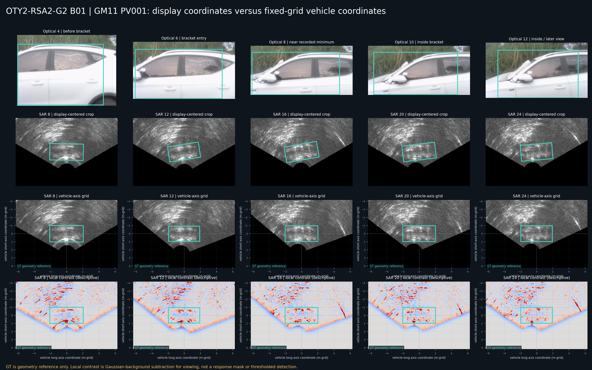
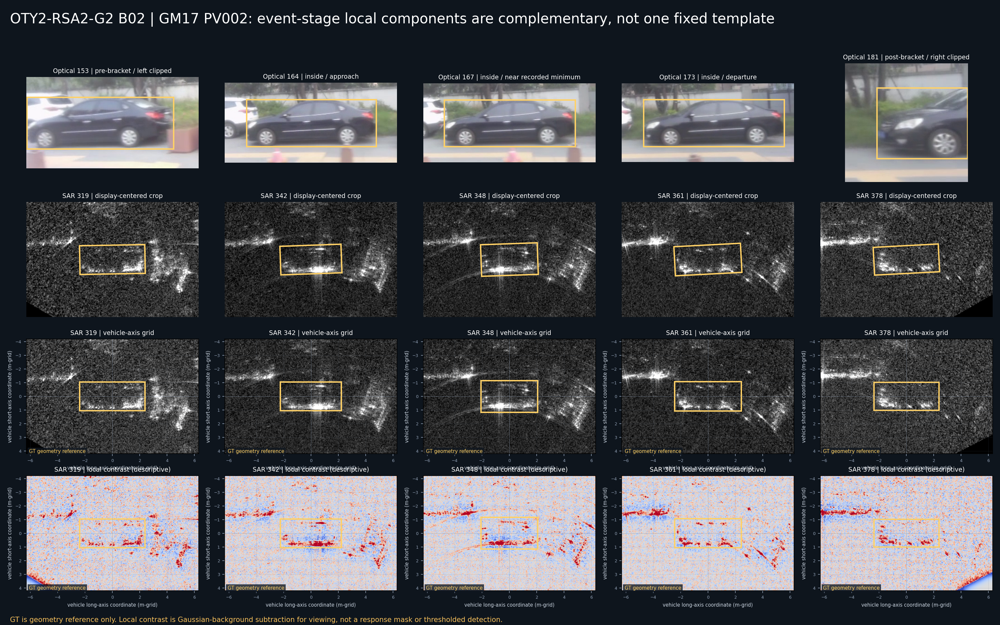
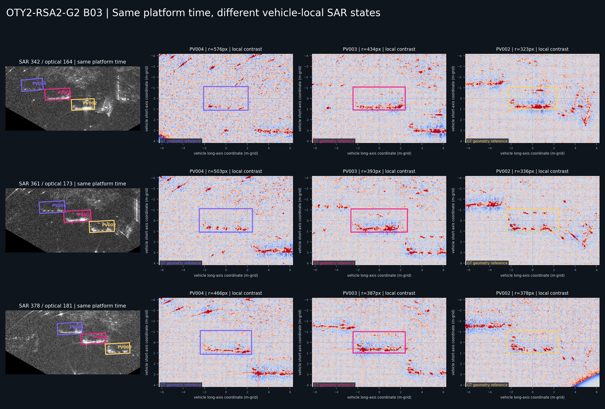
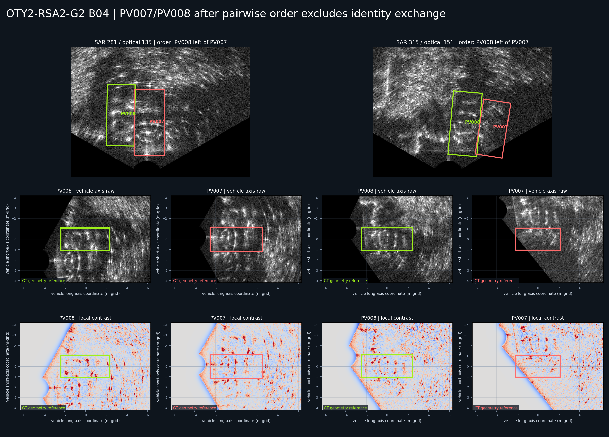
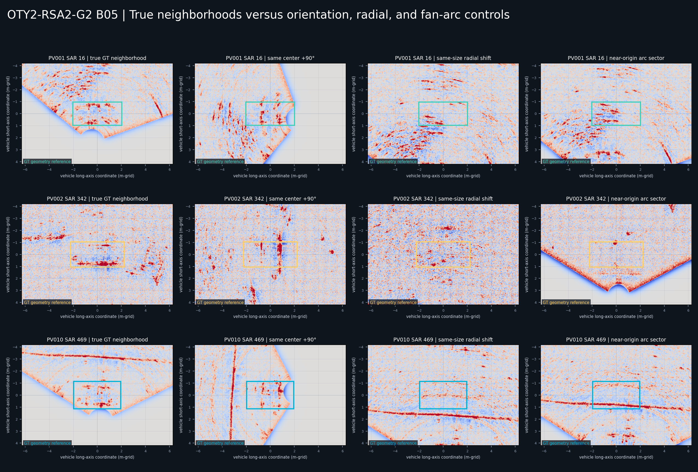
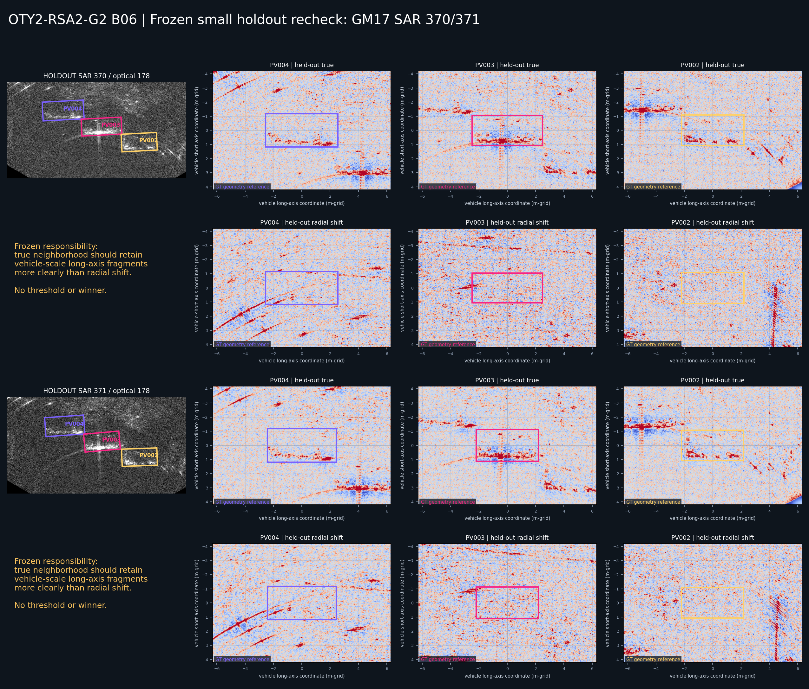

# OTY2-RSA2-G2 事件与多车几何约束下的 SAR 局部车辆结构机制探索

日期：2026-07-18

状态：`CONSTRAINED_LOCAL_COMPONENT_MECHANISM_PARTIALLY_SUPPORTED_WITH_SMALL_HOLDOUT_REPLICATION`

本轮结论不是全局光学→SAR 二维定位模型，不是响应检测器，不是候选、评分、排名、selector、winner、最终框或自动标注能力。研究期 SAR GT 只用于定义车辆中心、旋转框最长边方向、固定重建网格尺度局部坐标与明确负控制；GT 框没有被当作响应 Mask。

当前最重要的结论是：

> 车辆相关坐标没有把同一车辆的不同帧变成高相关的固定像素模板，但在 GM_RM017 三车中暴露出一种比原始显示坐标更可解释的部件级一致性：若干碎片化亮带和热点倾向沿车辆长轴分布，并集中在车辆框靠近扇形原点的一侧；观察阶段改变的是哪些片段和端部显现，而不是要求完整轮廓重复。冻结该表述后，GM17 SAR 370/371 的 6 个车辆-帧留出单元继续出现同类结构，且同尺寸径向平移未复制该侧锁定关系。与此同时，扇形切向弧线、径向强线和近原点无效边界仍能在 GT 邻域内形成很强的竞争解释。GM_RM011 PV001/PV010 证明，仅有车辆尺度、方向相容和 GT 邻域结构仍不足以建立车辆响应所有权。

因此，本轮支持的是“受身份、事件、多车顺序、方向和尺度约束的局部部件机制”，不支持统一像素模板、完整车辆轮廓或部署期定位规则。

## 1. 实际审阅范围

直接审阅并进入新证据图的车辆和帧如下。

### 1.1 GM_RM011 PV001：SAR 16 主案例

- optical `4/6/8/10/12`；
- SAR `8/12/16/20/24`；
- 对应事件语义：bracket 前、进入、记录最小值附近、bracket 内和后段观察；
- SAR 16 使用的首选研究 GT 为中心 `(1155.377,1248.565)`、`135.333×64.847 px`、原始角 `-10°`，即约 `4.060×1.945 m-grid`；
- SAR 16 另做同中心 `+90°`、同尺寸径向平移和近原点弧线控制。

### 1.2 GM_RM017 PV002：完整事件序列

- optical `153/164/167/173/181`；
- SAR `319/342/348/361/378`；
- 分别表示 bracket 前左截断、bracket 内接近、记录最小值附近、bracket 内离开和 bracket 后右截断。

### 1.3 GM_RM017 PV002/PV003/PV004：同平台时刻多车比较

- optical/SAR `164/342`、`173/361`、`181/378`；
- 每个时刻同时审阅 PV004、PV003、PV002 的原始 SAR 上下文和车辆相关局部坐标。

### 1.4 GM_RM011 PV007/PV008：身份排他后的局部比较

- optical/SAR `135/281`；
- optical/SAR `151/315`；
- 身份责任先由“PV008 位于 PV007 左侧”及 SAR theta 顺序冻结，不再依赖方向区分。

### 1.5 GM_RM011 PV010：事件和背景压力案例

- optical `225`；
- SAR `469`；
- 同样设置同中心 `+90°`、同尺寸径向平移和近原点弧线控制。

### 1.6 冻结后小规模留出复核

- GM17 optical `178`；
- SAR `370/371`；
- PV004/PV003/PV002 共 6 个真实车辆-帧单元；
- 每个单元同时检查同尺寸、同方向的向外径向平移控制。

全部 47 行图像、GT 和控制来源见 [G2 case manifest](../../manifests/oty2/oty2_rsa2_g2_local_structure_case_manifest.csv)。

## 2. 方法与边界

### 2.1 车辆相关固定网格坐标

每个 GT 旋转框都从中心、宽、高和原始角重建四角，选择最长边向量，并将其规范到 180° 无向角。局部裁剪以该最长边为横轴、垂直方向为短轴，保持 `0.03 m/px` 的显示/重建网格间距，不做车辆大小归一化。

这意味着：

- 横轴单位是 `m-grid`，不是声明 3 cm 独立空间分辨率；
- GT 只定义坐标和几何参考框；
- 裁剪区域包含 GT 外背景，避免把框内当作车辆响应 Mask；
- 没有通过缩放把不同帧强制变成同一大小或同一模板。

### 2.2 局部对比图

局部对比只以固定高斯背景减除增强短尺度亮暗变化，用于看图。没有阈值化、二值化、连通域接受、响应 Mask 或候选判定。每张图的色阶是描述性显示，不可跨图当作分数。

### 2.3 描述性相邻帧相关

为避免仅凭视觉宣称“对齐改善”，本轮记录了显示坐标中心裁剪和车辆轴对齐裁剪的相邻帧局部对比相关。它只回答“旋转对齐是否让整块像素更相似”，不回答车辆是否被检测。

结果：

| 序列 | 显示坐标平均相邻相关 | 车辆坐标平均相邻相关 | 差值 | 改善帧对 |
| --- | ---: | ---: | ---: | ---: |
| GM11 PV001 B01 | 0.1950 | 0.2171 | +0.0221 | 3/4 |
| GM17 PV002 B02 | 0.1655 | 0.1494 | -0.0160 | 1/4 |

车辆相关坐标没有产生稳定的像素相关提升。其新价值是部件位置、长短轴侧和竞争背景更容易被描述，而不是建立固定模板。

## 3. GM11 PV001 与 SAR 16：车辆尺度微斜结构的重新解释



### 3.1 看到了什么

SAR 8–24 的 GT 邻域一直位于扇形原点附近。局部图中同时出现：

- 与扇形切向近似相容的短弧和亮段；
- 穿过局部区域的近径向强线或竖向带；
- GT 几何范围内若干车辆尺度的短亮段、热点和暗亮交替；
- 有效成像区边界与原点黑洞造成的强几何截断。

SAR 16 的旋转框长轴为 `-10°`，与人类此前看到的“车辆尺度、近水平、轻微倾斜”相符。但图像不支持把这一视觉结构解释为一个完整车辆轮廓。更保守的解释是：

> SAR 16 的微斜结构是车辆尺度局部部件、扇形切向弧段和径向背景线在 GT 邻域中的混合。GT 证明正确车辆几何范围和方向相容，不能单独证明哪些亮段属于车辆。

### 3.2 车辆坐标是否增加一致性

仅有很小的平均相关增益 `+0.0221`，且最后一对帧反而下降。车辆坐标使 GT 长轴统一后，若干短亮段可以在相同长短轴语义下比较，但扇形弧线和原点边界仍占主导。

因此 PV001 提供的是“可提出车辆部件假设”的入口，不是清楚的响应所有权正例。

## 4. GM17 PV002：bracket 前、内、后的部件互补



### 4.1 跨阶段共同结构

在车辆相关坐标中，SAR 319/342/348/361/378 的 GT 几何范围内反复出现：

- 沿长轴分布的碎片化亮带；
- 亮带主要位于 GT 框靠近扇形原点的一侧，即图中的正短轴侧附近；
- 亮带不是连续直线，而是由多个短段、端部热点和内部暗亮间隔组成；
- GT 框上方或外侧另有更长的弧线和斜线，跨过局部区域但不锁定在同一车辆侧。

这个部件级位置关系比整块像素相关更稳定。

### 4.2 bracket 前

SAR 319 / optical 153 左侧仍截断。GT 内靠近原点侧的长轴亮段已经存在，但较碎，端部和内部热点不完整。上方背景弧线和右侧斜结构与车辆局部部件竞争明显。

### 4.3 bracket 内接近与记录最小值附近

SAR 342/348 对应完整侧视和记录最小值邻域。靠近原点侧的长轴亮带更连续、更强，内部热点数量增加；但仍没有形成完整矩形轮廓或固定骨架。

### 4.4 bracket 内离开

SAR 361 中原点侧亮带仍在，但亮点分布重新组织，部分片段合并，右侧斜向结构与局部背景的混合增强。它不是 SAR 342 的复制帧。

### 4.5 bracket 后

SAR 378 / optical 181 已右侧截断。原点侧长轴片段仍可见，但更破碎，端部平衡和内部热点与 bracket 内不同。光学截断并未让 SAR 局部结构全部消失。

### 4.6 是重复、互补还是矛盾

这些帧不是简单重复。整块相关没有因车辆坐标对齐而提高，说明固定像素模板不成立；但“同一短轴侧的长轴碎片带”没有被推翻。当前最合理的表述是：

- 部件位置关系具有弱一致性；
- 每帧显现的具体片段、热点和端部不同，属于互补观察；
- 上方背景弧线、右侧斜线和局部热点会造成单帧矛盾外观；
- 不应通过平均、最大值或并集抹掉这种替换关系。

## 5. GM17 同时刻三车：共享平台不等于共享局部状态



在 SAR 342/361/378 三个同时刻，PV004、PV003、PV002 都表现出车辆尺度、沿长轴分布、偏向原点侧短轴边缘的碎片化亮段，但具体完整度不同：

- PV002 在 SAR 342 的原点侧亮带最连续；
- PV003 在 SAR 361/378 出现更强的连续片段和内部热点；
- PV004 的同类结构更碎，且外部斜线/背景片段竞争更强；
- 同一 SAR 帧中三辆车并不处于同一种局部响应状态。

这与 G1-R1 的共享平台解释一致：`s(t)` 共享，但每辆车有自己的最近点偏置和局部观察阶段。

### 5.1 扇形弧线竞争解释

方向相容本身不够。manifest 记录了车辆长轴与局部扇形切向的无向夹角：

- PV002 SAR 342：`2.77°`；
- PV003 SAR 361：`6.24°`；
- PV004 SAR 342：`33.57°`；
- PV004 SAR 361：`23.99°`。

PV002/PV003 的车辆长轴与扇形切向很接近，背景弧线可以伪装成长轴结构。PV004 在夹角更大时仍保留原点侧车辆尺度碎片，说明“全部只是同一扇形弧线”不足以解释三车结果；但这仍不是纯车辆响应证明。

## 6. PV007/PV008：身份排除后局部结构是否仍不同



答案是：**仍有差异，但差异没有干净到可以单独承担响应所有权。**

### 6.1 SAR 281

- PV008 的 GT 邻域中，原点侧附近有更密集的热点和弧段；
- PV007 的局部区域更多由径向/近竖直强线和多条弧线穿过；
- 两者不是同一局部图案的平移复制。

### 6.2 SAR 315

- PV008 仍保留较密集的内部和原点侧片段；
- PV007 的 GT 内部更稀疏，斜线和边界混合更明显；
- 两车修正长轴约 `-85°/-81°`，方向不足以区分，但局部外观也没有变成可交换的同一结构。

### 6.3 限制

两车都靠近扇形原点和有效区边界，背景弧线、径向线和黑色无效区强烈进入局部裁剪。当前只能说“身份交换后仍不视觉等价”，不能说每个框内哪一条亮线已经确定属于对应车辆。

## 7. 负控制排除了什么，也暴露了什么



### 7.1 同中心 90° 控制

在 PV002 SAR 342 中，真实车辆轴坐标下的原点侧长轴碎片带，在 90° 控制坐标中变成明显跨短轴/近竖直结构。它排除了“只要中心正确，任意方向都能得到同样的车辆轴相容结构”。

但 PV001/PV010 的 90° 控制仍能看到很强的竖向或弧形结构，说明近原点背景本身具有丰富方向，不能把“控制中也有结构”误判为车辆机制失败或成功。

### 7.2 同尺寸径向平移

PV002 SAR 342 的径向平移区没有复制真实 GT 邻域中靠原点侧的连续碎片带。这削弱了“任一同半径方向附近都存在同样强的固定扇形弧线”解释。

PV001/PV010 的径向平移区仍出现明显弧线，证明近原点场景中背景结构足以制造车辆尺度假象。

### 7.3 近原点弧线控制

PV001/PV010 的近原点控制与真实邻域同样结构丰富，直接限制了车辆所有权结论。PV010 尤其表现为：真实 GT、径向平移和弧线控制都被强扇形弧线支配，当前不能从 SAR 469 建立可靠的车辆局部部件机制。

### 7.4 邻车控制

GM17 同帧三车和 GM11 PV007/PV008 表明，不同车辆局部状态不是同一背景图案的简单复制；但邻车对照也证明共享背景可以同时穿过多个 GT 邻域。多车排他解决身份责任，不自动解决响应像素所有权。

## 8. 当前更可能属于背景与更可能属于车辆的结构

### 8.1 更可能属于背景或混合

- 以扇形原点为中心、跨越大范围的弧线；
- 穿过多个车辆区域或在径向平移控制中重复出现的弧线；
- 近原点的强径向竖线和黑色无效区边界；
- GT 外持续、但不随车辆中心/阶段保持车辆侧位置的长结构；
- PV010 SAR 469 中主导真值和控制区的长弧；
- PV001 SAR 16 中无法由控制排除的部分切向弧段和径向交叉线。

### 8.2 当前更可能与车辆有关

- GM17 三车中位于车辆尺度范围内、沿正确长轴分布的碎片化亮带；
- 该亮带在多帧中保持在车辆框原点侧的短轴半区，而具体亮段和热点发生替换；
- PV002 SAR 342/348 的连续原点侧亮带及其内部/端部热点；
- PV003/PV004 在不同扇形切向夹角下仍出现的同类车辆侧结构；
- 径向平移控制中明显减弱或缺失、但真实车辆邻域中保留的局部片段。

这里的“更可能”仍是机制解释，不是响应 Mask 标注。

## 9. 光学姿态与 SAR 局部状态

### 9.1 GM17 完整侧视

optical 164–173 都是完整侧视，但 SAR 局部部件仍从较连续的原点侧亮带变成不同的热点组合。这说明完整侧视是有用条件，却不对应唯一 SAR 模板。

### 9.2 截断

PV002 optical 153 和 181 分别左/右截断，SAR 319/378 仍保留部分长轴片段。截断改变部件完整度和端部平衡，不等于结构全部消失。

### 9.3 GM11 近正面/斜正面

PV007/PV008 的 SAR GT 长轴近竖直，车辆坐标中局部结构与 GM17 侧视车辆明显不同，更易被径向线、扇形弧和有效区边界混合。它支持“姿态必须条件化”，但当前场景、半径和边界状态同时变化，不能把差异全部归因于光学姿态。

## 10. 当前最可信的局部响应机制

当前保留的最小机制是：

```text
静止车辆的 SAR 局部可见响应
  = 位于车辆尺度邻域中的若干长轴碎片、短带和热点
  + 更常集中在朝向扇形原点的一侧短轴半区
  + 随平台经过阶段发生片段替换、合并、分裂和端部失衡
  + 与扇形切向弧线、径向强线和邻车背景混合
```

它不是完整轮廓、固定骨架或单一最亮区。多帧的价值是提供互补部件和竞争解释反驳，而不是通过聚合制造一个看似稳定的 Mask。

## 11. 支持、反驳与限制

### 11.1 主要支持案例

- GM17 PV002 SAR `342/348/361`：原点侧长轴碎片带最清楚；
- GM17 PV003/PV004 SAR `342/361/378`：同平台多车中出现相似部件级表达，但完整度不同；
- GM17 PV002 SAR `319/378`：截断前后仍保留部分部件，支持“截断不是全部未知”；
- PV002 SAR 342 径向平移控制：没有复制真实区域的连续原点侧亮带。

### 11.2 主要反驳或限制案例

- GM11 PV001 SAR 16：车辆尺度和方向相容成立，但真值区与弧线/径向控制过于相似，所有权未闭合；
- GM11 PV010 SAR 469：真实区域和控制区都被扇形弧线支配，是明确压力反例；
- GM11 PV007/PV008：身份不再可交换，但近原点混合使局部响应仍未清楚归属；
- GM17 PV002 相邻帧整块相关在车辆坐标中没有提高，反驳固定像素模板；
- 车辆轴与扇形切向在部分帧接近，反驳仅靠方向相容确认车辆结构。

## 12. 已执行的小规模冻结后留出复核

在 B01–B05 的机制措辞冻结后，本轮没有改坐标、尺度、控制或案例责任，直接打开此前未进入 G2 图板的 GM17 SAR `370/371`。



冻结的观察责任为：

1. 坐标只用 GT 中心、最长边和固定网格尺度；
2. 先看原始灰度，再看车辆坐标，不先看聚合；
3. 检查原点侧长轴碎片是否存在、是否随车辆中心保持侧位置；
4. 同时检查同尺寸径向平移、局部扇形弧和邻车区域；
5. 允许 `VEHICLE_COMPATIBLE_MIXED`、`BACKGROUND_DOMINANT` 和 `UNRESOLVED`，不强制 PASS/FAIL。

复核结果：

- SAR 370/371 的 PV004、PV003、PV002 共 6 个真实邻域均保留车辆尺度、沿长轴、集中在原点侧短轴半区的碎片带；
- PV003 的真实邻域最连续，PV004 更碎，PV002 仍表现为多个分离热点和短段；
- 6 个同尺寸径向平移控制没有复制同样的原点侧车辆尺度碎片关系；个别控制有弧线或交叉线，但位置、连续度和侧锁定方式不同；
- 结果没有要求修改已冻结机制。

因此，小规模留出结果为 `SUPPORTED_WITHIN_SAME_SCENE_ADJACENT_FRAMES`。它仍只覆盖同一场景和相邻两帧，不能视为跨场景泛化或准确率。

## 13. 下一步最有价值的实验

下一步最有价值的是把已经在 GM17 复现的部件语法迁移到不同姿态和不同场景，而不是继续增加同场景相邻帧：

1. 选择 GM11 PV006 SAR `244/261` 的近正面案例，以及 GM19 SAR `27/31` 的多车压力案例；
2. 先冻结身份、方位顺序、事件阶段和粗方向，再查看车辆相关局部区域；
3. 人工记录可追踪的长轴碎片、端部热点、原点侧/远原点侧位置和竞争弧线；
4. 比较真实区域、径向平移、邻车和近原点弧线控制；
5. 只回答 GM17 的部件语法是否需要按端视姿态或场景背景修改，不生成候选和 winner。

如果 GM11 端视和 GM19 多车压力中仍能找到有控制支持的姿态条件化表达，才值得继续设计更正式的局部结构表示。

## 14. 十五个最终问题的直接回答

1. **实际审阅了哪些车辆和帧？** GM11 PV001 optical 4/6/8/10/12、SAR 8/12/16/20/24；GM17 PV002 optical 153/164/167/173/181、SAR 319/342/348/361/378；GM17 PV002/PV003/PV004 同帧 SAR 342/361/378；GM11 PV007/PV008 SAR 281/315；GM11 PV010 SAR 469；冻结后另复核 GM17 三车 SAR 370/371，并包含三类负控制。
2. **车辆相关坐标是否带来新的结构一致性？** 带来部件级和车辆侧位置的一致性，但没有带来统一像素相关提升。PV001 小幅改善，PV002 反而略降。
3. **SAR 16 的车辆尺度微斜结构如何解释？** 它是车辆尺度短亮段/热点、扇形切向弧和径向线的混合；方向和尺度相容，但车辆所有权未闭合。
4. **bracket 前、内、后有什么差异？** PV002 前段碎片弱且端部不完整；内部接近/最小值附近原点侧亮带更连续；离开和后段发生片段替换、分裂和端部失衡，结构未完全消失。
5. **同一车辆不同帧是重复、互补还是矛盾？** 主要是互补。具体像素和热点不重复，但粗部件位置关系不矛盾；背景混合造成部分单帧冲突。
6. **哪些结构更可能属于背景？** 扇形同心弧、跨多车/平移控制重复的弧线、近原点径向强线、无效区边界和 PV010 的主长弧。
7. **哪些结构更可能与车辆有关？** GM17 中车辆尺度、沿正确长轴、位于原点侧短轴半区、随车辆中心保持而随阶段替换的碎片带和热点。
8. **负控制排除了哪些解释？** 90° 控制排除中心正确即可任意方向相容；径向平移削弱任意同扇形位置都复制 PV002 结构的解释；近原点控制同时证明 PV001/PV010 背景足以产生假结构。
9. **PV007/PV008 局部结构是否仍有差异？** 有。PV008 更密集，PV007 更受径向/斜线和边界支配；但两者都混合严重，不能仅靠局部结构完成所有权确认。
10. **光学姿态是否对应不同 SAR 局部状态？** 有条件对应。完整侧视更容易出现长轴碎片带，截断改变完整度；近正面/斜正面案例更易与径向背景混合，但场景和半径仍是混杂变量。
11. **当前最可信机制是什么？** 原点侧短轴半区中的长轴碎片、短带和热点随观察阶段互补显现，同时嵌入扇形弧和径向背景。
12. **哪些案例支持？** GM17 PV002 SAR 342/348/361，GM17 PV003/PV004 SAR 342/361/378，PV002 的径向平移控制，以及冻结后 GM17 三车 SAR 370/371 的 6 个真实邻域对照。
13. **哪些案例反驳或限制？** PV001 SAR 16、PV010 SAR 469、PV007/PV008 近原点混合，以及 PV002 对齐后相关未提高。
14. **是否值得小规模留出验证？** 已完成。GM17 SAR 370/371 的 6 个车辆-帧单元在不改机制的情况下复现，当前仅支持同场景相邻帧范围。
15. **下一步最有价值的实验是什么？** 对 GM11 PV006 SAR 244/261 和 GM19 SAR 27/31 做跨姿态/跨场景压力复核，并与径向平移、邻车和近原点弧线控制比较。

## 15. 产物与严格未执行事项

新增：

- 本报告；
- [G2 可复现诊断脚本](../../tools/diagnostics/run_oty2_rsa2_g2_local_vehicle_structure_discovery.py)；
- [47 行案例与控制 manifest](../../manifests/oty2/oty2_rsa2_g2_local_structure_case_manifest.csv)；
- B01–B06 六张真实图像证据图，位于 `docs/reviews/assets/20260718_rsa2_g2_local_structure/`。

本轮没有读取或修改 `old_work`，没有修改 GT、历史报告、配置、阈值或正式定位流程，没有把 GT 当作响应 Mask，没有生成候选、评分、排名、selector、winner、最终框或自动标注。

当前冻结结论为：

> 受身份、事件、多车顺序、正确长轴和物理网格尺度约束后，GM17 支持一种“原点侧长轴碎片 + 多帧部件替换”的局部车辆相容机制，并已在同场景 SAR 370/371 的小规模冻结后复核中复现；PV001、PV007/PV008 和 PV010 同时证明近原点背景仍可产生强竞争结构。该机制尚不足以成为跨场景结论、部署输入或自动定位规则。
