# OTY2-RSA2-G2-R1 雷达近距侧车辆关联响应带的物理精化与因果排除

执行日期：2026-07-19

状态：`GM17_CONDITIONAL_NEAR_RANGE_SIDE_VEHICLE_ASSOCIATED_ANCHOR_SUPPORTED_AS_VEHICLE_GROUND_ROAD_MIXED`

## 0. 结论先行

本轮得到的是预设结果 **B**，同时保留一个严格受限的锚点用途：

> GM_RM017 中确实存在一个不依赖逐帧 GT 微调、不依赖单一高通尺度、在原始灰度中可见的“车辆位置锁定的近距侧长轴响应”。其主峰位于车辆中心朝扇形原点方向约 `0.65–0.79 × (W/2)`，即框内靠近近距短轴边界；亮带本身有宽度，常接触或跨过 GT 边界。PV004 在车辆轴与扇形切向相差约 `37°/25°` 的 SAR 342/361 及相邻帧中仍保留沿车辆轴的近距侧短段，排除了“全部只是扇形切向弧线”。但车辆长轴与停车道路方向几乎平行，现有空道路控制不是精确世界点配准，因而不能把纯车体散射与车辆—地面角反射、多径、路缘/道路混合完全拆开。

因此当前最合理的物理解释是：

```text
条件化车辆关联近距侧响应
  = 雷达朝向侧车体散射
  + 车辆—地面角反射/多径与近距向成像偏移
  + 同向道路或路缘背景的局部混合
  + 少量扇形成像结构竞争
```

当前可以称为：

- `VEHICLE_ASSOCIATED_NEAR_RANGE_ANCHOR_WITH_GROUND_ROAD_MIXING`；
- GM17 同场景研究期的车辆关联响应锚点；
- 后续局部搜索区域缩小的弱先验。

当前不能称为：

- 纯车辆本体响应；
- 已标定的物理侧边界；
- 稳定常数偏移的中心恢复公式；
- 跨场景成立的自动标注规则；
- 响应 Mask、候选、评分、排名、selector、winner 或最终框。

## 1. 研究边界与静止世界事实

所有车辆、道路、路缘、护栏和其他背景都固定在世界中，运动的是搭载光学相机和毫米波 SAR 的采集平台。报告采用：

```text
平台状态：P(t)

静止车辆世界几何：
G_i = (X_i, Y_i, ψ_i, L_i, W_i)

车辆观测几何：
Q_i(t) = h(P(t), G_i)

车辆相关 SAR 状态：
Z_i(t) = F(G_i, Q_i(t), 材质, 地面, 成像条件)

观测：
I_t = Σ H(Z_i(t)) + B(P(t))
```

`B(P(t))` 中的静态背景同样随平台运动发生投影和成像变化。本轮没有使用“车辆在动、背景不动”的错误区分。

研究期 SAR GT 只用于：

- 车辆中心、长短轴和尺度参考；
- 逐帧坐标基准；
- 留一帧线程稳定几何拟合；
- 明确控制的相对位移。

GT 框没有作为响应 Mask，也没有进入任何部署期构造。

## 2. 实际阅读、复核与图像审阅范围

开始前重新阅读并核对：

- G2 报告、47 行 manifest 和完整诊断脚本；
- G2 的 B01–B06；
- G1-R1 多模态机制重解释、事件 bracket、共享平台实验、长轴语义纠偏及案例表；
- 原始光学 PNG、原始 SAR 灰度 PNG 和新生成的局部图，而不是只读既有文字。

### 2.1 GM17 PV002

主序列：

- optical `153/164/167/173/181`；
- SAR `319/342/348/361/378`。

新增相邻帧连续性审阅：

- SAR `341/342/343`；
- SAR `347/348/349`；
- SAR `360/361/362`；
- SAR `377/378/379`；
- 对应新增打开 optical `165/168/174/182`。

冻结后相邻窗口：

- optical `178`；
- SAR `370/371`。

### 2.2 GM17 PV003

- optical `164/173/178/181` 的同平台多车上下文；
- SAR `342/361/370/371/378`。

### 2.3 GM17 PV004

主帧：

- SAR `342/361/378`。

新增关键相邻帧：

- SAR `341/342/343`；
- SAR `360/361/362`；
- SAR `377/378/379`；
- optical `164/165/173/174/181/182`。

冻结后窗口：SAR `370/371`。

### 2.4 GM11 压力复核

- PV001 optical `8` / SAR `16`；
- PV008/PV007 optical `151` / SAR `315`；
- 重新核对 B01、B04、B05 中近原点弧线、径向强线、黑色无效区和边界混合。

本轮没有提前进入 GM11 PV006 或 GM19 主结论实验。

## 3. 有符号车辆坐标和雷达局部坐标

### 3.1 车辆坐标

- `u`：车辆最长边轴；
- `u` 采用 180° 无向表达；
- 代码将 `u` 规范为图像 x 分量非负，只是确定绘图符号；
- `v`：与 `u` 正交；
- `v>0` 通过与 `FAN_ORIGIN - center` 的点积显式校正，保证指向扇形原点，即雷达近距侧。

所有 manifest 真值行的 `near_sign_dot_to_origin` 均为正。关键 9 个 GM17 多车单元为 `0.803–0.999`，说明近距符号没有依赖“图中上/下”猜测。

光学中三辆车均可见稳定的侧视车身，PV002/PV003/PV004 的车头大致位于光学左侧。但本轮没有可靠标定把光学左端映射为 SAR `u+` 或 `u-`，所以：

```text
optical head/tail visible ≠ SAR u sign established
```

manifest 明确记录 `UNDIRECTED_HEAD_TAIL_NOT_TRANSFERRED`，没有把 SAR 端点臆测为车头或车尾。

### 3.2 雷达局部坐标

- `ρ`：扇形径向；
- `τ`：同半径局部切向；
- 每个案例记录半径、方位、车辆轴与 `τ` 的轴向夹角、有效区状态和背景类型。

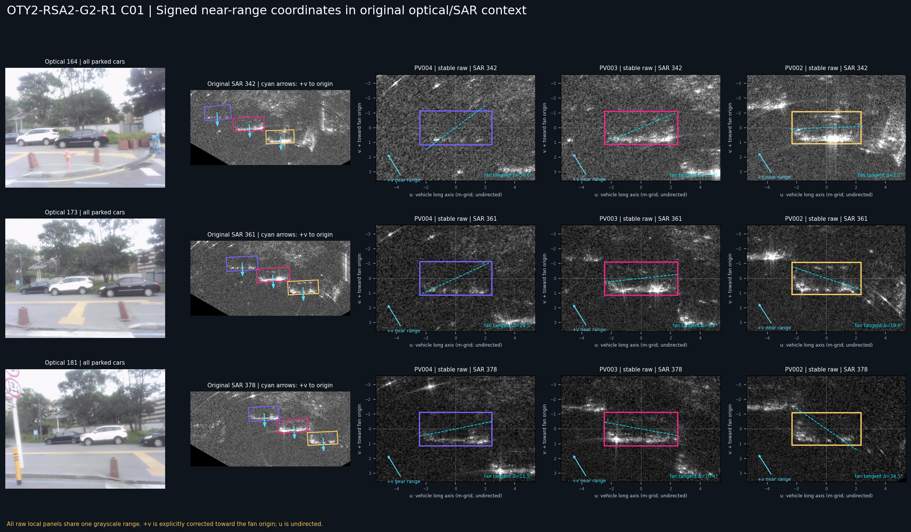

## 4. 逐帧 GT 与线程稳定留一帧坐标

### 4.1 方案 A：逐帧 GT

沿用 G2 基准：当前帧 GT 中心、当前帧最长边方向和当前帧长宽。

### 4.2 方案 B：线程稳定 LOO

对每个目标车辆和当前 SAR 帧：

1. 当前帧 GT 从拟合输入中剔除；
2. 对相邻线程 GT 中心轨迹做鲁棒二次拟合并预测当前中心；
3. 长宽使用线程局部中位数；
4. 方向使用 180° 轴向圆均值；
5. 当前帧 GT 只在绘图后作为 posthoc 几何差异参考，不参与裁剪贴合。

GM17 多车 9 个关键单元中：

| 项目 | 范围 | 均值 |
| --- | ---: | ---: |
| 逐帧中心与 LOO 中心差 | `1.146–5.784 px` | `2.957 px` |
| 逐帧轴与 LOO 轴差 | `0.279–2.754°` | `0.791°` |

PV002 五帧主序列的中心差为 `1.006–3.559 px`，轴差为 `0.279–1.328°`。

两种坐标得到相同物理结论：近距侧响应仍在，位置和多帧片段变化没有被吸收到逐帧 GT 微调中。

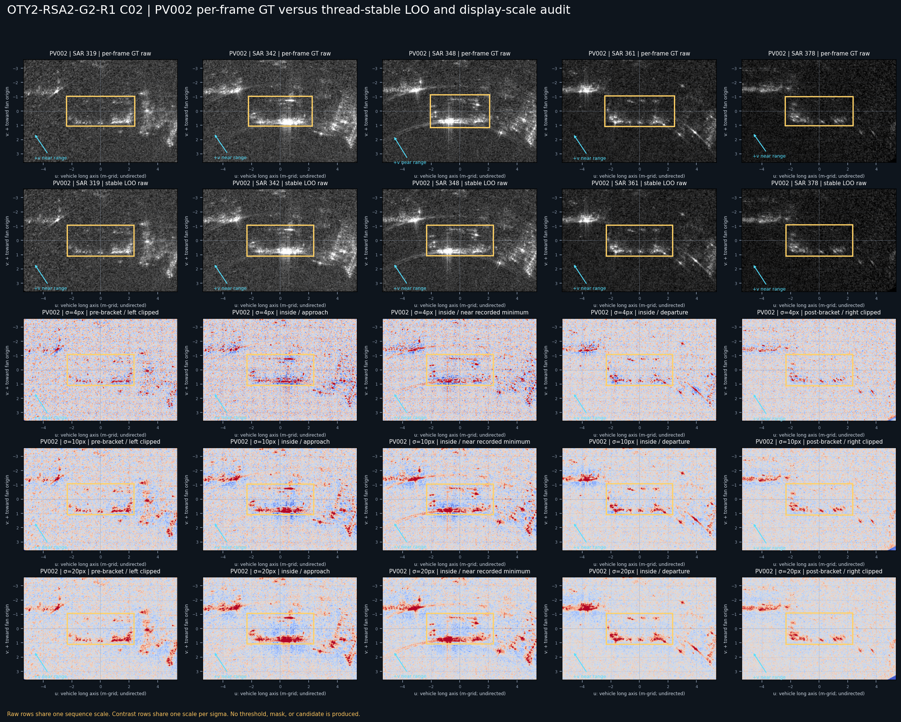

## 5. 原始灰度与显示尺度审计

### 5.1 原始灰度是否存在

存在。关键 9 个 GM17 车辆-帧单元在统一原始灰度色阶下都显示：

- GT 内 `+v` 半区亮度高于 `-v` 半区；
- 长轴向亮段、短带或热点集中在近距侧；
- 远距侧同时存在较弱结构、空缺或背景弧线竞争。

描述性近半区减远半区均值在 9 个单元中全部为正，为 `2.158–17.307` 灰度级。该量只用于核对人类看图，不是阈值或评分器。

### 5.2 是否依赖 sigma=10

不依赖。本轮同时显示：

- 原始灰度；
- 全序列统一色阶原始灰度；
- Gaussian 背景减除 `sigma=4/10/20 px`。

PV002 SAR `319/342/348/361/378` 在三个 sigma 下近半区减远半区描述量都保持正值。变化的是显示形态：

- `sigma=4` 更强调细边、端点和碎片；
- `sigma=10` 接近 G2 旧显示；
- `sigma=20` 恢复更宽、更连续的低频带状成分。

因此不能把 sigma=4/10 图中的碎片直接命名为独立散射部件；原图支持的是宽度有限的亮带、亮段和热点混合。

### 5.3 相邻帧是否连续

PV002 的 `341–343`、`347–349`、`360–362`、`377–379` 表明响应在原始灰度中连续改变：亮段位置、强度、分裂和端点发生渐变，没有只在代表帧闪现。

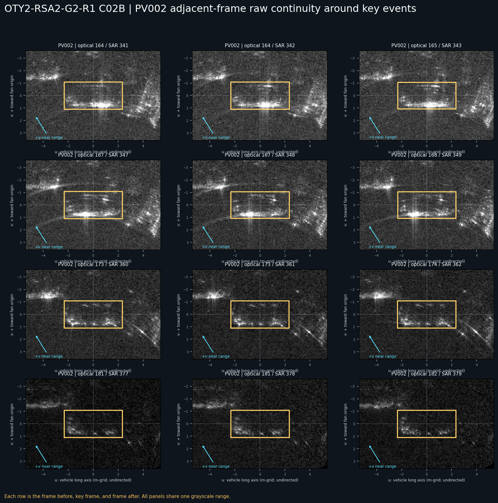

## 6. 响应相对车辆半宽的位置

在 GM17 PV002/PV003/PV004 的 SAR `342/361/378` 共 9 个线程稳定单元中，沿 `u` 平均的宽尺度描述峰为：

| 车辆/帧集合 | 峰值 `v` | 相对半宽 |
| --- | ---: | ---: |
| 9 个单元总范围 | `+24.5–+28.5 px` | `+0.652–+0.792 × (W/2)` |
| 总均值 | 约 `+26.8 px` | `+0.718 × (W/2)` |

这说明：

- 峰值位于 GT 框内部；
- 不是中心附近随机分布；
- 稳定偏向近距侧；
- 离近距短轴边界还有约 `0.21–0.35 × (W/2)`；
- 但亮带有宽度，原始灰度中的亮带边缘常接触或跨过 GT 边界。

当前不能把峰值位置直接当作物理侧壁。它也可能是侧体散射、车辆—地面交互与近距向成像偏移叠加后的中心线。

## 7. GM17 逐案例物理观察

### 7.1 PV002 SAR 319

- optical 153 左侧截断但侧视主轴清楚；
- 原始灰度中近距侧已有较弱长轴片段；
- 远距侧弧线和右侧斜结构竞争强；
- 状态：`VEHICLE_GROUND_MIXED_PLAUSIBLE`，不是清晰侧边界。

### 7.2 PV002 SAR 342/348

- optical 164/167 为完整侧视；
- 原始灰度近距侧亮带最强、最连续；
- 描述峰约为 `0.79 × (W/2)`；
- 亮带沿车辆长度展开，但内部热点和垂直条纹不应全部解释为车体部件；
- sigma 变大后宽带更加明显，说明小 sigma 会把它表达成碎片和端点。

### 7.3 PV002 SAR 361

- 光学仍为完整侧视；
- 近距侧长轴带变弱并分裂，右端斜向背景增强；
- 相邻 360/362 显示这是连续重组，不是单帧矛盾。

### 7.4 PV002 SAR 370/371

- optical 178 已开始右侧截断；
- 近距侧结构仍保留；
- 这是一个相邻两帧多车窗口，不是六个独立复现。

### 7.5 PV002 SAR 378

- optical 181 右侧截断；
- 原始灰度近距侧仍有较弱片段和热点；
- 描述峰约 `0.67 × (W/2)`；
- 响应没有因光学截断而全部消失。

## 8. PV004 的关键鉴别责任

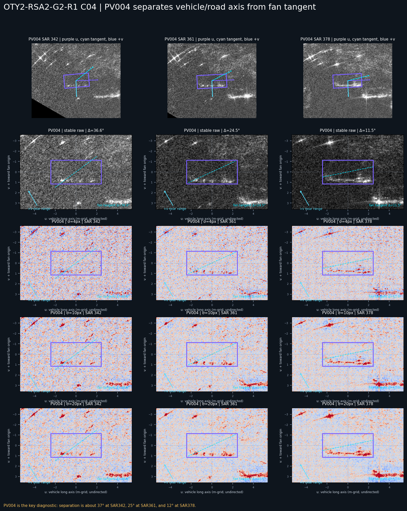

PV004 的车辆轴与扇形切向差异为：

- SAR 342：`36.6°`；
- SAR 361：`24.5°`；
- SAR 378：`11.5°`。

最有鉴别力的是 SAR 342/361 及相邻帧：

- 扇形切向以明显斜线穿过局部坐标；
- GT 内近距侧的短亮段总体更接近水平 `u` 轴；
- SAR `341–343` 和 `360–362` 中该关系连续存在；
- 因而“全部是扇形切向弧线”不能解释 PV004。

SAR 378 的夹角已缩小，单独鉴别力较弱，但 `377–379` 仍显示近距侧结构连续增强。

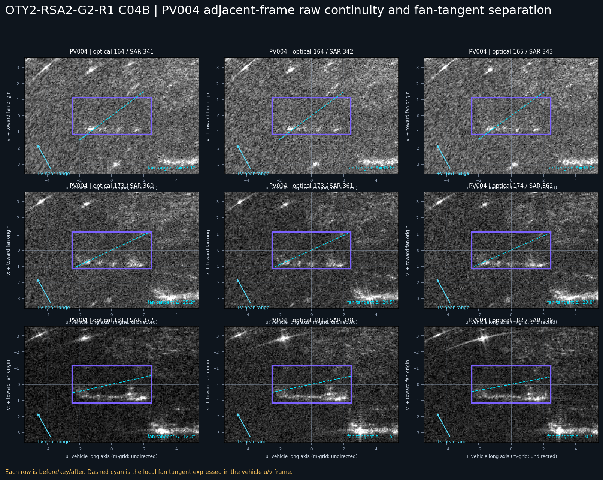

PV004 能区分车辆/道路轴与扇形切向，不能区分车辆轴与道路轴。三辆车沿同一道路停放，车身方向与道路/路缘方向高度相容，这是当前最大的剩余混杂。

## 9. 因果控制结果

### 9.1 对称小距离径向控制

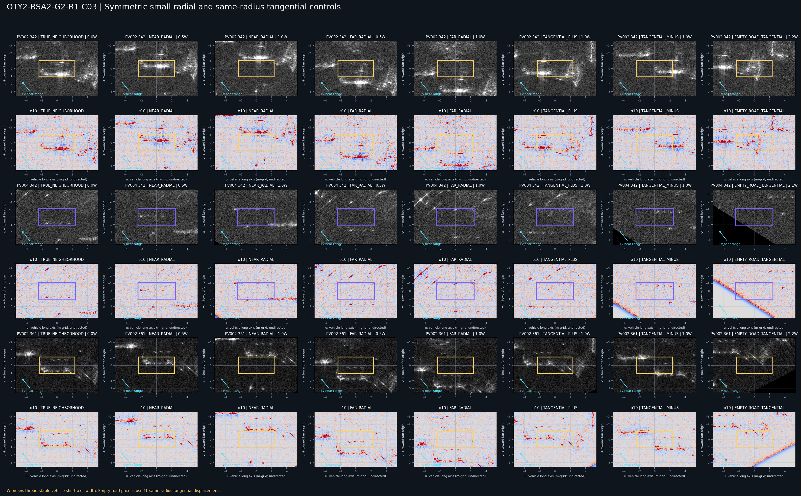

对 PV002 SAR 342、PV004 SAR 342 和 PV002 SAR 361 使用 `0.5W/1.0W` 近距与远距对称平移。

结果不是“控制区完全没有亮线”，而是更有物理意义的相对位置变化：

- 向近距移动控制框后，同一物理亮带移到控制框远半区或框外；
- 向远距移动后，同一亮带移到控制框近边外侧；
- 没有新亮带重新锁定在每个控制框的 `+v≈0.7(W/2)`；
- `0.5W` 控制与真值邻域重叠较多，只能看相对位移；
- `1.0W` 控制是更强的非重锁定证据。

它削弱了“任意附近位置都会出现同样近距侧锁定”的解释，但没有排除局部道路背景与车辆共同产生一条固定空间亮带。

### 9.2 同半径切向控制

- `1W` 小切向位移仍与车辆长轴范围重叠，出现延续是预期的，不能当作独立无车负样本；
- `1L` 同半径停车走廊代理包含其他背景结构，但没有复制真实车辆框的同一 `+v` 边界锁定；
- 因而单纯半径、全局亮度或扇形位置不足以解释真值关系；
- 但该代理没有精确注册到一个确认的同一道路世界点，不能关闭道路/路缘解释。

### 9.3 局部环形控制

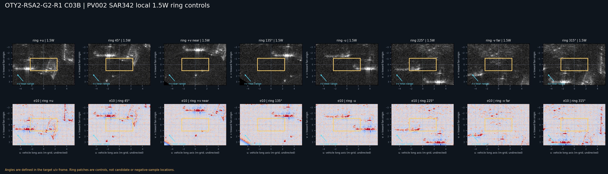

PV002 SAR 342 周围 `1.5W` 的 8 个角位置均可见不同背景线、热点和斜结构，证明局部背景很丰富。但这些结构没有在 8 个位置中统一复制“控制框近距边界的长轴带”。

局部环形控制排除的是空间均匀的假阳性解释，不排除一条恰好经过车辆附近的道路或车辆—地面混合结构。

### 9.4 车轴中心错配

PV002 与 PV004 的线程稳定长轴在 SAR 342 只差 `0.034°`。把 PV002 轴放到 PV004 中心、反向放置几乎等同于原轴，因此该控制被明确记录为 `LOW_POWER_CONTROL`，没有用它虚构方向排除证据。

这本身说明三辆车和道路高度共向。

### 9.5 车辆长度外延控制

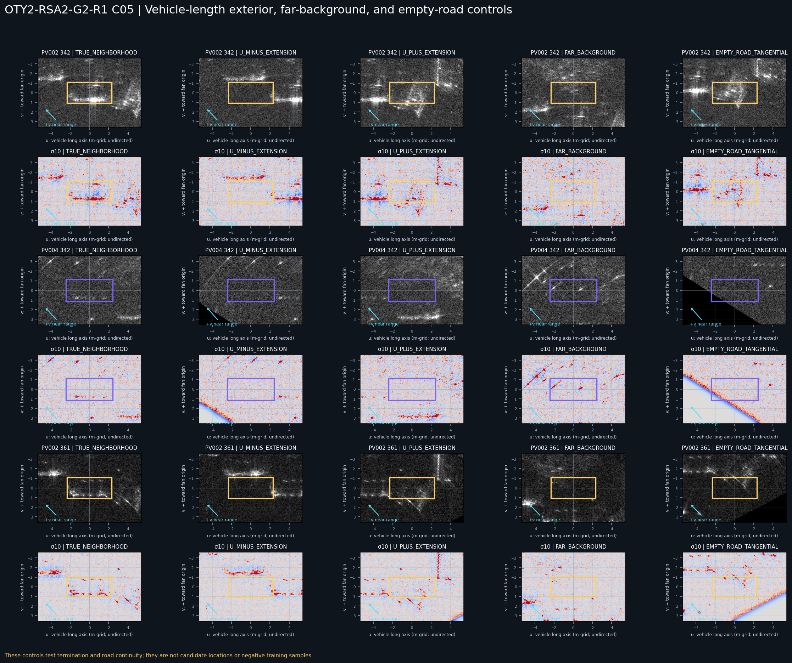

沿无向 `u` 轴向两端外移约 `0.9L`：

- 原车辆亮带主要停留在邻接控制框的最近边缘或框外；
- 没有完整穿过外延控制框；
- 支持响应在车辆长度附近大致终止；
- 外部仍存在背景弧线、竖线和零散热点，不能称为干净空背景。

这削弱“沿道路无限连续的同一亮带”解释，但不排除车辆附近道路/路缘参与形成响应。

### 9.6 跨帧背景代理

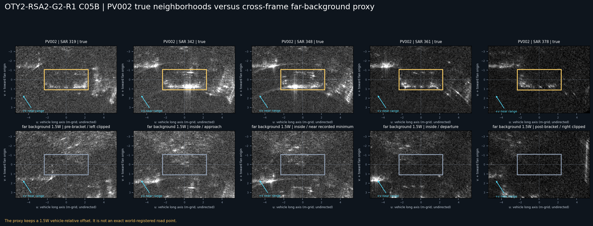

PV002 五个阶段使用固定车辆相对坐标的远距 `1.5W` 背景代理：

- 真值邻域始终保留框内近距侧带；
- 代理区的结构随帧变化，强线多在框外或其他 `v` 位置；
- 代理没有保持真值的近距边界位置关系。

该控制削弱“任一固定车辆相对背景偏移都能产生同样带”的解释，但它不是精确世界背景点跟踪，不能替代下一轮世界配准道路控制。

## 10. 光学姿态如何进入物理解释

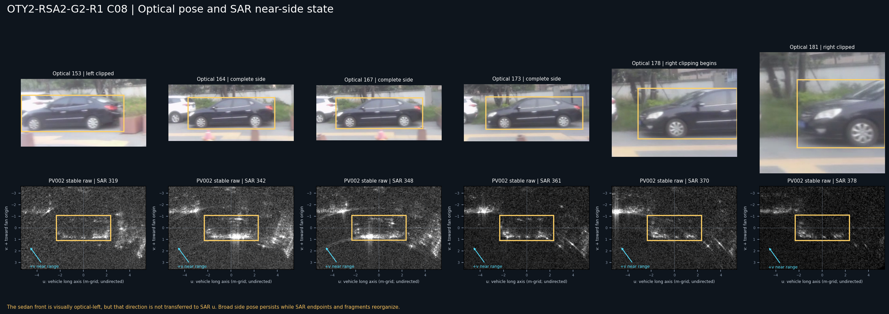

### 10.1 可确认的光学事实

- GM17 三辆车均为道路侧视/斜侧视停放；
- 车头大致朝光学左侧；
- PV002 optical 153 左截断；
- optical 164–173 为完整侧视主段；
- optical 178 开始右截断；
- optical 181/182 右截断更强。

### 10.2 能解释什么

- 完整侧视阶段 SAR 342/348 的近距侧带最强、更连续；
- 进入右截断后 SAR 370/371/378 的带变弱、端点不平衡和碎片化增加；
- 截断没有使 SAR 车辆关联结构消失。

### 10.3 不能解释什么

optical 164–173 的粗姿态都仍为侧视，但 SAR 342/348/361 的端点和内部热点明显重组。当前光学证据不能唯一判断：

- 哪个 SAR 端点对应车头或车尾；
- 热点是否来自轮毂；
- 是否为侧体散射还是车地角反射；
- 哪一段变化只由微小观察角变化造成。

所以光学姿态提供条件和不确定性边界，不提供 SAR 端点身份标签。

## 11. GM11 压力案例为何仍然重要

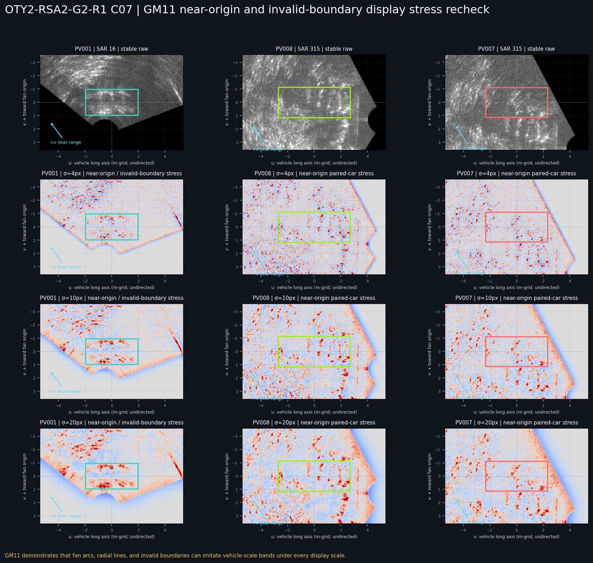

GM11 PV001 SAR 16、PV007/PV008 SAR 315 在原始灰度和 `sigma=4/10/20` 下都存在：

- 以扇形原点为中心的弧线；
- 强径向线；
- 黑色无效区和有效边界；
- 车辆尺度亮段和热点。

这些背景在所有显示尺度中都能制造车辆尺度假象。GM11 因此继续否定“看到近距侧/长轴结构即可自动归属车辆”的全局规则。它不否定 GM17 的局部机制，只限制外推。

## 12. 冻结后 SAR 370/371 复核

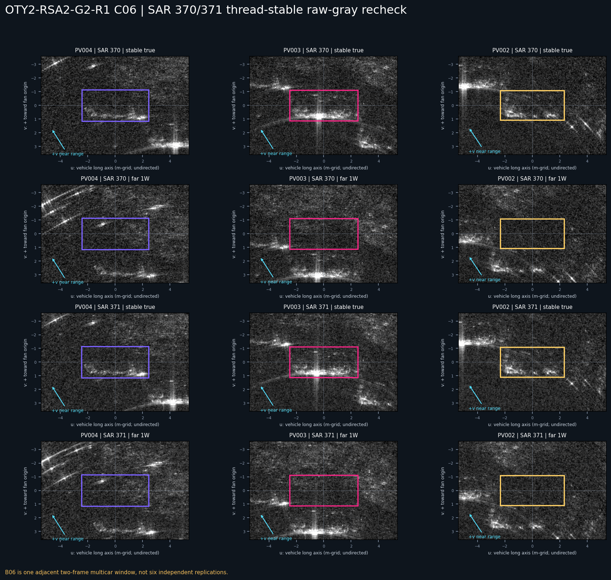

在 PV002/PV003/PV004 的 SAR 370/371：

- 6 个真值邻域原始灰度近半区减远半区均为正，为 `6.87–16.66`；
- 描述峰为 `0.697–0.785 × (W/2)`；
- 远距 `1W` 控制的同一物理带移到约 `2.44–2.73 × (W/2)`，即控制框外；
- 没有在控制框内重新形成近距侧锁定。

这支持同场景相邻窗口的稳定性。它仍然只是一个两帧、多车窗口，不是六个独立复现或跨场景泛化。

## 13. 当前物理模型

当前最小模型为：

```text
Z_i(t)
  = near_side_vehicle_ground_band_i(t)
  + endpoint_or_internal_hotspots_i(t)
  + far_side_weak_or_shadow_i(t)
  + road_curb_competition_i(t)
  + fan_imaging_competition_i(t)
```

其中：

- `near_side_vehicle_ground_band_i(t)` 的位置比其具体像素形态稳定；
- 具体亮点会随 `Q_i(t)` 连续、分裂、合并和改变端点；
- 车辆轴方向优于扇形切向解释 PV004；
- 车辆轴与道路轴仍共线，纯车体归属未闭合；
- 响应峰在框内靠近近距边界，但响应宽度可跨界；
- 当前不支持固定偏移常数。

## 14. 对自动标注主线的含义

当前最合理用途排序为：

1. **局部搜索弱先验**：支持；
2. **车辆关联一侧锚点**：GM17 研究期条件支持；
3. **物理侧边界**：不支持；
4. **中心恢复公式**：不支持；
5. **完整响应 Mask/最终框**：禁止且未执行。

概念式：

```text
车辆中心
≈ 近距侧车辆关联锚点
  - (车辆半宽 + 观测条件化偏移) × 近距方向
```

当前只能保留为研究假设，因为“观测条件化偏移”可能随距离、方位、车地结构、道路背景和成像条件变化。禁止把本轮 `0.65–0.79 × (W/2)` 直接冻结为运行时常数。

## 15. 可以冻结与不能冻结

### 15.1 可以冻结

- `v>0` 必须显式指向扇形原点；
- GM17 近距侧结构在原始灰度中存在；
- 该结构不依赖 sigma=10；
- 线程稳定 LOO 不改变结论；
- GM17 关键单元的响应峰位于框内靠近近距边界；
- PV004 342/361 排除纯扇形切向解释；
- 小径向、环形和背景代理没有复制相同侧锁定；
- 车辆长度外延支持大致终止；
- 当前最合适名称是车辆关联、车地/道路混合锚点。

### 15.2 不能冻结

- 纯车体侧壁散射；
- 车头/车尾 SAR 端点身份；
- 轮毂或特定部件热点；
- 固定成像偏移；
- 物理侧边界；
- 跨场景成立；
- 自动中心恢复、候选或定位规则。

## 16. 二十个问题的直接回答

1. **实际审阅了哪些新旧帧？** 旧主帧为 PV002 SAR 319/342/348/361/378、三车 SAR 342/361/378、SAR 370/371、GM11 SAR 16/315；新增 PV002 SAR 341/343、347/349、360/362、377/379，PV004 SAR 341/343、360/362、377/379，并直接打开 optical 165/168/174/178/182 等连续帧。
2. **“近距侧”符号是否正确统一？** 是。所有 `v` 都通过与扇形原点方向点积校正，关键单元符号点积均为正。
3. **逐帧 GT 与线程稳定对齐是否相同结论？** 是。中心差最多 5.8 px、轴差最多 2.8°，近距侧带的位置和物理结论不变。
4. **原始灰度中是否存在？** 是。统一色阶原始灰度直接可见，9 个关键单元近半区均比远半区亮。
5. **是否依赖某一高通尺度？** 否。sigma 4/10/20 都保留侧偏置；小 sigma 只让形态更碎。
6. **更服从车辆长轴还是扇形切向？** 更服从车辆/道路共向长轴。PV004 反驳纯扇形切向。
7. **PV004 的关键证据？** SAR 342/361 车辆轴与扇形切向相差约 36.6°/24.5°，近距侧短段仍沿车辆轴，且相邻帧连续。
8. **相对车辆半宽位置是否稳定？** GM17 9 个单元峰值为 `0.652–0.792 × (W/2)`，同场景内较稳定，但不能外推为常数。
9. **位于框内、边界还是框外？** 峰值在框内靠近近距边界；亮带有宽度，常接触或跨过边界。
10. **对称小径向控制？** 同一亮带随控制框平移到另一半区或框外，没有重新锁定控制框近距边。
11. **同半径切向控制？** 1W 控制与车辆长度重叠，只说明局部连续；1L 停车走廊代理有背景结构但无同一侧锁定。半径本身不足以解释真值。
12. **道路/路缘控制？** 道路轴与车辆轴共线，空道路代理不复制同一侧锁定，但缺少精确世界道路点注册，所以道路/路缘混合仍未排除。
13. **车前/车后外延是否终止？** SAR `u` 无向，故只称两端外延；亮带主要停在邻接边缘或框外，没有穿过外延框，支持车辆长度附近大致终止。
14. **光学姿态是否解释端点变化？** 只部分解释。完整侧视阶段更强，截断阶段更碎；但同为完整侧视的 342/348/361 仍重组，无法给 SAR 端点赋车头/车尾或轮毂身份。
15. **当前最合理物理解释？** 雷达朝向侧车体 + 车辆—地面角反射/多径 + 近距向成像偏移 + 同向道路/路缘混合。
16. **排除了什么，仍有什么？** 排除了固定图像上下、逐帧 GT 循环、单一高通、纯扇形切向、任意局部位置同样侧锁定和无限长度带；仍有纯车体/车地/道路混合、成像位移、局部旁瓣和端点身份竞争。
17. **能称车辆本体响应吗？** 不能。
18. **能称车辆关联响应锚点吗？** GM17 同场景研究期可以，必须带 `vehicle-ground/road mixed` 限定。
19. **对自动标注最可能提供什么？** 首选局部搜索弱先验，其次是条件化一侧锚点；暂不能提供物理侧边界或中心恢复。
20. **下一步最小实验？** 在 GM17 只选 PV004 SAR 341–343、360–362 和 PV002 SAR 341–349，手工注册 3–5 个确认无车的同一道路/路缘世界点，跨帧跟踪这些点并在相同 LOO 坐标、相同原始色阶下比较。先关闭“道路世界点是否复制侧锁定”这一唯一主要缺口，不跨场景、不拟合阈值、不做定位。

## 17. 产物与未执行事项

本轮新增：

- 本报告；
- [可复现诊断脚本](../../tools/diagnostics/run_oty2_rsa2_g2_r1_near_range_side_vehicle_response_physical_disambiguation.py)；
- [106 行案例与控制 manifest](../../manifests/oty2/oty2_rsa2_g2_r1_near_range_physical_disambiguation_manifest.csv)；
- C01、C02、C02B、C03、C03B、C04、C04B、C05、C05B、C06、C07、C08 共 12 张责任明确的证据图。

本轮没有：

- 修改 GT；
- 读取或依赖 `old_work`；
- 生成响应 Mask；
- 生成候选、评分、排名、selector 或 winner；
- 自动定位车辆；
- 生成最终框或训练样本；
- 把 SAR GT 内容迁移到运行时主线。

最终冻结语句为：

> GM17 的“车辆框原点侧似乎有亮带”已经推进为一个有原始灰度、显式近距符号、线程稳定对齐、多尺度显示、PV004 轴向鉴别和匹配控制支持的条件化车辆关联锚点。其响应峰稳定落在框内靠近近距边界，但物理所有权最合理地仍应写成车辆—地面/道路混合，而不是纯车辆本体侧边界。当前价值是研究期局部搜索弱先验，不是中心恢复或自动标注规则。
