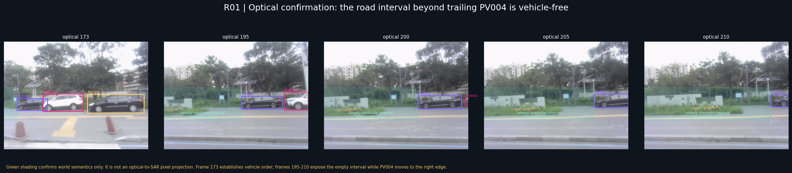
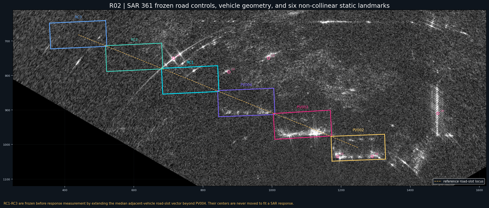
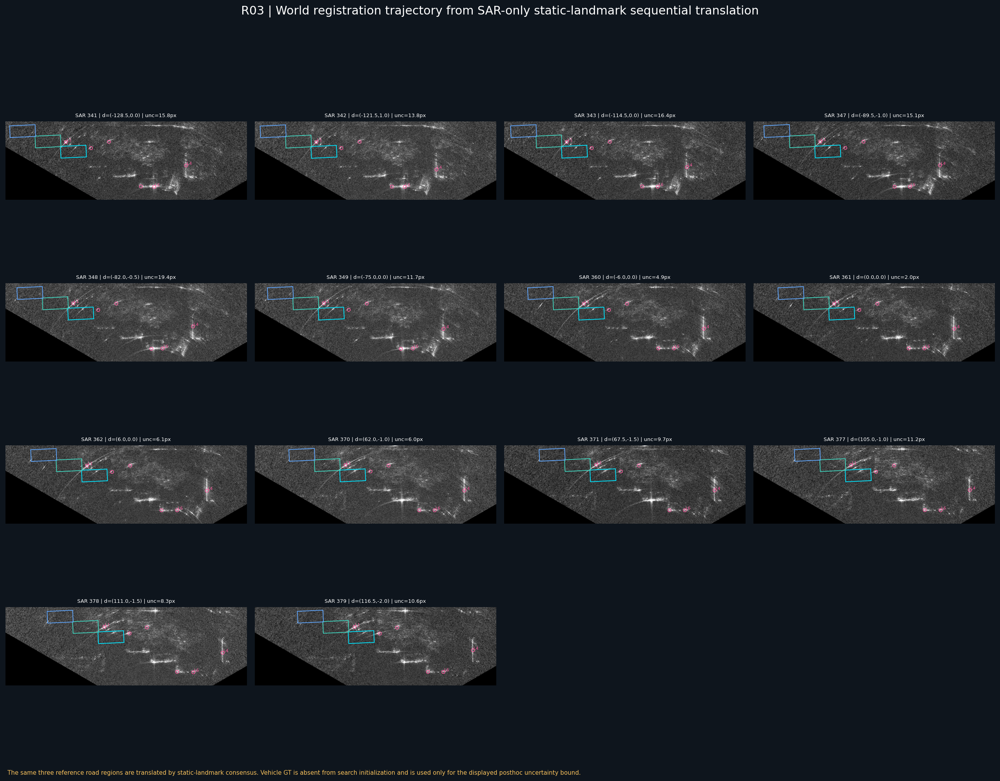
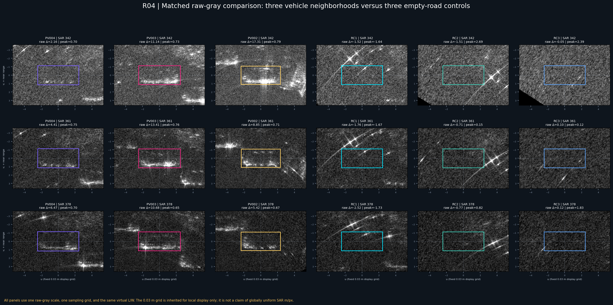
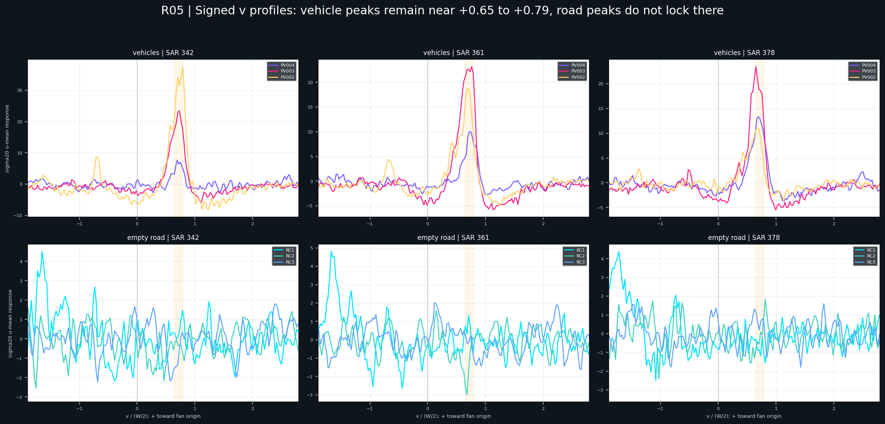
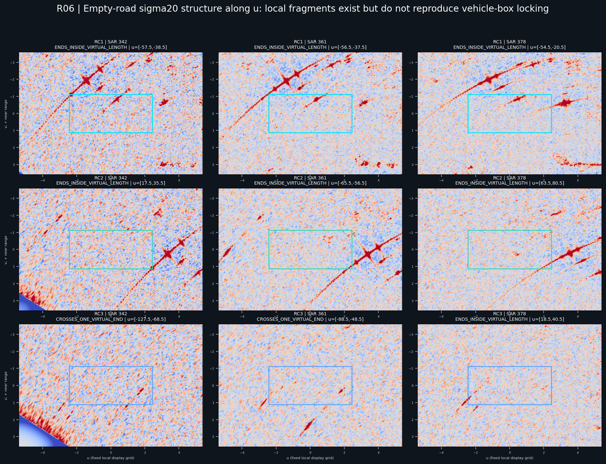
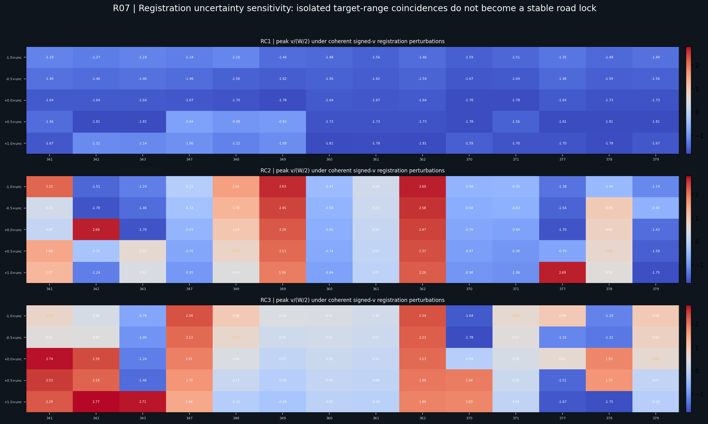
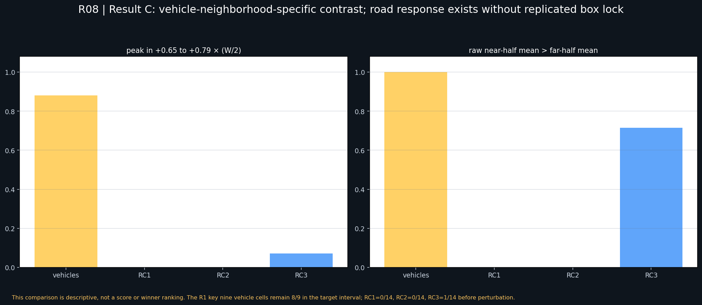

# OTY2-RSA2-G2-R2 同道路无车世界段反事实注册与车辆因果归属

执行日期：2026-07-19

状态：`C. VEHICLE_NEIGHBORHOOD_SPECIFIC_CONTRAST`

世界注册状态：`3 × WORLD_REGISTERED_ROAD_CONTROL`

## 0. 结论先行

本轮在 GM_RM017 中实际建立了 3 个确认无车的同道路世界控制段 RC1–RC3，并以 SAR 361 为参考帧，使用 6 个空间分布非共线的静态 SAR 地标，向前后逐帧完成纯 SAR 的二维平移注册。光学只确认“PV004 排列外侧道路连续无车”，没有把光学坐标制造成 SAR 像素。

主要结果为：

- 三车扩展关键序列共 42 个车辆-帧单元，原始灰度近半区减远半区全部为正；精确按 `[0.65,0.79] × (W/2)` 计有 `37/42` 个峰落入该区间，中位峰为 `0.709 × (W/2)`；
- R1 的 9 个关键车辆单元中有 `8/9` 精确落入 `[0.65,0.79]`，唯一超出者为 `0.79236`，仍位于 R1 报告的实测范围 `0.652–0.792` 内；
- RC1、RC2、RC3 的基准世界注册道路控制分别只有 `0/14`、`0/14`、`1/14` 个峰进入 `[0.65,0.79]`；
- RC1、RC2 的原始灰度近半区减远半区为正次数均为 `0/14`；RC3 为 `10/14`，说明道路本身确实有响应，但没有复制车辆框内的稳定近距侧锁定；
- 三个道路控制的峰位中位数分别为 `-1.672`、`-0.227`、`+0.535 × (W/2)`，与车辆中位峰 `+0.709 × (W/2)` 的跨帧稳定性不同；
- 将每帧注册误差与参考道路外推误差合并，并沿有符号 `v` 轴做一致扰动后，RC1、RC2、RC3 最多分别只有 `0/14`、`2/14`、`2/14` 个帧落入车辆峰区间，仍不能形成跨帧道路侧锁定；
- 道路响应沿 `u` 的主要正分量中位跨度只有约 `19.5–21 px`，远小于虚拟车长 `162.681 px`，没有复制“约一车长度的稳定终止关系”。

因此本轮不是“道路完全无响应”，而是：

> 同一道路空置世界段可以出现弧线、交叉亮点、短段和局部道路响应，但这些响应没有在虚拟车辆框的近距侧、归一化横向位置、车辆长度终止和跨帧状态上共同复制真实车辆邻域。

结果归入 **C. `VEHICLE_NEIGHBORHOOD_SPECIFIC_CONTRAST`**。道路轴响应存在这一子现象与结果 B 的描述相容，但完整反事实责任由 C 更准确地概括。

当前 R1 锚点应继续保留为：

`VEHICLE_ASSOCIATED_NEAR_RANGE_ANCHOR_WITH_GROUND_ROAD_MIXING`

并可增加限定：

`VEHICLE_NEIGHBORHOOD_SPECIFIC_IN_GM17_WORLD_REGISTERED_COUNTERFACTUAL`

不能改写为纯道路锚点，也仍不能在纯车体散射与车辆—地面交互之间二选一。

## 1. 研究边界

本轮仅使用 GM_RM017，没有跨到 GM11 或 GM19，也没有执行：

- 响应 Mask；
- 车辆候选；
- 评分、排名、selector 或 winner；
- 运行时阈值搜索；
- 自动位置、最终框或训练样本；
- 将 `0.65–0.79` 固化为自动标注常数。

研究期 SAR GT 的职责仅为：

1. 在参考 SAR 361 中冻结三车局部中位长宽、轴向和道路车位步长；
2. 注册完成后的独立车辆中心误差验证；
3. 真实车辆邻域的 posthoc 描述比较。

SAR GT 没有进入静态地标搜索初值，也没有逐帧移动道路控制框。

## 2. 光学如何确认道路世界段无车

光学 173 明确三车排列顺序：PV004 是 trailing dark sedan，位于 PV003/PV002 的排列外侧。随后：

- optical 195/200：PV004 仍完整可见，PV003 向右离场，PV004 左侧道路段连续暴露；
- optical 205/210：PV002/PV003 已不在画面，PV004 只在右侧部分可见，画面左侧至 PV004 之间的停车道路连续无车；
- 低矮路缘、绿化和固定路侧结构仍存在，因此本轮从未把该处称为“空白无响应背景”。

三个控制段的空置责任分别为：

| 控制段 | 光学证据 | 语义限定 |
| --- | --- | --- |
| RC1 | optical 195/200/205/210 | PV004 紧邻外侧的第一车位尺度道路段无车 |
| RC2 | optical 200/205/210 | PV004 外侧第二车位尺度道路段无车，PV002/PV003 已离开 |
| RC3 | optical 205/210 | PV004 外侧第三车位尺度道路段无车；保留低矮路缘/绿化上下文限制 |



图中的绿色区域只表达空置语义，不是光学到 SAR 像素投影。

## 3. 道路控制几何如何冻结

### 3.1 参考帧和固定几何

参考帧为 SAR 361。三车线程稳定 LOO 中心按 SAR x 坐标排序为：

- PV004：约 `(925.290, 878.418)`；
- PV003：约 `(1088.229, 942.689)`；
- PV002：约 `(1249.569, 1009.313)`。

相邻中心位移的分量中位数作为参考道路车位步长，只在 SAR 361 中使用一次。由 PV004 向排列外侧连续外推 1、2、3 个步长，得到：

| 控制段 | SAR 361 中心 | L/W | 轴向 |
| --- | ---: | ---: | ---: |
| RC1 | `(763.151, 812.971)` | `162.681 / 74.774 px` | `-2.639°` |
| RC2 | `(601.012, 747.523)` | `162.681 / 74.774 px` | `-2.639°` |
| RC3 | `(438.873, 682.076)` | `162.681 / 74.774 px` | `-2.639°` |

中心、长宽和轴向在读取道路响应之前冻结。脚本没有根据亮线位置反向调整任何控制中心。



### 3.2 固定采样责任

车辆和道路统一使用：

- 有符号 `u/v` 坐标；
- `u` 沿车辆/停车道路局部长轴；
- `v>0` 通过与扇形原点 `(1154.0,1330.6)` 点积显式校正；
- 相同 `L/W`；
- 相同 `360 × 240` 采样网格；
- 原始灰度统一色阶；
- sigma `4/10/20 px` 描述性背景减除；
- 相同峰位、半区差和 `u` 覆盖记录。

`0.03 m/px` 只沿用为与 R1 一致的局部显示网格，不表示整幅 SAR 已获得均匀 `m/px` 物理标定。

## 4. SAR 世界注册方法

### 4.1 为什么没有采用车辆相对偏移

最终 transform 不使用“当前车中心减参考车中心”。车辆中心只在 transform 形成后做独立误差验证。

预研中的背景 SIFT 在非参考关键帧只有 `0–7` 个 ratio-test 匹配，全部不足以承担可靠仿射拟合，因此没有声称自动全局注册成功。

### 4.2 六个静态 SAR 地标

SAR 361 中预先声明 6 个空间分布非共线地标：

- L1：左上弧线交叉；
- L2：左上短亮返回；
- L3：上部弧段；
- L4：右侧强竖直杆状响应；
- L5：下部交叉结构；
- L6：下部斜线结构。

它们覆盖上下两个高度层和左右大范围，不能退化为三车中心的近共线拟合。

### 4.3 逐帧纯 SAR 注册

以 SAR 361 为参考，向前后逐帧遍历 SAR 341–379：

1. 使用固定参考地标模板；
2. 以前一帧静态地标共识平移作为下一帧局部搜索中心；
3. 每帧重新在原始 SAR 上定位六个静态结构；
4. 对六个地标位移取分量中位数，得到二维平移 `(dx,dy)`；
5. 留一地标只用于共识稳定性；
6. 三车 GT 中心只在最后检查 transform 是否与独立静止物体一致。

关键帧平移从 SAR 341 的 `(-128.5,0.0)` 连续变化到 SAR 379 的 `(116.5,-2.0)`，没有逐窗口跳回车辆相对偏移。



### 4.4 注册质量和不确定性

关键帧中：

- 地标中位残差为 `0–5.308 px`；
- 地标 p90 残差最大为 `19.394 px`，最大值出现在 SAR 348 的少数歧义结构；
- 独立车辆中心二维验证最大误差为 `0–16.402 px`；
- 沿道路框 `v` 方向的独立验证最大误差为 `6.799 px`；
- 每帧综合注册不确定性为 `2.0–19.394 px`。

加入参考道路外推定义误差后，各控制的总不确定性范围为：

| 控制段 | 总不确定性范围 | 半宽占比上限 |
| --- | ---: | ---: |
| RC1 | `4.0–19.7 px` | 约 `0.53 × (W/2)` |
| RC2 | `5.2–20.0 px` | 约 `0.54 × (W/2)` |
| RC3 | `6.6–20.4 px` | 约 `0.55 × (W/2)` |

这些误差不允许把单帧道路峰的精确位置当成强结论，因此本轮专门进行了有符号 `v` 扰动敏感性，而不是忽略误差。

全部三段达到研究期二维 `WORLD_REGISTERED_ROAD_CONTROL`；没有控制段仅能写成 `ROAD_AXIS_REGISTERED_WITH_CROSS_AXIS_UNCERTAINTY`。不过 RC3 半径更大、离扇形边界更近，其结论权重低于 RC1/RC2，并已在 manifest 的 `evidence_limit` 中保留。

## 5. 真实车辆与无车道路的同责比较

### 5.1 原始灰度半区差

| 对象 | 单元数 | 原始灰度近半区 > 远半区 | 均值特征 |
| --- | ---: | ---: | --- |
| 三车合计 | 42 | `42/42` | 近距侧一致为正 |
| RC1 | 14 | `0/14` | 均值 `-2.314` |
| RC2 | 14 | `0/14` | 均值 `-0.892` |
| RC3 | 14 | `10/14` | 均值 `+0.240`，道路有响应但较弱且不稳定 |



道路不是统一的暗背景。RC1/RC2 的弧线和交叉结构主要位于虚拟框远侧或框外；RC3 在若干帧近半区较亮，但没有同时满足稳定归一化峰位。

### 5.2 有符号 v 峰

| 对象 | 峰位中位数 | 峰位范围 | 精确进入 `[0.65,0.79]` |
| --- | ---: | ---: | ---: |
| 三车合计 | `+0.709` | 主要集中在 R1 近距带 | `37/42` |
| RC1 | `-1.672` | `-1.779` 至 `-1.645` | `0/14` |
| RC2 | `-0.227` | `-1.698` 至 `+2.688` | `0/14` |
| RC3 | `+0.535` | `-1.244` 至 `+2.742` | `1/14` |



RC1 是稳定的远侧/框外道路结构；RC2 和 RC3 的峰在不同帧跳到远侧、近侧外部或局部热点。只有 RC3 单帧偶然进入车辆区间，不能构成跨帧复现。

### 5.3 沿 u 的覆盖与长度终止

道路主正分量的 `u` 跨度为：

| 控制段 | 中位跨度 | 范围 | 端点状态 |
| --- | ---: | ---: | --- |
| RC1 | `21 px` | `18–35 px` | `14/14` 在虚拟车长内终止 |
| RC2 | `19.5 px` | `10–63 px` | `12/14` 内终止，`2/14` 跨一端 |
| RC3 | `20 px` | `8–60 px` | `8/14` 内终止，`6/14` 跨一端 |

虚拟车长为 `162.681 px`。道路响应通常只是短弧、短交叉和局部碎片，既没有稳定跨过整个道路，也没有稳定地在“一车长度附近”终止。因此不能把任意道路短段的终止误写成车辆长度关系。



### 5.4 跨帧状态是否复制车辆增强、分裂和减弱

以三车原始近减远均值作为车辆邻域阶段序列，和三个道路控制做描述性 Pearson 相关：

- RC1：`r = +0.029`；
- RC2：`r = -0.278`；
- RC3：`r = +0.116`。

这些值只用于说明时序形态没有同步，不是统计显著性检验。道路弧线和热点会随平台状态改变，但没有复制车辆邻域“近距侧保持、强度连续重组”的同一状态关系。

## 6. 注册误差是否足以翻转结论

对每个控制和每帧，将：

- 静态地标/车辆验证得到的帧注册误差；
- 参考道路外推定义误差；

合成为总不确定性，并沿当前有符号 `v` 轴施加 `-1.0/-0.5/0/+0.5/+1.0 × uncertainty` 的一致扰动。

结果：

| 控制段 | 基准进入车辆区间 | 任一一致扰动下的最大进入数 |
| --- | ---: | ---: |
| RC1 | `0/14` | `0/14` |
| RC2 | `0/14` | `2/14` |
| RC3 | `1/14` | `2/14` |



注册误差可以让少数 RC2/RC3 帧偶然进入车辆峰区间，但无法把 14 帧道路序列变成稳定近距侧锁定。因此误差足以限制单帧解释，不足以解释车辆—道路整体差异。

## 7. 因果归属

### 7.1 被削弱的解释

本轮显著削弱：

1. G2-R1 的近距侧峰主要只是同一道路/路缘固定结构；
2. 任意相邻空车位都会在虚拟框 `+0.65–0.79 × (W/2)` 重新锁定；
3. 车辆长度终止只是道路结构在任意车位的普遍现象；
4. 车辆邻域跨帧变化只是道路背景共同变化。

### 7.2 仍不能区分

本轮仍不能在以下两者之间完成归属：

- 车辆本体朝雷达侧散射；
- 车辆—地面角反射、多径、遮挡/叠掩和成像偏移。

安全结论是：

```text
车辆存在改变了局部道路邻域的近距侧响应关系，
但改变来自车体本身还是车地交互，当前数据仍不可辨识。
```

纯道路解释不再是主要解释；“车辆关联的车体/车地混合”得到加强。



## 8. 十五个问题的直接回答

1. **实际注册了多少个确认无车的道路世界区域？** 3 个：RC1、RC2、RC3。
2. **每个区域由什么光学证据确认无车？** RC1 使用 optical 195/200/205/210；RC2 使用 200/205/210；RC3 使用 205/210。PV004 位于右侧或右边缘，其排列外侧道路连续暴露，PV002/PV003 已离场。
3. **每个区域如何在 SAR 帧间注册？** SAR 361 冻结参考框；六静态地标逐帧模板跟踪；每帧取地标位移分量中位数作为二维平移；同一参考框由该 transform 搬运到 SAR 341–379。
4. **是否使用了足够的非共线静态地标？** 是，6 个地标覆盖上下两层和左右大范围；不是三车近共线中心拟合。
5. **哪些只能做到道路轴一维注册？** 无。三个控制都达到带显式误差的二维平移注册；RC3 质量较弱但没有降级为一维注册。
6. **注册不确定性是多少？** 帧注册 `2.0–19.394 px`；独立跨轴验证最大 `6.799 px`；合并道路定义误差后 RC1/RC2/RC3 最大约 `19.7/20.0/20.4 px`。
7. **无车道路是否存在沿道路轴响应？** 存在。RC1/RC2 有弧线、交叉和短段，RC3 有 `10/14` 帧原始近半区较亮；但响应位置和形态不锁定虚拟框。
8. **是否复现约 `0.65–0.79 × (W/2)` 近距侧峰？** 没有稳定复现。RC1 `0/14`、RC2 `0/14`、RC3 `1/14`；误差扰动后最多 `0/14`、`2/14`、`2/14`。
9. **是否复现车辆长度附近终止？** 没有。道路主分量中位跨度只有约 `19.5–21 px`，明显短于 `L=162.681 px`，且端点状态跨帧不一致。
10. **是否复现车辆邻域的跨帧强弱和片段变化？** 没有。道路响应会变化，但与车辆阶段序列相关仅为 `+0.029/-0.278/+0.116`，也没有共同保持近距峰位。
11. **车辆与道路的主要差异是什么？** 车辆 `42/42` 原始近半区较亮、峰位中位 `+0.709`；道路允许有亮线，但没有同一框内近距锁定、相同归一化位置、车辆长度关系和同步时序。
12. **“车辆关联锚点”应保留、降级还是改写为道路锚点？** 保留并增加 GM17 世界反事实限定；不能改写为道路锚点，仍需保留 ground/road mixing 限制。
13. **当前更支持纯道路、车辆—地面交互还是车辆本体？** 纯道路作为主要来源被削弱；车辆存在相关的车体/车地混合得到加强；车辆—地面与车辆本体之间仍不可辨识，不能排序。
14. **结果属于 A、B、C 还是 D？** C：`VEHICLE_NEIGHBORHOOD_SPECIFIC_CONTRAST`。道路有响应但无框锁定是 B-like 子现象，不改变总体 C 归类。
15. **是否具备进入 GT-blind 同场景局部搜索微实验的资格？** 具备。仅限 GM17 同场景、GT 不作输入、道路控制继续作为审计反事实、不得提前形成最终框或自动标注规则。

## 9. 下一阶段准入判断

本轮满足下一阶段的四个条件：

- 有 3 个可接受的世界注册无车道路控制；
- 无车道路没有复制完整车辆近距侧锁定；
- 结论在原始灰度成立；
- 注册误差只能制造少数孤立重合，不能解释整体车辆—道路差异。

因此可以建议下一轮进入：

> GM17 同场景、GT 不作为输入的局部搜索微实验。

准入不等于允许：

- 跨场景外推；
- 固化 `0.65–0.79`；
- 生成候选评分器、selector 或 winner；
- 直接输出最终车辆框。

## 10. 产物

- 可复现脚本：[run_oty2_rsa2_g2_r2_world_registered_empty_road_counterfactual.py](../../tools/diagnostics/run_oty2_rsa2_g2_r2_world_registered_empty_road_counterfactual.py)
- 42 行注册 manifest：[oty2_rsa2_g2_r2_world_registered_empty_road_counterfactual_manifest.csv](../../manifests/oty2/oty2_rsa2_g2_r2_world_registered_empty_road_counterfactual_manifest.csv)
- 证据图目录：[20260719_rsa2_g2_r2_world_registered_empty_road_counterfactual](../../docs/reviews/assets/20260719_rsa2_g2_r2_world_registered_empty_road_counterfactual)

manifest 每行记录：道路控制 ID、参考/当前 SAR 帧、光学空置证据、注册方法与地标、平移与不确定性、道路轴、虚拟框中心和 L/W、`v` 符号检查、半径/方位、峰位、原始半区差、`u` 覆盖、长度状态、跨帧一致性、误差敏感性、物理解释和证据边界。
