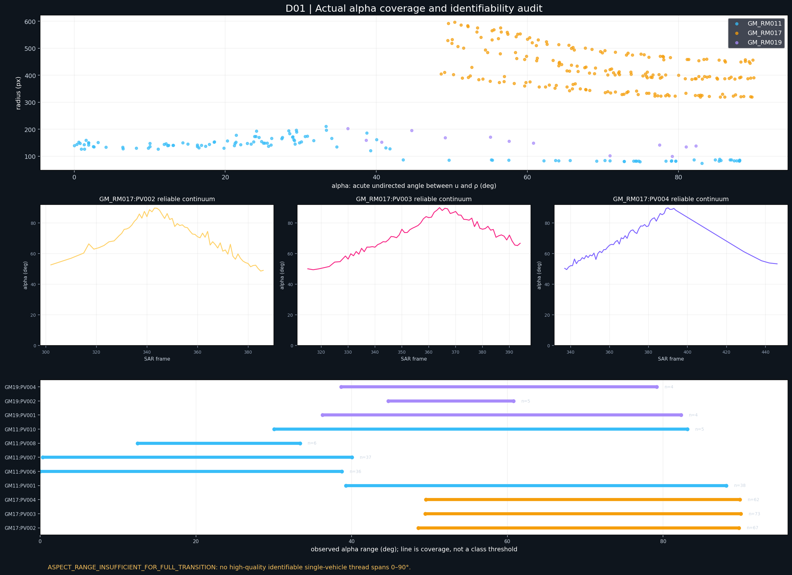
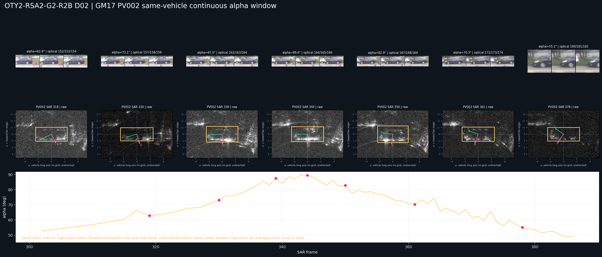
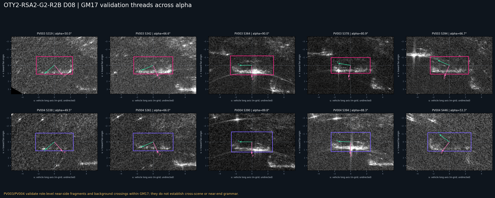
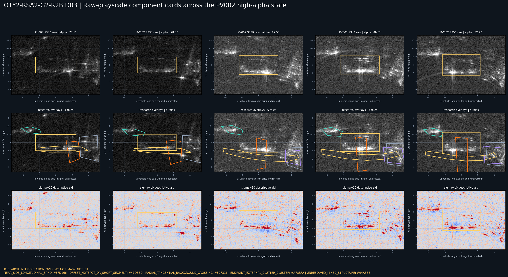
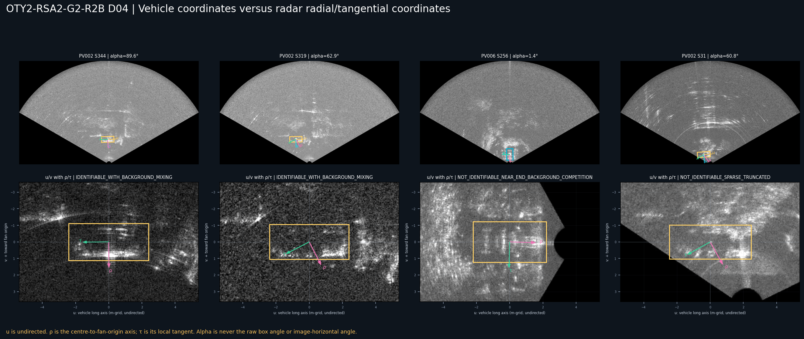
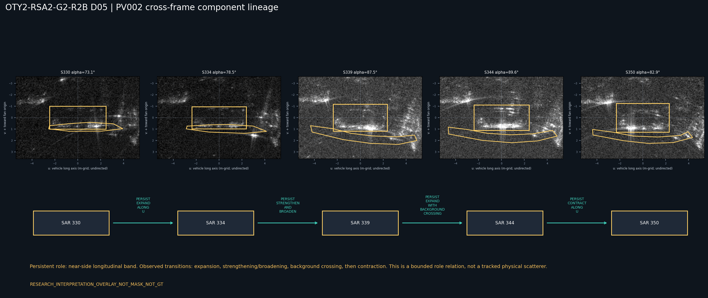
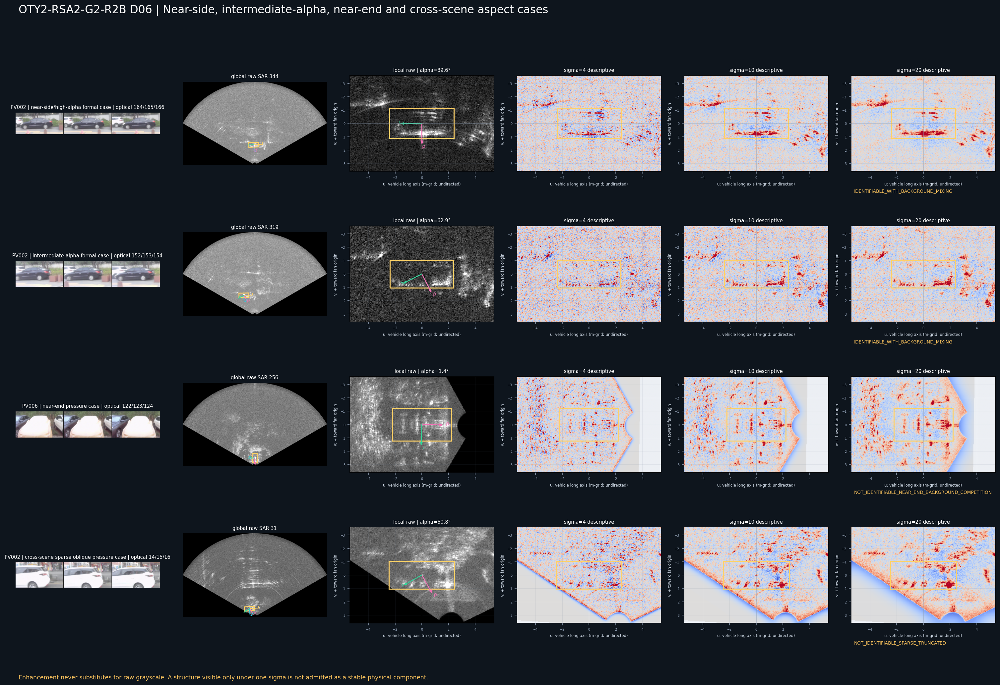
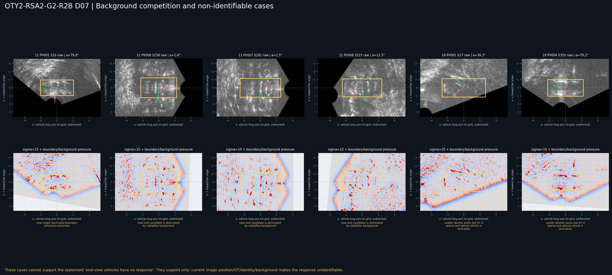
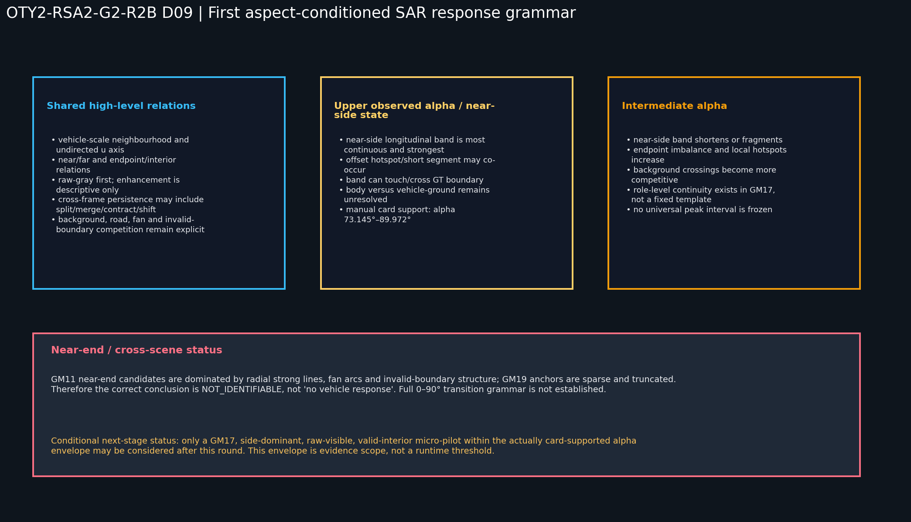

# OTY2-RSA2-G2-R2B 轴向角条件化 SAR 车辆响应部件与跨帧谱系探索

执行日期：2026-07-19

状态：`ASPECT_CONDITIONED_RESPONSE_GRAMMAR_V1_PARTIALLY_ESTABLISHED`

完整转换状态：`ASPECT_RANGE_INSUFFICIENT_FOR_FULL_TRANSITION`

R2A+R2B 联合准入状态：`CONDITIONALLY_QUALIFIED_FOR_GM17_SIDE_DOMINANT_CARD_SUPPORTED_SCOPE_ONLY`

## 0. 结论先行

本轮没有得到一个可跨姿态、跨场景复用的统一车辆模板，而是建立了第一版受轴向角和可辨识性共同约束的响应语法：

- 337 个研究期案例覆盖的几何 `alpha` 范围为 `0.000000–89.971606°`，但低 `alpha` 与部分跨场景案例主要承担不可辨识压力责任，不能把“几何覆盖”写成“机制覆盖”；
- GM_RM017 中共有 189 个可靠、可辨识、可进入部件语法开发或验证的案例，覆盖 `48.572405–89.971606°`；
- 10 张人工近距侧长轴带 `NEAR_SIDE_LONGITUDINAL_BAND` 卡的直接证据包络为 `73.145406–89.971606°`。该范围只描述现有人工卡证据，不是姿态分类阈值，也不是运行时阈值；
- GM17 PV002、PV003、PV004 均存在同车连续线程。PV002 的责任窗为 SAR `315–386`，实际语法准入的选定帧从 SAR `317` 开始，共 64 行；PV003 在 `315–394` 中有 67 个准入帧和 6 个 diagnostic-only 缺口；PV004 在 `337–394` 中有 58 个准入帧；
- GM17 的近距侧长轴带主要属于当前观测到的高 `alpha`、近侧视状态。它并非高 `alpha` 独占：在 `55.072794°`、`62.878171°`、`70.293716°` 等中间 `alpha` 案例中仍可看到更弱、缩短或分裂的近距侧片段；
- GM11 近端视压力案例被径向强线、扇形弧、无效区边界和近原点成像状态支配，只能写成 `NOT_IDENTIFIABLE`，不能写成“端视车辆没有响应”；
- GM19 的可用案例因 GT 稀疏、光学截断和身份锚点不足，不能建立可靠部件谱系；
- R2A 已削弱 GM17 的纯道路主要解释；R2B 进一步证明局部响应随轴向角发生部件级重组。但车辆本体与车辆—地面交互仍不可分。

因此，本轮形成的是：

```text
高 alpha / 近侧视：
  近距侧长轴带 + 可选热点/短段 + 显式背景交叉

中间 alpha：
  缩短或分裂的近距侧片段 + 端点失衡/局部热点 + 更强背景竞争

近端视与跨场景压力：
  当前成像位置/GT/身份/背景导致 NOT_IDENTIFIABLE
  而不是“没有车辆响应”
```

这足以支持一个严格受限的 GM17 侧视主导微实验资格判断，但不支持一般性 GT-blind 搜索，不支持跨姿态或跨场景外推。本轮没有执行该微实验。

## 1. 研究边界

本轮只完成 R2B，不重算 R2A，也没有执行：

- GT-blind 搜索；
- 检测候选生成；
- 分数、排名、selector、winner；
- 运行时阈值；
- 中心恢复公式；
- 响应 Mask；
- 最终框或训练标注。

研究期 SAR GT 只用于：

1. 重建车辆旋转框长轴和中心；
2. 定义车辆 `u/v` 与雷达 `rho/tau` 研究坐标；
3. 计算 `alpha/beta`、半径和方位；
4. 裁取包含 GT 外背景的研究图；
5. 记录人工解释部件相对 GT 的接触、跨越和延伸关系。

所有人工开放几何叠加均标明：

`RESEARCH_INTERPRETATION_OVERLAY_NOT_MASK_NOT_GT`

这些叠加不是响应 Mask、GT 修订、训练标签或运行时输入。

## 2. 轴向角与双坐标定义

对每个研究期 SAR GT：

- `u`：旋转框最长边得到的无向车辆长轴；
- `rho`：车辆中心指向扇形原点的无向径向轴；
- `tau`：与 `rho` 正交的局部扇形切向；
- `v`：车辆短轴，并令正向指向扇形原点，即近距侧。

定义：

```text
alpha = axial_angle(u, rho),  alpha in [0°, 90°]
beta  = axial_angle(u, tau),  beta  in [0°, 90°]
alpha + beta = 90°
```

`alpha` 接近 0° 表示近端视，接近 90° 表示近侧视，中间值表示斜视。它不是图像水平角、原始 rotated-box angle 或光学 bbox 角度。

全部 eligibility 与 component card 行均满足 `alpha + beta = 90°`。光学姿态审阅与 SAR 可辨识性分别记录，没有用固定 `alpha` 阈值先验决定姿态类别。



## 3. alpha—可辨识性清单

337 行 eligibility manifest 的场景责任如下：

| 场景 | 选定行数 | alpha 范围 | 可进入语法的行数 | 当前责任 |
| --- | ---: | ---: | ---: | --- |
| GM_RM017 | 202 | `48.572405–89.971606°` | 189 | 同车连续、可辨识；承担开发和同场景验证 |
| GM_RM011 | 122 | `0.000000–88.093205°` | 0 | 近原点、径向强线、扇形弧和边界压力；只承担不可辨识审计 |
| GM_RM019 | 13 | `36.238808–82.289315°` | 0 | GT/身份稀疏和光学截断；只承担跨场景压力 |

GM11 中 `0–40.025713°` 的近端视/斜端视案例全部不可辨识。GM11 还包含较高 `alpha` 的侧视但截断案例；这些案例同样因近原点或无效边界压力不能承担跨场景语法结论。

可辨识性状态不是姿态标签。一个案例可以在光学上属于近端视，却因当前 SAR 成像位置不可辨识；这时正确结论是：

> 该近端视候选在当前成像位置不可辨识，不能承担近端视机制结论。

## 4. 同车连续窗口与 alpha 变化

可靠同车线程如下：

| 车辆 | 线程责任窗 | 实际准入责任 | 准入 alpha 范围 | 用途 |
| --- | --- | --- | ---: | --- |
| GM17 PV002 | SAR `315–386` | 选定准入帧 SAR `317–386`，64 行 | `48.572405–89.712662°` | 语法开发；显式部件谱系 |
| GM17 PV003 | SAR `315–394` | 67 个准入帧；6 个 diagnostic-only 缺口 | `49.443225–89.971606°` | 同场景 holdout；显式部件谱系 |
| GM17 PV004 | SAR `337–394` | 58 个准入帧 | `49.534941–89.834255°` | 同场景图像验证；未写入 lineage CSV |

这些是同车身份和轨迹连续线程，不表示每一个整数帧都通过 GT 质量或研究责任准入。

PV002 的代表序列为 SAR `319/330/339/344/350/361/378`：`alpha` 先从中间值升到接近 90°，随后下降。车辆几何、材质和道路邻域基本不变，主要变化来自平台观察几何，因此该序列可以承担部件出现、扩展、收缩、分裂和背景交叉的局部状态研究。



PV003/PV004 提供相同场景内的独立车辆线程压力检查。D08 中的 PV004 SAR 446 是末端截断和责任外压力帧，不是可靠验证帧。



没有任何一条同车线程覆盖足够宽的 `0–90°` 转换，因此必须保留：

`ASPECT_RANGE_INSUFFICIENT_FOR_FULL_TRANSITION`

不能通过拼接 GM11、GM17、GM19 伪造一条连续姿态转换。

## 5. 响应部件卡

本轮建立 51 张 component cards：

- 45 张来自既有人工自由多边形解释叠加；
- 6 张来自本轮原始灰度压力审阅，不绘制闭合几何；
- 35 张标为原始灰度直接人工可见；
- 10 张标为弱但原始灰度直接可见；
- 6 张标为原始灰度可见但责任归属未决。

角色统计如下：

| 部件角色 | 数量 | 当前责任 |
| --- | ---: | --- |
| `NEAR_SIDE_LONGITUDINAL_BAND` | 10 | 车辆关联，但车体/车地交互不可分 |
| `OFFSET_HOTSPOT_OR_SHORT_SEGMENT` | 10 | 车辆端点/内部、车地或背景邻接均可能 |
| `RADIAL_TANGENTIAL_BACKGROUND_CROSSING` | 10 | 径向/切向背景为主要解释 |
| `UNRESOLVED_MIXED_STRUCTURE` | 10 | 未决混合结构 |
| `ENDPOINT_EXTERNAL_CLUTTER_CLUSTER` | 5 | 外部杂波与端点关系未决 |
| `FRAGMENTED_NEAR_SIDE_BAND` | 3 | 中间 alpha 的弱化/分裂车辆关联片段 |
| `NEAR_END_WIDTH_SCALE_CLUSTER_UNRESOLVED` | 1 | 近端视宽度团候选，不可辨识 |
| `RADIAL_STRONG_LINE_COMPETITION` | 1 | 径向强线背景主导 |
| `SPARSE_COMPACT_CLUSTER_UNRESOLVED` | 1 | GM19 稀疏紧凑团，无法建谱系 |



### 5.1 近距侧长轴带

10 张人工 `NEAR_SIDE_LONGITUDINAL_BAND` 卡全部来自 GM17 PV002/PV003，证据包络为 `73.145406–89.971606°`。它们具有共同关系：

- 主方向与车辆 `u` 轴相差 `0.178–7.421°`；
- 质心位于近距 `+v` 侧；
- 原始灰度中直接可见，sigma `4/10/20` 只用于描述增强；
- 5/10 接触 GT 边界，5/10 跨越 GT 边界；
- 10/10 的人工开放几何沿 `u` 延出名义车长范围。

最后一点说明它不能被解释为车体轮廓或响应 Mask。安全责任仍是：

`VEHICLE_ASSOCIATED_BODY_GROUND_MIXED`

### 5.2 双坐标拓扑

部件卡同时记录：

- 车辆坐标中的 `u/v` 质心、范围和主方向；
- 雷达坐标中的 `rho/tau` 质心；
- 是否接触或跨越 GT；
- 是否延出名义车长；
- 原始灰度可见性与增强依赖；
- 车体、车地和背景三种解释责任。



## 6. 跨帧部件谱系

component lineage manifest 共 27 条关系，只覆盖 GM17 PV002/PV003：

| 角色 | 谱系关系数 | 允许的结论 |
| --- | ---: | --- |
| 近距侧长轴带 | 8 | 角色在选定帧间持续并重组 |
| 偏移热点/短段 | 8 | 弱持续、增强、迁移、间歇或减弱 |
| 径向—切向背景交叉 | 8 | 背景关系持续或交叉增强 |
| 外部端点杂波团 | 3 | 外部混合关系出现或持续 |

显式主序列为：

| 车辆 | 部件卡帧 | alpha 序列 | 近距侧带事件 |
| --- | --- | --- | --- |
| PV002 | `330/334/339/344/350` | `73.145/78.540/87.528/89.554/82.911°` | 沿 `u` 扩展 → 增强展宽 → 与背景交叉并扩展 → 沿 `u` 收缩 |
| PV003 | `360/364/372/378/384` | `83.445/89.972/85.071/80.869/75.720°` | 扩展 → 增强展宽 → 收缩并沿 `u` 偏移 → 减弱缩短 |



谱系只支持“部件角色持续或重组”，不支持：

- 同一物理散射点被追踪；
- 固定像素模板；
- 固定 Mask；
- 运行时原子或自动规则。

## 7. 不同 alpha 状态的真实图像结论

### 7.1 当前观测高 alpha / 近侧视状态

GM17 高 `alpha` 案例中：

- 近距侧长轴带最连续、最强；
- 偏移热点或短段可以共存；
- 带状开放几何可接触、跨越 GT，并延出名义车长；
- 径向/切向背景交叉仍然存在；
- 车体与车辆—地面交互不可分。

因此，GM17 G2-R1 的近距侧长轴结构主要属于高 `alpha`、近侧视状态，而不是所有车辆姿态的统一特征。

### 7.2 中间 alpha / 斜视候选

PV002 的原始灰度压力卡在：

- SAR 319，`alpha=62.878171°`；
- SAR 361，`alpha=70.293716°`；
- SAR 378，`alpha=55.072794°`；

仍显示较弱、缩短或分裂的近距侧片段，并伴随端点失衡、局部热点/短段和更强背景交叉。真实图像没有支持一个固定的“斜视模板”，但支持高 alpha 长轴带向较弱碎片化状态的局部转变。

GM19 PV002 SAR 31 的紧凑亮团在原始灰度中可见，但 GT、身份和光学截断使其只能承担跨场景压力，不能并入 GM17 谱系。

### 7.3 近端视候选

GM11：

- PV006 SAR 256，`alpha=1.355676°`：宽度尺度亮团候选与径向/扇形结构不可分；
- PV007 SAR 281，`alpha=2.505939°`：径向强线和扇形弧主导；
- PV008 SAR 315，`alpha≈12.494°`：仍受近原点、边界和背景竞争支配。

因此本轮没有得到可归责的近端视车辆部件。正确状态为：

`NOT_IDENTIFIABLE_IN_CURRENT_GM11_BACKGROUND_AND_GT_CONDITIONS`





## 8. 原始灰度与增强显示责任

本轮没有接纳任何“只在某个 sigma 下出现”的稳定部件：

- 近距侧长轴带在原始灰度中直接存在；
- 偏移热点、短段、背景交叉、外部端点团和混合结构也以原始灰度为审阅基础，但强度和责任状态更弱；
- sigma `4/10/20` 仅用于描述性增强；
- 一个结构若只在单一 sigma 下出现，就不能进入稳定物理部件语法。

因此增强图没有替代原始灰度，语法也没有由显示参数定义。

## 9. 车体、车地与背景责任

### 9.1 更可能与车辆存在有关

- 车辆尺度、沿 `u` 分布、位于近距 `+v` 侧并随同车线程重组的长轴带；
- 中间 alpha 下仍保留的碎片化近距侧带；
- 与带状角色共同出现的局部热点或短段。

### 9.2 更可能属于车辆—地面交互

近距侧长轴带本身也是最强的车辆—地面角反射、多径、遮挡/叠掩和近距向成像偏移候选。热点/短段也可能包含车地交互贡献。

当前没有任何部件可以唯一归给纯车体或纯地面，安全结论是：

`VEHICLE_ASSOCIATED_BODY_GROUND_MIXED`

### 9.3 更可能属于背景或混合竞争

- 径向强线；
- 以扇形原点为中心的弧线和局部切向弧；
- 道路/路缘线；
- 无效区边界；
- 穿过多个车辆邻域或在 GT 外持续的长结构；
- 外部端点杂波团；
- GM11 近原点与 GM19 稀疏截断压力结构。

R2A 已削弱 GM17 的纯道路主要解释，但没有消除局部道路、扇形成像和车地混合。

## 10. 第一版姿态条件化响应语法

不同姿态可共享的高层关系为：

1. 车辆尺度邻域与无向 `u` 轴；
2. 近/远侧和端点/内部关系；
3. 原始灰度优先，增强只承担描述责任；
4. 部件角色可以跨帧持续，同时发生扩展、收缩、偏移、分裂、合并、弱化或端点失衡；
5. 背景、道路、扇形和无效边界竞争必须显式保留；
6. 车头/车尾不能可靠跨模态映射时，SAR `u` 保持无向。

不能跨姿态共享的具体结构为：

- 固定近距侧长轴带；
- 固定峰值区间；
- 固定端点热点几何；
- 统一完整度；
- “端视等于侧视带旋转 90°”；
- GM17 的 `0.65–0.79 × (W/2)` 外推到 GM11/GM19。



## 11. R2A+R2B 联合准入判断

R2A 证明：GM17 的三个世界注册空道路段没有稳定复制真实车辆邻域的近距侧锁定，纯道路作为主要解释被削弱，但车体与车地交互仍不可分。

R2B 证明：该车辆关联近距侧结构主要出现在当前观测的高 `alpha`、近侧视状态，并在同车连续线程中发生角色级扩展、增强、收缩、偏移和碎片化；近端视与跨场景机制尚未建立。

联合后不具备一般性 GT-blind 资格，只达到：

`CONDITIONALLY_QUALIFIED_FOR_GM17_SIDE_DOMINANT_CARD_SUPPORTED_SCOPE_ONLY`

如后续另开微实验，只能同时满足：

- GM17；
- 侧视主导；
- 高身份可信度；
- 有效区内部；
- 原始灰度直接可见；
- 位于现有 NSB 人工卡证据包络 `73.145406–89.971606°` 内；
- R2A 道路控制继续作为审计反事实。

该 `alpha` 包络是研究证据范围，不得直接编码成运行时阈值。本轮没有执行微实验、候选生成、评分、排名或最终框。

若要求一般性资格，缺少的最小证据是：至少一条非 GM17、usable/gold GT、高身份、有效区内部、背景不过度支配的同车连续斜视或近端视线程，并在原始灰度中建立直接部件卡和跨帧谱系。

若要求完整 `0–90°` 转换语法，还缺少一条单车覆盖足够宽 `alpha` 的连续线程，不能用跨场景拼接代替。

## 12. 二十个问题的直接回答

1. **实际覆盖的 alpha 范围是什么？** 几何选定范围为 `0.000000–89.971606°`，但 0° 来自 diagnostic-only、不可辨识压力样本，不能等同于机制覆盖。
2. **哪些范围有足够可辨识案例？** GM17 的 `48.572405–89.971606°` 有 189 个可靠可辨识案例；人工 NSB 卡直接支持 `73.145406–89.971606°`。GM11 低 alpha 和 GM19 跨场景案例不足以承担语法结论。
3. **是否存在同一车辆随 alpha 改变的可靠连续窗口？** 存在。PV002 责任窗 `315–386`、实际准入选定帧 `317–386`；PV003 `315–394`；PV004 `337–394`。显式 lineage 使用 PV002 与 PV003 的各 5 个卡片帧。
4. **GM17 近距侧长轴结构是否主要属于近侧视状态？** 是。10 张直接 NSB 卡全部位于 `73.145–89.972°`，但中间 alpha 仍保留较弱碎片，因此不能写成高 alpha 独占。
5. **斜视候选中出现了哪些不同部件？** 缩短或分裂的近距侧带、端点失衡、局部热点/短段，以及更强的径向—切向背景交叉。
6. **近端视候选中出现了哪些不同部件，或为何不可辨识？** 可看到宽度尺度亮团候选和径向强线，但 GM11 近原点、扇形弧和无效边界主导，当前只能写 `NOT_IDENTIFIABLE`。
7. **哪些部件在原始灰度中直接存在？** 近距侧长轴带最明确；热点/短段、背景交叉、外部端点团和部分混合结构也可直接或弱直接看到，但责任等级不同。
8. **哪些部件依赖增强显示？** 没有已接纳稳定部件仅依赖增强。sigma `4/10/20` 只辅助描述；只在单一 sigma 下出现的结构不进入语法。
9. **哪些部件具有跨帧谱系支持？** 近距侧长轴带 8 条、偏移热点/短段 8 条、径向—切向背景交叉 8 条、外部端点杂波团 3 条，共 27 条。
10. **哪些结构更可能是车辆本体？** 车辆尺度、沿 `u`、位于近距 `+v` 侧并随同车线程重组的长轴带及碎片带最符合车辆关联；局部热点可能含车体贡献，但不能唯一归属。
11. **哪些更可能是车辆—地面交互？** 近距侧长轴带及部分热点/短段也是最强的角反射、多径和成像偏移候选；当前没有纯车地独立部件。
12. **哪些属于道路、扇形或径向背景竞争？** 径向强线、扇形同心/切向弧、道路/路缘线、无效区边界和外部杂波团属于背景或混合竞争。
13. **不同姿态共享的高层关系是什么？** 车辆尺度邻域、无向 `u`、近/远侧、端点/内部、原始灰度优先、角色级跨帧重组和显式背景竞争。
14. **哪些具体结构不能跨姿态共享？** 固定近距侧长轴带、固定峰值区间、固定端点热点和统一完整度；近端视不能被当成侧视带旋转 90°。
15. **当前是否形成了第一版姿态条件化响应语法？** 是，但只能写 `ASPECT_CONDITIONED_RESPONSE_GRAMMAR_V1_PARTIALLY_ESTABLISHED`；近端视、跨场景和完整转换仍未建立。
16. **SAR 车辆描述是否仍然主要依赖统计量？** 否。主产物是部件、拓扑、责任和状态转换；alpha、峰位和半区差只承担几何与审计责任。
17. **本轮新增了哪些部件、拓扑和状态转换理解？** 新增近距侧带、碎片带、热点/短段、背景交叉、端点杂波团、近端宽度团未决、径向强线竞争和跨场景紧凑团未决；新增 `u/v` 与 `rho/tau` 双坐标，以及扩展、展宽、收缩、偏移、缩短、弱化、间歇、端点失衡和背景交叉事件。
18. **R2A 与 R2B 综合后，是否真的具备 GT-blind 微实验资格？** 不具备一般性资格；只达到 GM17 侧视主导、卡片直接支持范围内的条件化资格。
19. **若具备，GT-blind 微实验只能针对哪些 alpha 和可辨识条件？** 仅 GM17、侧视主导、高身份、有效区内部、原始灰度直接可见，并位于 NSB 卡证据包络 `73.145406–89.971606°` 内。该包络不是运行时阈值。
20. **若不具备，缺少的最小证据是什么？** 对一般性资格，至少缺一条非 GM17、usable/gold GT、高身份、有效区内部、背景不过度支配的同车连续斜视或近端视线程，并建立原始灰度部件卡和跨帧谱系；对完整转换，还缺单车宽 alpha 连续线程。

## 13. 产物与可复现入口

- 可复现脚本：[run_oty2_rsa2_g2_r2b_aspect_conditioned_response_grammar.py](../../tools/diagnostics/run_oty2_rsa2_g2_r2b_aspect_conditioned_response_grammar.py)
- eligibility manifest：[oty2_rsa2_g2_r2b_aspect_eligibility_manifest.csv](../../manifests/oty2/oty2_rsa2_g2_r2b_aspect_eligibility_manifest.csv)
- component cards：[oty2_rsa2_g2_r2b_component_cards.csv](../../manifests/oty2/oty2_rsa2_g2_r2b_component_cards.csv)
- component lineage：[oty2_rsa2_g2_r2b_component_lineage.csv](../../manifests/oty2/oty2_rsa2_g2_r2b_component_lineage.csv)
- 汇总：[oty2_rsa2_g2_r2b_summary.json](../../manifests/oty2/oty2_rsa2_g2_r2b_summary.json)
- 证据图目录：[20260719_rsa2_g2_r2b_aspect_conditioned_response_grammar](../../docs/reviews/assets/20260719_rsa2_g2_r2b_aspect_conditioned_response_grammar)

最终冻结结论为：

> GM17 支持一个以高 alpha 近侧视长轴带为强状态、以中间 alpha 碎片化重组为弱状态、并始终显式保留背景竞争和车体/车地不可分责任的第一版局部响应语法。GM11 近端视和 GM19 跨场景案例当前不可辨识，完整 0–90° 转换尚未建立。
