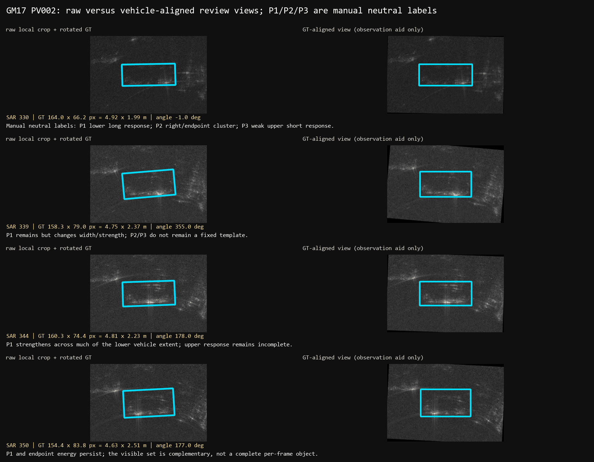
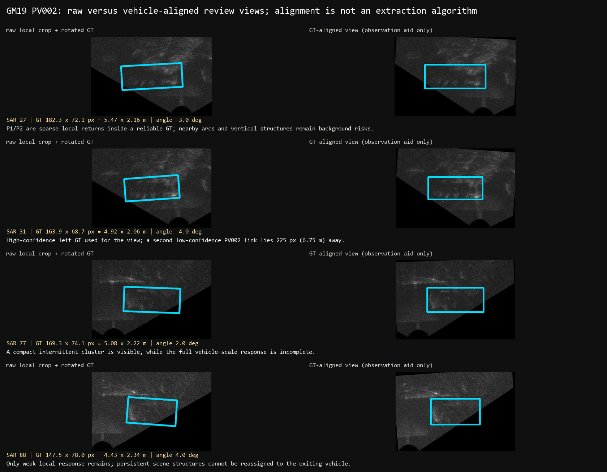

# OTY2-RSA2-O0 开卷式车辆级多时间尺度 SAR 响应机制审阅

日期：2026-07-18

阶段名：`OTY2-RSA2-O0 Open-Book Vehicle-Level Multi-Timescale Mechanism Review`

性质：研究期开卷式机制审阅，不表示算法成熟度，不授权后续实现。

## 0. 冻结结论摘要

本轮直接审阅了 GM_RM017 与 GM_RM019 的原始 SAR 连续帧、旋转 GT、同步光学帧、相邻光学帧、完整光学生命线和多车上下文。审阅支持以下描述性结论：

1. `DIRECTLY_OBSERVED`：同一已知车辆在连续 SAR 帧中的可见响应不是完整、刚性、逐帧恒定的车辆轮廓。GM17 PV002 的下侧长响应、端点能量和上侧短响应会交替增强、减弱或缺失。
2. `MULTIFRAME_SUPPORTED`：GM17 PV002 与 PV003 都存在“单帧不完整、跨帧能够形成更一致车辆尺度解释”的案例；这种支持来自身份、车辆尺度、相对位置、出现顺序与生命周期的联合关系，不来自并集、频率图或总分。
3. `DIRECTLY_OBSERVED`：PV003 明显比 PV002 更弱、更碎；PV004 在完整审阅范围内没有复现 PV002 的固定近水平主带。PV002 不能作为固定切线或固定模板的跨车辆依据。
4. `DIRECTLY_OBSERVED`：GM19 中固定竖线、扇形圆弧和热点在车辆退出后仍持续。亮度和时间持续性本身不能证明车辆归属。
5. `UNRESOLVED`：GM17 PV003 的 SAR 335–337、PV004 的 429/438，以及 GM19 PV001 的 0/4、PV002 的 31 存在同车多框或身份链接冲突。本轮保留冲突，不自动修正 GT。
6. `MULTIFRAME_SUPPORTED`：`0.03 m/px` 与两场景的车辆 GT 量级一致，可用于车辆尺度和间距解释；它仍只是当前 SAR 重建显示网格尺度，不是 3 cm 的独立距离或方位分辨率。
7. `CANDIDATE_RELATION`：可以用“潜在车辆响应体的互补、不完整观测”组织部分跨帧关系，但当前证据不足以冻结逐像素对象边界、物理部件名称或完整响应 Mask。

本轮没有产生算法、阈值、候选库、评分、排序、selector、Mask、seed propagation、固定切线扩展或自动标注。

## 1. 任务边界

本轮研究单元是一辆已知身份车辆的完整观测生命线，而不是 seed、候选、连通域、单帧、固定五帧窗口或像素通道。

允许使用研究期 GT 的中心、长宽、方向、身份和多车关系来理解机制；部署期仍禁止使用目标 SAR GT。车辆自身坐标只作为人工观察工具，不被转换为模板、分割器或评分器。

历史 S1X、RSA0、RSA1 仅作为负面方法论与表示错误证据：

- S1X 的 `support recovery` 只解释为保守亮响应子集提取；
- RSA1-A0 的固定切线段由人工种子几何预构造，连接性主要由构造保证；
- `component continuity` 只表示高强度像素出现频率；
- `temporal propagation` 只表示固定位置或固定几何的邻帧一致性支持。

这些历史代理结果不被继承为车辆响应对象传播证据，也不被用来否定原始多帧互补灵感。

## 2. 阅读与证据来源

本轮先完整阅读：

1. `docs/reviews/OTY2_SAR_ROUTE_ERRORS_AND_OMISSIONS_DEEP_REVIEW_20260718.md`
2. `docs/OTY2_RESEARCH_CONCLUSION_STATUS_REGISTER_20260718.md`
3. `docs/OTY2_SESSION_START_HERE.md`

随后阅读路线重置、P0 数据资产与硬同步审计、SAR 坐标与网格合同、SAR GT 结构基础、光学完整身份路线重置、光学时序泛化协议，以及 S1X、RSA0、RSA1 的历史报告和固定切线代码法证材料。

直接数据来源：

- GM_RM017 SAR：`D:/profile/research/data/GM_RM017/GM_RM017_SARframes_gray`
- GM_RM019 SAR：`D:/profile/research/data/GM_RM019/GM_RM019_SARframes_gray`
- 同场景光学连续帧目录；
- `manifests/oty2/oty2_s0_sar_gt_quality_audit.csv`
- `manifests/oty2/oty2_p0_hard_sync_sar_to_optical.csv`
- `manifests/oty2/oty2_p1e_canonical_vehicle_frame_states.csv`
- `manifests/oty2/oty2_p1e_canonical_optical_vehicle_registry.csv`

本轮通过逐帧面板和完整接触表连续查看了：

- GM17 SAR 302–446；重点高分辨率复核 319、330、335、336、337、339、344、350、370、386、394、429、438、442、446；
- GM19 SAR 0–90；重点高分辨率复核 0、4、8、20、27、31、40、50、60、77、81、88、90；
- GM17 光学 PV002 145–185、PV003 151–200、PV004 162–214；
- GM19 光学 PV001 0–14、PV002 5–43；
- GM19 SAR 20–60 的同帧多车完整上下文。

证据包包含 31 张经过缩小优化的 PNG。每张图的来源、帧范围、SHA-256 和路径见 [review pack manifest](samples/oty2_rsa2_o0_review_pack_20260718/review_pack_manifest.csv)。

## 3. 数据和车辆范围

| 场景 | 车辆 | 完整光学生命线 | 本轮完整 SAR 审阅范围 | 直接 SAR GT 锚点范围 | 主要限制 |
| --- | --- | ---: | ---: | ---: | --- |
| GM_RM017 | PV002，前方深色轿车 | 145–185 | 302–386 | 302–386 | 310 有额外 diagnostic duplicate |
| GM_RM017 | PV003，中间白色 SUV | 151–200 | 314–417 | 315–394 | 335–337 身份/几何冲突；395–417 无直接 GT |
| GM_RM017 | PV004，后方深色轿车 | 162–214 | 337–446 | 337–394；429；438；442；446 | 395–428 长 GT 缺口；429/438 双框冲突 |
| GM_RM019 | PV001，早期黑色轿车 | 0–14 | 0–35 | 0；4；8；27 | 0/4 高低置信双框；退出后背景持续 |
| GM_RM019 | PV002，白色 MPV | 5–43 | 10–90 | 27；31；77；81；88 | GT 极稀疏；31 双框；中段为观察裁剪而非 GT |

完整车辆级清单见 [vehicle lifecycle review manifest](samples/oty2_rsa2_o0_vehicle_lifecycle_review_manifest_20260718.csv)。

## 4. `0.03 m/px` 的使用口径与车辆尺度

本轮采用：`0.03 m/px` 是当前固定 SAR 重建显示网格的有效物理尺度。它可把 GT 长宽、局部响应跨度、部件间距和双框间距转换成米；它不等于真实独立距离或方位分辨率。

以下范围只统计审阅窗口内 `usable` GT，用于检查物理量级，不把统计量当作响应机制：

| 车辆 | GT 长轴 px，最小/中位/最大 | GT 长轴 m | GT 短轴 px，最小/中位/最大 | GT 短轴 m | 解释 |
| --- | --- | --- | --- | --- | --- |
| GM17 PV002 | 137.2 / 155.1 / 169.7 | 4.12 / 4.65 / 5.09 | 62.9 / 71.6 / 85.5 | 1.89 / 2.15 / 2.57 | 稳定在正常轿车量级，局部人工框和可见性造成波动 |
| GM17 PV003 | 144.0 / 165.2 / 193.2 | 4.32 / 4.96 / 5.80 | 64.5 / 74.6 / 84.3 | 1.93 / 2.24 / 2.53 | SUV 量级合理；335–337 冲突未用于可靠结构解释 |
| GM17 PV004 | 139.5 / 163.8 / 198.1 | 4.18 / 4.91 / 5.94 | 64.3 / 76.5 / 90.7 | 1.93 / 2.30 / 2.72 | 晚期边界框偏大，不能把最大值当车体真实尺寸 |
| GM19 PV001 | 145.8 / 146.2 / 179.5 | 4.37 / 4.39 / 5.38 | 64.5 / 65.0 / 75.6 | 1.94 / 1.95 / 2.27 | 锚点少，但仍是轿车量级 |
| GM19 PV002 | 147.5 / 163.9 / 182.3 | 4.43 / 4.92 / 5.47 | 68.7 / 73.5 / 78.0 | 2.06 / 2.20 / 2.34 | MPV 量级合理；不足以证明逐帧几何稳定 |

直接观察到的关键米制关系：

- GM17 PV002 P1 下侧长响应的可见跨度约 `90–145 px ≈ 2.70–4.35 m`。这是图像响应跨度，不是实体构件长度。
- GM17 PV002 P3 与 P1 的可见偏移约 `35–55 px ≈ 1.05–1.65 m`，只冻结为候选关系，未跨车辆确认。
- GM17 PV003 335/336 的两个同 ID 框中心相距 `179.1 px ≈ 5.37 m` 与 `168.5 px ≈ 5.05 m`，超过单车内部合理中心变化，属于身份/几何冲突证据。
- GM17 PV004 429/438 的主框与低置信补充框中心相距 `158.1 px ≈ 4.74 m` 与 `170.7 px ≈ 5.12 m`。
- GM19 PV001 0/4 的高低置信同 ID 框中心相距 `211.5 px ≈ 6.34 m` 与 `208.6 px ≈ 6.26 m`。
- GM19 PV002 31 的两个同 ID 框中心相距 `225.0 px ≈ 6.75 m`。

图中亮带厚度、热点直径和圆弧宽度受成像扩展、旁瓣和显示映射影响，不能直接等同于实体尺寸或独立散射体间距。

## 5. GM17 PV002（`GM_RM017:PV002`）完整生命线

光学侧 145–185 能持续辨认同一辆前方深色轿车：145–153 与 174–185 为部分可见，154–173 为完整可见。身份主要由车辆颜色、前后顺序和连续移动确认，不由任一 tracker ID 单独保证。

SAR 302–329：车辆 GT 已存在，但框内响应普遍稀疏。302 表明车辆的 SAR 生命周期早于后续明显长带；310 的额外 diagnostic PV002 框与主框相距 5.36 m，不能被当作一次车辆跳变。

SAR 330–360：这是本车最清楚的互补观察段。人工中性编号：

- P1：GT 下侧/近侧的长响应；
- P2：一端附近的紧凑热点或短簇；
- P3：相对 P1 上方的短响应或弱点。

330 同时显示 P1、P2 和弱 P3；339 的 P1 更宽更强，但 P2/P3 关系改变；344 的下侧响应占主导，上侧仍不完整；350 保留 P1 和端点能量，但宽度与强弱再次变化。相关原图与车辆对齐观察图见：

SAR 361–386：P1 类关系仍可在多帧中看到，但整体减弱并重新分布。光学已进入部分可见段，不能把减弱解释成车辆不存在。386 是本轮映射到光学 185 的退出边界，之后的固定场景结构不再归给 PV002。

冻结状态：P1 是 `MULTIFRAME_SUPPORTED` 的重复关系；P2/P3 为 `CANDIDATE_RELATION`。不存在逐帧完整对象、固定切线或固定强度模板。

## 6. GM17 PV003（`GM_RM017:PV003`）完整生命线

光学 151–200 是白色 SUV，位于两辆深色车之间。151–161 与 189–200 部分可见，162–188 完整可见。这个明显的颜色、车身高度和前后排他关系，使光学身份比局部 tracker 片段更稳定。

SAR 314–329：315 已有 GT，但框内缺少清楚的完整车辆响应。车辆存在早于清晰响应，这一事实直接反对“当前帧没有明显亮带就没有车辆”的解释。

SAR 330–394：框内可重复看到弱、碎的下侧响应与间歇端点热点，但强度和连续性明显低于 PV002。330、350 等帧提供了其他帧没有的局部响应信息；它们可以共同支持同车不完整观察，但不能拼成固定模板。

335–337 是关键冲突：335/336 各有两个 PV003 框，中心相距约 5.37 m/5.05 m；337 将上左轨迹标为 PV004，而保留另一框为 PV003。因此本轮把 335–337 登记为身份/几何冲突，不把两个框间变化解释成 SAR 响应传播。

SAR 395–417：光学 SUV 继续可见到 200，但 PV003 的最后直接 SAR GT 在 394。395–417 的裁剪只用于观察，不提供新的 GT 几何。本段保持 `UNRESOLVED`，说明完整光学身份不能自动补出缺失的 SAR 像素归属。

冻结状态：PV003 提供了跨车辆反证——PV002 的强近水平带不是通用固定响应模板。PV003 的弱下侧关系是 `MULTIFRAME_SUPPORTED`，端点热点只是 `CANDIDATE_RELATION`。

## 7. GM17 PV004（`GM_RM017:PV004`）完整生命线

光学 162–214 为白色 SUV 后方的深色轿车；162–168 与 202–214 部分可见，169–201 完整可见。它保持尾随顺序并从右边界退出。

SAR 337–394：框内大多数帧只出现弱小斑点或没有清楚响应；框外或附近的斜线、圆弧比车内响应更醒目。即使查看了完整连续帧，也没有出现 PV002 那样可重复的强近水平主带。

SAR 395–428：缺少直接 PV004 GT，观察裁剪来自 394 与 429 之间插值。场景斜线与圆弧持续存在，但这不能成为车辆响应连续性的证据。

SAR 429/438：各有一个 usable/high 主框和一个 diagnostic/low 补充框，中心相距约 4.74 m/5.12 m。442 只有 diagnostic-only 框；446 虽有 usable 框，内部仍缺少稳定强响应。完整生命周期没有消除晚期冲突。

冻结状态：PV004 是固定切线跨车辆泛化失败的直接证据。箱内小斑点为 `CANDIDATE_RELATION`，主要斜线/圆弧按完整生命周期和场景固定性判为 `EXCLUDED` 的车辆解释，晚期响应归属为 `UNRESOLVED`。

## 8. GM19 PV001（`GM_RM019:PV001`）完整生命线

光学 0–14 为早期黑色轿车。除光学 1 外，其余可见帧多为部分可见；白色 MPV 从 5 开始进入，形成同帧多车条件。

SAR 0/4：每帧均同时存在高置信主框与低置信补充框，中心相距 6.34 m/6.26 m。它们不能同时代表同一辆车，时间持续也不能消除冲突。

SAR 8/27：单一 usable 锚点内只有稀疏局部响应。27 同时存在 PV001 与 PV002 两个 usable 框，是 GM19 中少数直接两车几何锚点。

SAR 28–35：光学 PV001 已在 14 后退出，但竖线、圆弧和热点继续存在。这个完整生命周期对照直接证明：持续亮结构不等于车辆状态持续，也不等于该车辆的响应传播。

冻结状态：PV001 的局部响应只到 `CANDIDATE_RELATION`；退出后仍持续的场景结构对 PV001 归属为 `EXCLUDED`。

## 9. GM19 PV002（`GM_RM019:PV002`）完整生命线

光学 5–43 为白色箱形 MPV。5–19、21、24–25、27–43 部分可见；20、22–23、26 完整可见。车辆从左侧进入、穿过画面并从右边界退出，人工观察身份稳定。

SAR 10–26：没有直接 PV002 GT，只能用后续锚点附近裁剪观察。PV001 同时存在于早段，固定竖线、扇形圆弧和热点也在场景中持续。光学可见不能直接转化为 SAR 像素所有权。

SAR 27：usable GT 内只有稀疏 P1/P2 类局部响应，没有完整车体响应。

SAR 31：usable/high 主框内仍有相关簇，但另有 diagnostic/low PV002 框，中心相距 225 px ≈ 6.75 m。右侧低置信框在空间上更靠近此前 PV001 一侧，但光学 PV001 已退出；两种证据冲突，因此本轮不自动改名。

SAR 32–76：缺少直接 PV002 GT。40、50、60 的原图中，竖线、圆弧和固定热点持续，不能用插值裁剪、频率或最大值证明车辆响应对象连续。

SAR 77/81/88：重新出现 usable GT。77 有紧凑间歇簇，81 方向变为约 12°且响应仍碎，88 只剩弱局部响应。它们可作为同一光学车辆在不同扫描位置下的不完整观察，但不足以给出完整对象边界。

冻结状态：跨 27/31/77/81/88 的稀疏局部关系为 `MULTIFRAME_SUPPORTED`，但精确部件对应和中段响应归属仍为 `CANDIDATE_RELATION` 或 `UNRESOLVED`。

## 10. 相邻帧审阅

相邻帧的不可替代作用是检查局部变化是否与车辆连续运动和 GT 几何相容：

- GM17 PV002 330–350 中，下侧响应逐帧改变宽度和强度，而 GT 中心与车辆顺序连续；这支持“响应显现变化”，不支持固定像素传播。
- GM17 335–337 中，两个 PV003 框的约 5 m 级跳变与单车连续运动矛盾；相邻帧使身份链接错误暴露出来。
- GM19 27–31 中，主 PV002 框位置相容，但 31 的第二框相距 6.75 m；相邻帧不能支持它为同一辆车的正常移动。
- 场景圆弧和竖线在相邻帧中保持场景位置，而车辆框和光学生命线发生进入/退出；这种相对运动差异用于背景排除。

相邻帧不能回答完整进入、退出、主体切换或长 GT 缺口问题，因此不能替代完整生命周期。

## 11. 短窗互补审阅

3–7 帧短窗主要揭示“局部响应轮流显现”：

- PV002 的 P1、P2、P3 不是每帧共同存在。某一帧上侧弱响应消失时，下侧或端点响应可能增强。
- PV003 的弱下侧段与端点热点在短窗内交替出现；要求所有部件持续存在会错误删除真实但间歇的观察。
- PV004 的短窗没有形成同类互补结构，反而显示背景斜线更稳定。
- GM19 的短窗受 GT 稀疏和固定背景影响，能够发现局部候选，却不能唯一归属。

简单并集会把不同时刻的车辆位置、邻车和固定背景叠在一起；交集会删除间歇真实响应；最大值会把场景热点升级为永久结构；频率图会把固定竖线和圆弧误叫“稳定部件”。

## 12. 中窗车辆坐标和部件关系

10–30 帧中窗用于比较车辆尺度和相对车辆坐标关系。本轮只将 GT 对齐图作为观察辅助，并回看原始 SAR。

稳定或重复关系：

- PV002 P1 多次位于 GT 下侧/近侧，并在车辆长轴方向形成多米跨度；
- PV002/PV003 都可出现一个端点附近紧凑热点，但强度和位置不固定；
- 车辆 GT 长宽在两场景中总体保持乘用车量级。

变化关系：

- 同一部件的可见长度、厚度和强度会改变；
- P2/P3 可互斥或只在部分方位出现；
- PV003/PV004 的响应显著弱于 PV002，说明方位、距离、车辆形态和背景共同影响显现。

背景关系：

- 圆弧、竖线和斜线在车辆坐标中不形成稳定的车体相对位置；
- 它们在车辆退出后仍存在，因此不能因落入某一帧 GT 框就被永久归为车辆部件。

人工部件表见 [multiframe complementary part review](samples/oty2_rsa2_o0_multiframe_complementary_part_review_20260718.csv)。P1/P2/P3 只是在本轮图像中的中性索引，不代表车头、车尾、轮轴或确定散射中心。

## 13. 完整生命周期的不可替代作用

完整生命周期解决的是短窗不能解决的问题：

1. 进入/退出：PV001 退出后背景仍亮，可排除“持续亮点等于车辆持续”。
2. 弱响应维持：PV002/PV003 在部分帧弱或空白时，光学身份与前后帧仍说明车辆没有消失。
3. 多车排他：GM17 三车的颜色和前后顺序限制 SAR 框归属；GM19 黑轿车与白 MPV 的不同退出时间限制旧响应所有权。
4. 主体切换与 GT 冲突：335–337、429/438、0/4、31 必须作为冲突保留，不能用局部连续性填平。
5. 扫描表观过程：本轮车辆大多是相对静止世界中的目标，光学画面左到右变化主要来自相机/扫描视场；“进入/退出”不能简单解释成车辆物理加速驶入或驶出。

因此完整时序不是更长的 temporal score，而是身份、排他、进入、退出、遮挡、恢复、主体切换和背景持续性的约束集合。

## 14. 多车竞争与排他关系

详细记录见 [multivehicle exclusivity review](samples/oty2_rsa2_o0_multivehicle_exclusivity_review_20260718.csv)。主要结论：

- GM17 319–386 三辆车大多保持空间顺序，响应强弱却差异显著；同一固定切线不能解释三车。
- GM17 335–337 的两个 PV003 框与 PV004 新出现框构成身份冲突，不能把框间跳变叫车辆响应迁移。
- GM17 387–394 出现未链接框，完整光学顺序只能约束它，不能唯一命名。
- GM17 PV004 429/438 的双框在车辆边界退出段重复出现，保持未决。
- GM19 27 同时有 PV001/PV002 usable 框，是直接两车对照；31 的双 PV002 标签与 PV001 退出信息冲突。
- GM19 32–60 的背景结构持续性强于任何单车响应，完整生命周期用于拒绝它们属于车辆。

本轮不使用 `neighbor_risk=true` 代替解释，也不强迫每个亮点唯一归属。

## 15. 光学约束实际提供了什么

光学直接观察提供：

- 车辆颜色、车型轮廓和前后顺序；
- 相邻运动方向与尺度趋势；
- 完整/部分可见状态；
- 进入与退出边界；
- 同帧其他车辆和排他关系。

检测器输出和 tracker ID 只作为历史来源，不作为身份真值。人工与多模态确认在以下区间相对稳定：

- GM17 PV002 145–185；
- GM17 PV003 151–200；
- GM17 PV004 162–214；
- GM19 PV001 0–14；
- GM19 PV002 5–43。

不稳定点主要不在光学外观身份本身，而在 SAR GT identity link：GM17 310、335–337、429/438；GM19 0/4、31。PV003 395–417 还存在“光学身份继续、SAR 直接 GT 已结束”的断裂。

光学不能提供：SAR 响应逐像素 Mask、固定散射模板、最终车辆框或背景像素所有权。

## 16. 跨车辆与跨场景比较

### 16.1 同场景不同车辆

GM17 三车的 GT 米制尺度都在乘用车范围，但响应不统一：

- PV002 有最明显的下侧长响应；
- PV003 是更弱、更碎的下侧/端点组合；
- PV004 长时间缺少可确认的车辆尺度主响应，背景斜线更突出。

因此“响应都接近水平”不成立；固定切线只适配 PV002 的局部窗口，不能跨 PV003/PV004 泛化。

GM19 PV001/PV002 都受到同一组竖线、圆弧和热点干扰。两车光学身份明确，但 SAR GT 稀疏，说明身份可靠不等于响应边界可靠。

### 16.2 跨场景

跨场景共同点：

- GT 尺度都在约 4–6 m 长、约 1.9–2.7 m 宽的乘用车量级；
- 车辆响应都可能稀疏、分裂、强弱变化和间歇出现；
- 端点热点与长轴附近响应可以出现，但不固定；
- 单帧 GT 框不等于当前可见响应 Mask。

不能跨场景冻结的内容：

- PV002 的强近水平下侧带；
- P1/P2/P3 的精确数量、位置和间距；
- 某一亮带的物理部件名称；
- GM17 的背景斜线或 GM19 的扇形圆弧为车辆结构。

跨场景证据目前支持的是“响应显现不完整且受方位/场景影响”的关系，不支持统一散射模板。

## 17. 稳定、互补、变化、歧义与失败关系

### 17.1 稳定关系

- 车辆 GT 米制量级基本合理；
- 光学车辆顺序和外观身份在上述生命周期内相对稳定；
- 固定背景圆弧、竖线和斜线在场景坐标中持续；
- PV002 的下侧长响应在中段多次出现。

### 17.2 互补关系

- PV002 的 P1/P2/P3 在不同帧提供不同信息；
- PV003 的弱下侧段和端点热点跨帧互补；
- GM19 PV002 的 27/31 与 77/81/88 是相隔较远的稀疏观察，只有结合身份和生命周期才可组织为同一车辆的候选互补观察。

### 17.3 变化关系

- 响应长度、厚度、强度和连续性逐帧变化；
- 部件可能出现、消失、迁移或交替增强；
- 同一车辆在不同方位/扫描位置不保持固定响应模板。

### 17.4 歧义和失败关系

- 同车多框冲突；
- 光学身份存在但 SAR GT 长缺口；
- 背景结构偶然进入 GT；
- 多车同帧使局部亮点可能有两个解释；
- 车辆自身坐标对齐不能消除原始图中的背景混合。

## 18. GT 可靠性问题

GT 是研究期答案的一部分，但不是无条件真值：

- GM17 PV002 310：usable 主框与 diagnostic duplicate 相距 5.36 m；
- GM17 PV003 335/336：两个 diagnostic-only 框相距 5.37/5.05 m；
- GM17 PV003 395–417：光学仍可见但无直接 SAR GT；
- GM17 PV004 395–428：长 GT 缺口；429/438 有高低置信双框；442 为 diagnostic-only；
- GM19 PV001 0/4：高低置信双框相距 6.34/6.26 m；
- GM19 PV002 31：高低置信双框相距 6.75 m；
- GM19 PV002 32–76：无直接 GT。

本轮没有修改任何原 GT，也没有将人工视觉判断写回自动真值。

## 19. 对强制研究问题的回答

### 19.1 物理尺度

1. `0.03 m/px` 与 GM17/GM19 的车辆 GT 量级一致，可用于尺度解释。
2. 同车长宽总体保持乘用车量级，但手工框、部分可见、边界和冲突会造成明显波动，不能宣称精确刚性稳定。
3. PV002 P1 的多米长轴跨度和 P1/P3 的约 1.05–1.65 m 候选偏移具有车辆尺度意义，但后者尚未跨车辆确认。
4. 亮带厚度、热点直径和圆弧宽度可能是成像扩展，不能当实体尺寸。

### 19.2 多帧互补

1. PV002 330/339/344/350 和 PV003 330/350 等帧提供了其他帧没有的局部部件信息。
2. P1/P2/P3 会交替出现或交替增强。
3. PV002 是明确的“单帧不完整、多帧共同解释”案例；PV003 有较弱的同类证据。
4. 并集、交集、最大值和频率图会丢失身份、互斥、移动和背景持续关系。
5. 多帧联合的核心是同一身份下的相对位置、尺度、出现顺序、排他和生命周期关系，而不是单一统计量。

### 19.3 时间尺度

1. 相邻帧：检查平滑移动、跳变和背景相对运动。
2. 短窗：观察部件轮流显现和单帧缺失。
3. 中窗：比较车辆坐标、米制尺度、方位依赖和背景失配。
4. 完整生命线：处理身份、进入、退出、遮挡、恢复、主体切换和多车排他。
5. 完整生命线不能由短窗替代；中窗的尺度关系也不能由单个相邻帧替代。

### 19.4 身份与多车

1. 上述五辆车的光学外观生命线相对稳定。
2. SAR 链接在 GM17 310、335–337、429/438 与 GM19 0/4、31 断裂或冲突；PV003 395–417 缺直接 SAR GT。
3. 多车竞争使同一亮点可能属于邻车、背景或未链接框，必须使用排他和退出关系。
4. GM19 PV001 退出后背景仍持续、GM17 335–337 的 PV003/PV004 转换，都必须依赖完整身份解释。
5. 任何把局部 tracker ID、短窗连续、固定几何接受或高频像素当完整身份/对象传播的历史结论均不可信。

### 19.5 响应对象语义

1. GT 框是车辆物理范围参考；当前可见响应是其中及邻域内的图像子集；潜在车辆响应体是组织多帧互补观察的研究解释；最终标注本轮未生成。
2. 当前不需要像素级 Mask 才能表达研究对象。可以用身份、GT 物理范围、中性部件关系、背景排除和证据等级表达。
3. 多帧重复、与车辆尺度相容、随车辆生命周期变化且不由背景解释的响应可作为候选部件。
4. 位于 GT 框中但在车辆退出后持续、在车辆坐标中不一致、或更符合固定圆弧/竖线/斜线的结构更可能是背景。
5. “车辆响应对象”目前有不完整、多部件、跨帧互补和生命周期约束的事实支持；逐像素完整边界、固定部件数和确定物理命名仍只是未成立解释。

## 20. 仍未成立的结论

以下结论本轮没有成立：

- 存在可跨车辆、跨场景复用的固定近水平主带；
- 固定切线是车辆响应传播；
- 高精度低覆盖亮子集等于车辆响应体恢复；
- 高频像素等于物理部件；
- 邻帧相似性等于对象传播；
- 多帧并集等于完整对象；
- 一个完整车辆响应体已经被逐像素恢复；
- 光学 tracker ID 或局部框关联已经形成部署可用的完整身份真值；
- GM19 稀疏锚点已经足以唯一解释 10–90 的所有 SAR 响应。

## 21. 本轮冻结语义

| 术语 | 本轮冻结解释 |
| --- | --- |
| GT 框 | 已知车辆的研究期物理范围、中心、长宽和方向参考；不是响应 Mask |
| 当前可见 SAR 响应 | 当前帧直接可见、可能稀疏且背景混合的局部响应集合 |
| 潜在车辆响应体 | 用同一车辆身份、尺度、相对位置、跨帧互补和背景排除组织的研究解释；尚无完整像素边界 |
| 响应部件 P1/P2/P3 | 人工中性索引，不带车头、车尾、轮轴或确定散射中心语义 |
| 完整时序 | 相邻、短窗、中窗和全生命周期四类不可互相替代的约束 |
| 多帧支持 | 多帧关系共同支持某一解释；不是频率、NCC、面积或总分 |
| 最终标注 | 本轮未产生，也未授权产生 |

证据等级只保留：`DIRECTLY_OBSERVED`、`MULTIFRAME_SUPPORTED`、`CANDIDATE_RELATION`、`UNRESOLVED`、`EXCLUDED`、`NOT_YET_TESTED`。它们不转换为加权总分或 winner selection。

## 22. 审阅清单与可追踪性

- [车辆级时间线清单](samples/oty2_rsa2_o0_vehicle_lifecycle_review_manifest_20260718.csv)
- [帧级信息贡献清单](samples/oty2_rsa2_o0_frame_information_contribution_review_20260718.csv)
- [多帧互补部件清单](samples/oty2_rsa2_o0_multiframe_complementary_part_review_20260718.csv)
- [多车排他清单](samples/oty2_rsa2_o0_multivehicle_exclusivity_review_20260718.csv)
- [审阅证据图 manifest](samples/oty2_rsa2_o0_review_pack_20260718/review_pack_manifest.csv)

帧级清单包含 42 个代表帧记录，并强制填写“本帧新增信息”；部件清单包含 15 个中性部件/冲突结构记录；多车清单包含 11 个排他或冲突区间。所有证据路径已做存在性检查，所有清单主键已做重复检查。

## 23. 最终总判定

本轮确实检验了用户原始灵感的一部分，而不是再次替换成新的代理问题：

- 已直接看到同一车辆在连续 SAR 中呈现稀疏、分裂、强弱变化和间歇局部响应；
- 已直接看到不同帧提供互补信息，尤其是 GM17 PV002；
- 已确认多时间尺度各自提供不同约束；
- 已确认完整身份和排他关系对背景排除、退出和多车冲突不可替代；
- 已确认旧固定切线代理失败不等于原始“互补不完整观察”灵感失败；
- 尚未确认统一的潜在响应体像素边界、跨车固定部件模板或自动求解方式。

本报告到此冻结研究语义，不包含下一阶段算法方案、Codex 实现建议或实验设计。
